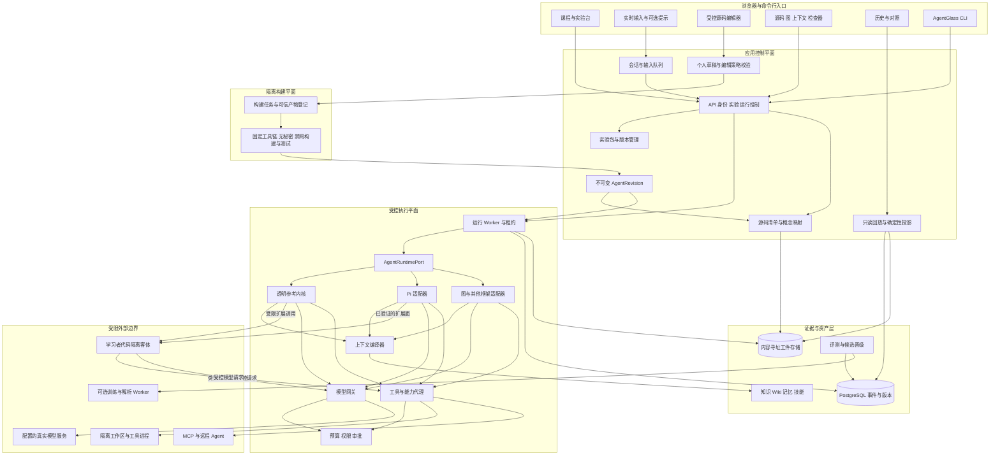
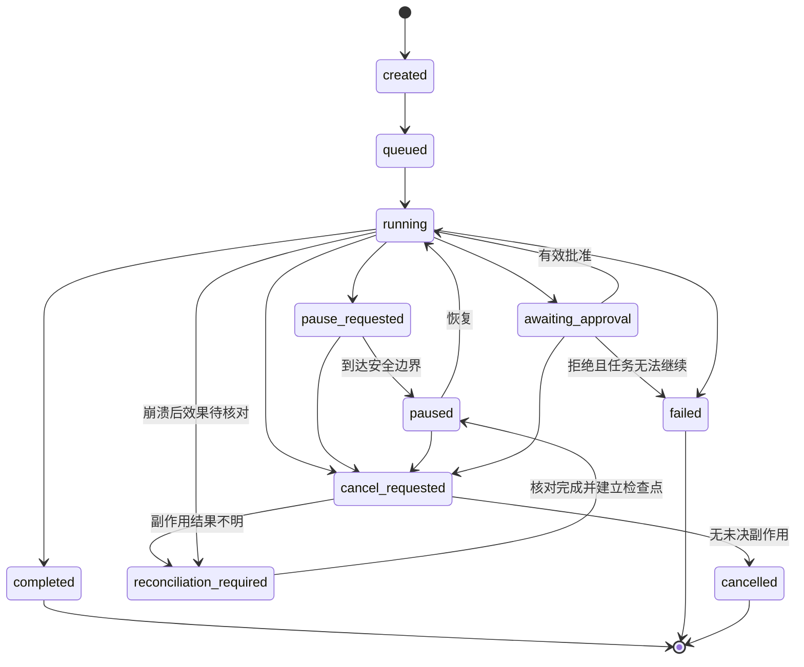
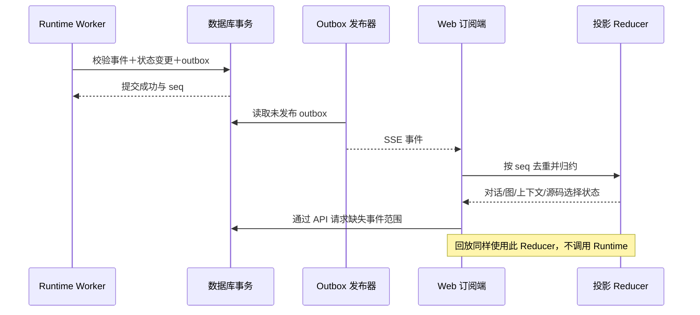
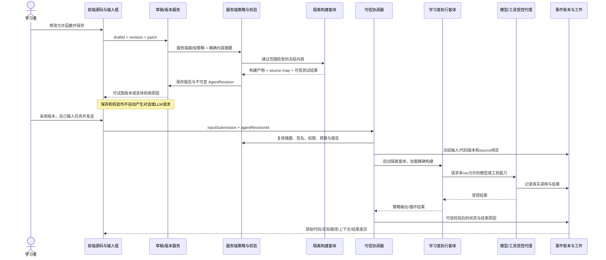
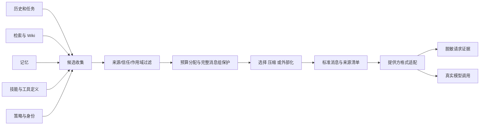
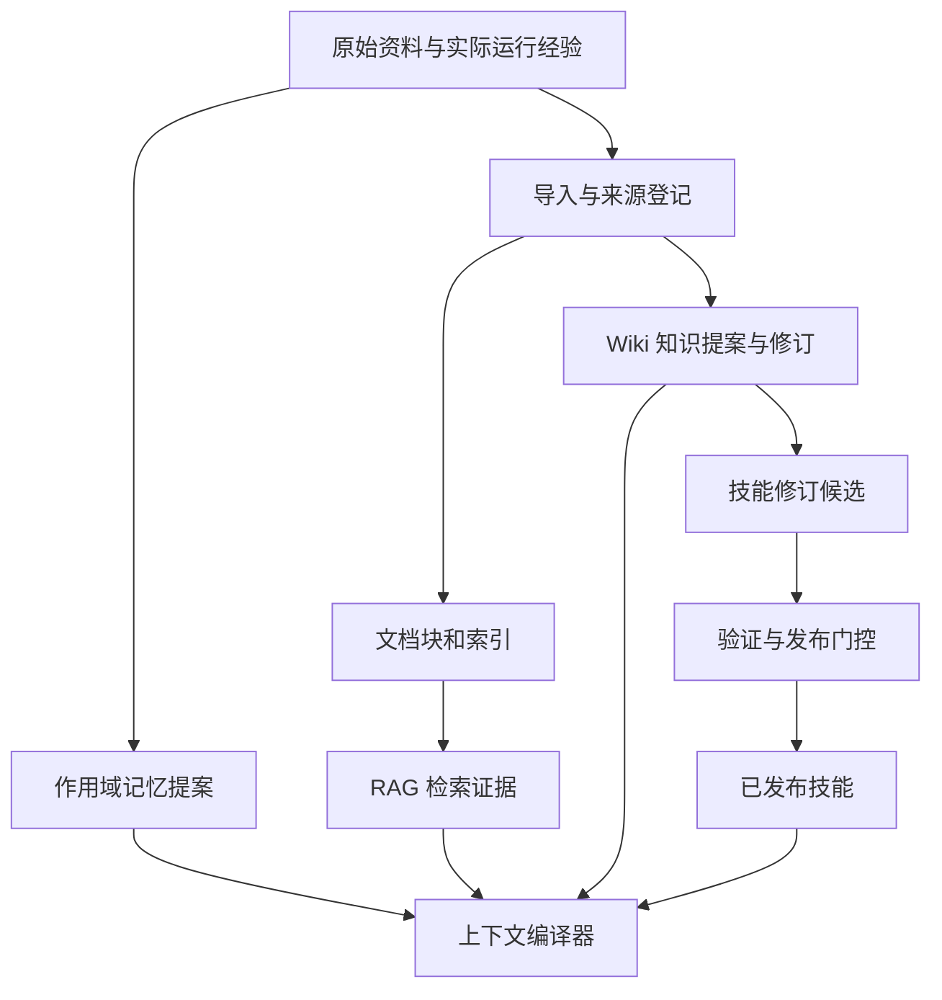
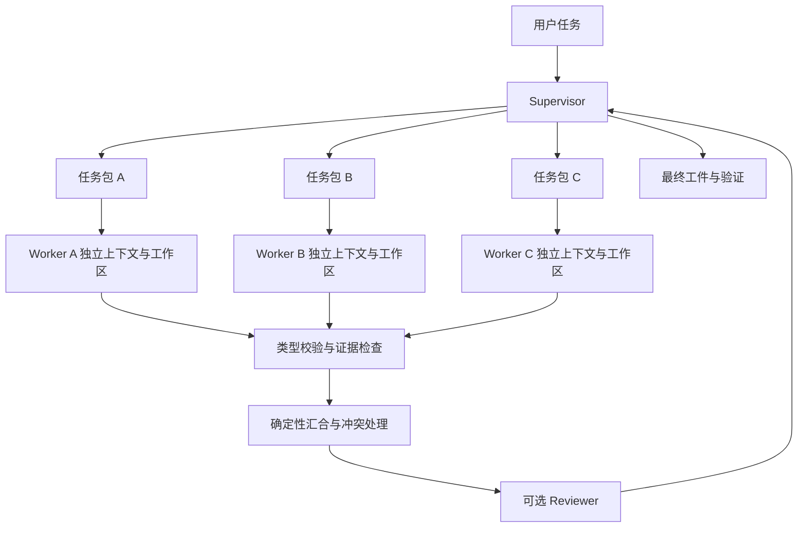
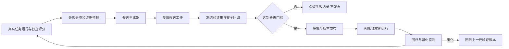
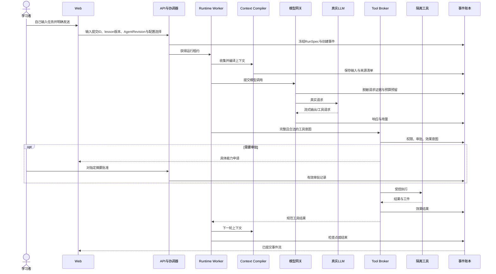
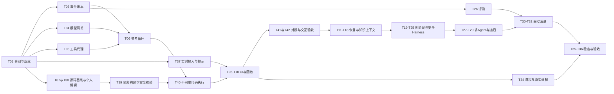

# AgentGlass：Agent 原理可观测实验室
## 研究综述、系统设计与工程开发计划

**版本：** v1.1（完整设计基线）  
**调研日期：** 2026 年 9 月 13 日  
**设计日期：** 2026 年 9 月 14 日  
**交付类型：** 可独立阅读、可拆分实施的 Markdown 设计文档  
**目标读者：** Agent 学习者、授课教师、技术负责人、前后端工程师、测试与平台工程师  
**交付状态：** 本文完成研究、设计和开发规划；不表示软件已经实现、开源项目已经部署、真实课程运行已经录制或性能指标已经验证。

> **核心方案：建设一个“能运行、能拆开、能修改、能对照、能回放”的 Agent 实验室，而不是给聊天机器人附加术语说明。**
>
> 同一次真实运行，必须能够从任务、源码、架构、实际信息流、模型可见上下文、工具副作用、知识与记忆变化、成本与评估八个角度观察。所有视图指向同一份运行证据，不分别编造演示状态。
>
> **学习者实时输入自己的任务，在前端修改课程明确开放的 Agent 代码，再用真实运行验证变化。案例只提供可选提示，不自动发送，不自动生成用户轮次，不用预编排对话冒充实时教学。**

---

## 阅读导航

| 内容 | 章节 |
|---|---|
| 先判断方案是否值得做 | [0. 结论与关键选择](#s00)、[1. 目标与边界](#s01) |
| 了解调研与原理组织 | [2. 研究综述与开源选型](#s02)、[3. 统一概念模型](#s03) |
| 了解如何教学 | [4. 42 个递进实验](#s04)、[5. 代表性实验规格](#s05) |
| 了解用户如何使用 | [6. 页面与交互设计](#s06)、[实时输入与案例提示](#s06-input) |
| 了解如何安全改代码 | [受控编辑交互](#s06-edit)、[代码开放面与执行链](#s09-edit)、[版本与会话合同](#s19-edit) |
| 了解系统如何实现 | [7. 总体架构](#s07)至[20. 部署与安全](#s20) |
| 判断是否真实、可靠 | [18. 回放与恢复](#s18)、[21. 评测与验收](#s21) |
| 直接组织研发 | [22. 里程碑与资源](#s22)、[23. 仓库结构](#s23)、[24. 开发任务](#s24)、[25. 测试示例](#s25) |
| 评审和扩展 | [26. ADR 与风险](#s26)、[27. 需求覆盖](#s27)、[28. 参考资料](#s28) |

<a id="s00"></a>
## 0. 结论与关键选择

### 0.1 推荐建设什么

推荐采用 **“透明参考内核 + 工程运行时适配器 + 受控代码实验层 + 教学事件账本 + 实验包”** 的产品架构。

透明参考内核用于解释一个 Agent 如何真正工作：构造上下文、调用模型、解析工具请求、执行工具、接收观察、更新状态、决定下一轮或停止。它不是伪代码动画，而是能调用真实模型和真实工具的小型运行时。工程运行时优先对接 Pi，由适配层接入同一套模型网关、工具安全代理、上下文证据、运行记录和教学视图。后续将 LangGraph、OpenAI Agents SDK 等作为对照实验适配器，而不是把多个框架的调度器同时叠进主循环。[E06][E07][E08][E11]

前端采用独立、轻量的 Web 工作台：课程与实验在左，任务与输出居中，右侧为可折叠的原理检查器，底部为时间轴。检查器包括源码、架构、信息流、上下文、知识/记忆、评估；初学者只打开当前课程需要的页签。参考现有聊天和编码 Agent 的交互，但不整体改造一个大型聊天平台来承担教学内核。[O02][O11][O12][O13]

### 0.2 十二项不可退让的设计决定

| 决定 | 具体含义 |
|---|---|
| 真实执行优先 | “实时运行”必须产生真实模型请求与工具操作；未配置模型就显示未配置，不切换成隐藏 mock。 |
| 用户主导对话 | 打开课程不产生对话；学习者实时撰写并明确发送。案例只可插入草稿，用户追问不能由脚本或助教代发。 |
| 代码可改，平台边界不可改 | 前端开放课程白名单内的真实代码；保存为个人变体，经校验和隔离执行生效，不热改正在运行的代码。 |
| 教学与执行同源 | 课程讲解引用实际执行模块；架构图有组件注册依据，信息流图有事件依据。 |
| 可观察不等于读心 | 展示模型实际收到的应用层输入、输出、公开计划和工具结果，不声称还原不可见的内部思维链。 |
| 先单 Agent，后复杂编排 | 先让用户理解一次调用和一次循环，再引入图、子智能体、远程协作和演进。 |
| 一个实验只突出少数变量 | 对照实验保持任务、数据、预算和工具权限尽可能一致，避免模型、框架、数据同时更换。 |
| 原理代码与工程代码双视角 | 原理页展示本次真正执行的参考实现；工程页展示适配器和依赖边界。两者有区别时明确标注。 |
| 一条证据链、多种投影 | 对话、源码高亮、图、上下文差异、终端和统计都消费统一事件账本。 |
| 回放不执行 | 历史回放只读取已有事件和工件；重新执行、分支继续分别创建新运行。 |
| 安全在模型外落实 | 权限、审批、隔离、预算和副作用控制由宿主与执行代理实施，不能只靠提示词或 SDK hook。 |
| 自我改进必须过门控 | 反思、记忆更新、技能演化、提示优化与模型训练分开；候选不能自行修改验收标准。 |

### 0.3 完整产品与首个可用版本的关系

完整目标是 **8 个教学阶段、42 个实验、5 个交付版本**。第一个版本就完成一次“用户实时输入 → 真实模型 → 真实工具 → 完整轨迹 → 前端修改受控代码 → 用户确认再次运行 → 差异观察 → 断网回放”的纵向闭环，而不是先做几十个空页面。受控编辑至少开放课程提示与一个真正参与执行的循环判断函数，不能全部退化为参数面板。

“轻量化”指交互简洁、基础部署少、学习负担可控，不指省略可靠性。基础部署不强制 Kubernetes、独立消息中间件、图数据库或第三方观测云。复杂解析、多智能体框架对照、模型训练采用按需启动的扩展 worker。

<a id="s01"></a>
## 1. 目标、使用者与范围

### 1.1 产品定位

AgentGlass 是面向教学和工程理解的可执行实验环境。它同时回答四类问题：

1. **它是什么？** 这一机制解决什么问题，与相邻概念有什么区别。
2. **它怎样工作？** 哪段代码改变了哪份状态，发起了什么模型调用或工具操作。
3. **它为什么在这里有效或失败？** 用证据、对照和环境结果解释，而不是仅展示模型自己的解释。
4. **它如何进入真实系统？** 权限、持久化、恢复、评测、部署、升级和运行成本怎样落实。

主要使用者包括从未开发过 Agent 的学习者、理解提示但不熟悉运行时的应用开发者、需要讲清机制的教师，以及希望比较方案的工程团队。第一版以中文课程为主，代码与协议使用原始标识符；中英文术语对应表进入课程资源。

### 1.2 使用场景

| 场景 | 使用方式 | 结果 |
|---|---|---|
| 自学 | 自己输入任务，读短讲解，预测下一步，运行，修改开放代码并再次运行 | 能用源码、上下文与事件差异解释机制 |
| 课堂实时演示 | 教师现场输入任务与追问，在安全边界暂停；学生可各自创建代码变体 | 看到真实延迟、失败、恢复以及同题不同代码的差异 |
| 课堂历史演示 | 加载经过脱敏的真实运行包，离线逐步播放 | 没有密钥或网络仍可学习；明确标记历史记录 |
| 工程排障 | 从失败输出回溯上下文、工具结果、源码和审批 | 找到证据支持的故障位置，而非只读长日志 |
| 方案比较 | 同任务比较单 Agent、工作流、图与多 Agent | 以任务完成度、成本、延迟和风险比较 |
| 开发教学内容 | 新增实验包，声明源码锚点、数据、权限、评估器 | 课程可以扩展，不需要修改整个应用 |

### 1.3 范围与分层

**完整覆盖的主干范围：** 实时用户对话、受控源码编辑与版本对照、模型接口、提示与结构化输出、工具使用、循环与工作流、规划与图、上下文工程、RAG、Wiki、记忆、技能、MCP、CLI、harness、人机协同、安全、追踪与回放、评测、多智能体、远程协议、自我改进、训练接口、部署与版本治理。

**作为扩展课程的范围：** 多模态、浏览器/GUI、长文递归处理、声音实时交互、机器人/具身环境、传统规划器和仿真环境。扩展通过同一环境和事件合同接入，不把一个课堂项目扩张为通用机器人操作系统。

“囊括 Agent 的所有内容”落实为**覆盖完整生命周期和主要机制族，并为新增机制保留明确接口**，而不是宣称已穷尽所有已发表或未发表算法。

### 1.4 明确不做的事情

不把实时课堂做成自动播放的固定对话；不将受控代码编辑退化为仅可改温度和模板；不把拖拽画布当作 Agent 原理本身；不把一段自述当作真实内部推理；不把自动改写提示词称为模型已经训练；不把播放预存文字伪装为正在调用模型；不承诺相同参数重复调用能得到完全相同结果；不在首版整体派生 Dify、Open WebUI 或多个 Agent 框架；不为追求“完全自主”默认开放宿主文件、网络和命令权限。

<a id="s02"></a>
## 2. 研究综述与开源选型

### 2.1 调研方法、证据等级与局限

本文整理 **82 项一手参考资料：28 项研究论文、12 项官方工程/框架文档、7 项协议资料、35 项开源项目或组件资料**。资料之间存在同一生态的论文、仓库和文档对应关系，这不是 82 个互不相关的系统。

阅读范围包括论文摘要与关键方法部分、官方文档、项目 README，并针对 Pi 循环源文件阅读执行与事件边界。没有逐一部署这些仓库，没有实施独立性能对比，也没有完成许可证法律审查。研究结论分为：**来源陈述、工程推断、本系统设计决定、待实验验证的假设**。后续数值指标均为设计目标，不是实测数据。

参考资料时间覆盖基础研究和截至调研日可见的 2026 年研究。`main`、`latest` 文档是可变引用；进入开发必须形成包含 commit、包版本、协议版本、镜像摘要和许可证摘要的 `dependency-lock.json`，不能把本文链接本身当作供应链锁文件。

### 2.2 从研究脉络到教学机制

| 机制族 | 代表参考 | 应教的本质 | 需要纠正的误解 |
|---|---|---|---|
| 提示与显式推理 | CoT、Tree of Thoughts [P02][P08] | 输入设计与候选搜索是两个层面 | 输出步骤文字不等于读取内部神经计算 |
| 行动与观察循环 | ReAct、Toolformer [P03][P04] | 模型提出动作；运行时执行；环境反馈再进入下一次决策 | Function calling 返回不等于工具已经执行；工具训练不等于工具注册 |
| 检索增强 | RAG、Self-RAG、CRAG [P01][P11][P12] | 证据获取、质量控制、引用及失败恢复 | 建一个向量库就完成可靠知识系统 |
| 记忆与长期状态 | Generative Agents、MemGPT [P06][P09] | 选择保留、检索、更新和遗忘，区分内外部状态 | 聊天记录越长就代表记忆越强 |
| 技能与程序资产 | Voyager、Agent Skills [P07][S03] | 可复用程序性知识及加载机制 | 一个 Markdown 文件天然拥有执行权限 |
| 编排与协作 | AutoGen、MetaGPT、LangGraph [P13][P14][E08] | 控制权、状态、任务依赖与合并规则 | 多个名字不同的 prompt 自动形成有效多智能体 |
| 上下文与 harness | Context Engineering、长任务 harness、ACE [E02][E03][P20] | 除模型外支撑长期可靠执行的整个系统 | harness 只是一个更长的 system prompt |
| 语言反馈与演进 | Reflexion、GEPA、DSPy [P05][P19][P10] | 用反馈产生可验证候选，明确变更对象 | 反思一次就证明能力持续提高 |
| Wiki 与技能演化 | SkillWiki、WikiSkill [P25][P27] | 经验证知识与操作策略分开管理 | Wiki、向量库、记忆、skills 都是同一类文件 |
| 训练与运行解耦 | Agent Lightning 及 v1.0 [P21][P26] | 轨迹、奖励、训练任务和模型工件的关系 | 收集 reward 或更换 prompt 就已经做了 RL |
| 递归与外部化计算 | RLM、Recursive Agent Harnesses [P22][P24] | 输入、子任务和计算预算可以外部化与分层 | 递归一定更好，或可以没有资源上限 |
| 结果评测 | AgentBench、SWE-bench、WebArena、τ-bench [P15][P16][P17][P18] | 通过环境终态与约束判定任务是否完成 | Agent 自称“完成”就是成功 |

2026 年的 harness、递归和 Wiki 演进研究进入进阶实验库，不直接升级为默认生产路径。对新论文只描述论文实际研究的问题，不根据名称推断其已具有完整工程能力。[P23][P24][P25][P26][P27][P28]

### 2.3 三条建设路线比较

| 路线 | 优点 | 代价/风险 | 结论 |
|---|---|---|---|
| 全部自研运行时与平台 | 每一步可控，教学解释直接 | 容易花大量时间重做协议、模型差异、会话和工具边界 | 只保留小型透明参考内核，不自研全部生态 |
| 小型自有教学内核 + Pi 工程适配 + 独立 Web | 原理透明，工程可复用，界面围绕教学定制 | 必须定义稳定的端口、事件与能力矩阵 | **推荐主线** |
| 整体派生大型聊天/低代码平台 | 配置、管理和部分 UI 已有 | 业务抽象与教学证据错位，升级合并成本高 | 作为体验参考，不作为基线代码库 |

### 2.4 运行时和 harness 项目比较

下表是**设计适配度判断**，不是性能排行榜；“适合”只指资料显示的机制与本项目需求之间的匹配。

| 项目 | 参考价值 | 采用方式 | 不作为基线的部分 |
|---|---|---|---|
| Pi [O01][E06][E07] | 小内核、上下文变换、工具和事件边界便于解释 | 首选工程运行时，经 `AgentRuntimePort` 接入 | 不依赖其默认权限实现；不将全部内部状态暴露为公共合同 |
| DeepSeek Harness [O02] | 插件组织、CLI/Web 入口、工程体验 | UI 与插件概念参考；后续隔离适配实验 | 项目处于 developer preview，不用浮动版本承担核心稳定性 |
| Hermes Agent [O03][O28] | 会话、技能、记忆与 Wiki 工作方式 | 选取可独立解释的机制做对照 | 不直接导入其全部用户目录和环境配置 |
| Deep Agents [O04] | 规划、文件外部化和子智能体组合 | 进阶实验适配器 | 不与 Pi 同时争夺一个 run 的主循环 |
| smolagents [O05] | 简短可读实现与代码动作机制 | 参考课程与对照实验 | 代码执行仍必须使用本系统隔离代理 |
| LangGraph [E08][E09][E10] | 状态图、检查点和中断 | 图编排对照适配器 | 框架时间旅行不直接替换只读回放 |
| OpenAI Agents SDK [E11][E12] | 工具、handoff、追踪与 guardrail 的工程分层 | SDK 对照课与可选适配器 | 框架 trace 不等于完整教学账本 |
| Pydantic AI [O06] | 类型化依赖与验证 | 类型安全专题适配 | 不因 Python 适配引入第二套通用主后端 |
| Microsoft Agent Framework、AgentScope [O07][O08] | 多 Agent 组织与集成 | 高级课程对照 | 不同时扩展为所有框架的托管平台 |
| OpenHands、OpenCode [O09][O10] | 编码任务、文件修改与终端体验 | harness/CLI 课程与 UI 参考 | 不把学生实验接入宿主完整开发环境 |

**Pi 适配的特别注意事项：** 本次读取的仓库位于 `earendil-works/pi`，核心包使用 `@earendil-works/pi-agent-core` 命名空间；旧仓库名和安装片段不能直接作为实施依据。[O01] 文档中的 `Agent.subscribe()` 与低层事件流的等待语义不同，因此“看见事件”不代表“能够在此阻塞执行”。具体适配必须依据锁定源码和契约测试确定暂停、消息屏障及工具前置控制能力。[E06][E07]

### 2.5 前端参考与取舍

| 参考对象 | 借鉴内容 | 本系统的改造原则 |
|---|---|---|
| assistant-ui、Chainlit、Agent Chat UI [O11][O12][O13] | 流式对话、工具卡片、运行状态、消息组织 | 保持聊天简单，把解释和证据放到可联动检查器 |
| LibreChat、Open WebUI [O14][O15] | 配置模型、切换会话、历史浏览 | 简化到模型配置、实验历史、资产与工具配置，不复制所有通用产品功能 |
| DeepSeek Harness、OpenCode [O02][O10] | 会话和运行操作的轻量体验 | 借鉴信息层级，不承诺像素级复刻或复用未核验组件 |
| Flowise、Dify、Coze Studio [O16][O17][O18] | 节点配置、连接关系与错误提示 | 图是解释和受约束编排界面，不是默认首页 |
| DeepWiki-Open [O21] | 源码知识页面、引用和页面关联 | 用真实源码锚点驱动，不让生成的说明取代执行证据 |

React Flow、Monaco、xterm.js 分别负责图、源码编辑/差异和终端呈现；它们只是 UI 组件，真实节点语义、权限、运行状态和源码映射仍由 AgentGlass 提供。[O29][O30][O31]

### 2.6 知识、记忆、观测与训练组件

| 组件 | 复用策略 |
|---|---|
| pgvector [O33] | 基线向量检索，与 PostgreSQL 中的版本、权限和运行信息共存 |
| Docling [O32] | 复杂文档解析按需 worker；初版先用 Markdown、文本与 CSV |
| GraphRAG、LightRAG [O19][O20] | 独立检索实验适配，避免强迫所有知识库图化 |
| Letta [O22] | 长期记忆机制对照，不让框架存储与系统主账本形成双重真相 |
| DSPy、GEPA [O23][O24] | 候选优化服务；输出版本化候选，不自动改生产配置 |
| Agent Lightning [O25] | 真实训练服务适配，资源、日志、模型工件和发布审批独立 |
| Langfuse、Phoenix [O26][O27] | 可选观测出口；禁用出口时本地运行与回放仍完整 |
| Ragas、promptfoo [O34][O35] | 扩展检索、提示与安全评测，不替代本系统结果验证器 |

<a id="s03"></a>
## 3. 统一概念模型：先把边界教清楚

### 3.1 Agent 不等于某个框架

从最一般的交互系统看，Agent 根据观察与内部状态选择动作，动作改变环境，环境产生新的观察。LLM Agent 是其中一种实现：语言模型参与动作选择，宿主程序负责调用、执行和状态管理。

用离散步表达本系统的教学模型：

```text
H_t       = 截至 t 的持久交互历史
M_t       = 可读取的长期记忆版本
K_t       = 可检索的知识、Wiki 与证据版本
W_t       = 工作区和环境状态
C_t       = Compile(goal, policy, H_t, M_t, K_t, skills, tools, budget)
a_t       ~ LLM(C_t; provider, model, parameters)
(o_t, W_{t+1}) = Execute(a_t, W_t, permissions)
H_{t+1}   = Append(H_t, a_t, o_t)
S_{t+1}   = Reduce(S_t, committed_events_t)
```

这里 `a_t` 可以是最终回答、工具调用、子任务、请求澄清或计划变更。并不是每一步都有外部工具，也不是每个 Agent 都有奖励信号。只有训练或明确评价任务时才引入 `r_t`；不要为了套用强化学习术语给所有网页 Agent 虚构一个 reward。

这一表达是产品的解释模型，不声称语言模型内部严格等价于上述可见变量。闭源模型的内部状态、服务端隐藏预处理和神经计算不在本系统可观测范围内。

### 3.2 八组必须明确的区别

| 容易混淆的概念 | 本系统定义 |
|---|---|
| Prompt / Context | Prompt 是输入组织的一部分；Context 是一次调用实际提供给模型的消息、工具定义、多模态内容及相关控制输入。 |
| Chat history / Memory | History 是发生过什么；Memory 是经过选择、组织和读取策略管理的长期信息。 |
| RAG / Wiki | RAG 是获取证据的机制；Wiki 是可版本化、可链接、可校正的知识工件。 |
| Skill / Tool | Skill 说明如何完成一类任务，可能附脚本；Tool 是宿主暴露的受控执行接口。 |
| Loop / Graph | Loop 表达反复决策；Graph 表达状态与控制关系，节点中可以包含受控 loop。 |
| Workflow / Autonomous Agent | 前者主要由预设程序路径控制，后者允许模型动态决定后续行动；二者可以组合。[E01] |
| Agent / Harness | Agent 是执行角色或决策单元；Harness 是使其可运行、可恢复、可评测和受约束的宿主工程系统。[E03] |
| Reflection / Training | 反思改变本次或后续输入不必改变权重；训练必须有真实训练过程及新模型工件。 |

此外，**知识图谱、执行图、系统架构图、多 Agent 通信图是四种不同的图**。UI 页签必须标注其语义，不能用一个名为“Graph”的页面混合表达。

### 3.3 由简到繁的控制模型


教学先展示“只有一个请求”的全部细节，再增加状态、工具、外部知识和控制复杂度。每新增一层，都保留与前一层的相同任务对照。

<a id="s04"></a>
## 4. 课程体系：8 个阶段、42 个可执行实验

### 4.1 每个实验统一采用的学习闭环

**用户自行提出问题 → 最小原理 → 预测 → 真实运行 → 观察证据 → 修改一个开放代码片段或配置 → 校验 → 用户确认再运行/分支 → 解释差异 → 完成练习。**

每节正文以能独立理解一个机制为目标。复杂代码按实际模块展开，不用脱离工程的第二份“教学伪代码”冒充执行代码。历史样本用于讲解真实发生过的结果，实时结果不要求复现固定措辞。

实验包统一包含：学习目标、前置课程、真实输入数据、可选案例提示、模型与工具需求、代码入口、编辑开放清单、可观察锚点、预期机制、不确定性说明、故障注入方式、结果验证器、思考题、参考资料和可选历史运行包。

所有 LIVE 课程从空白输入框开始。课程可以准备数据、工具、代码模板和建议问题，不能准备一个自动发送的用户对话序列。多轮记忆课的事实、追问与纠正由学习者逐次输入；需要固定输入的批量评测置于独立“评测”页面，显著标记为自动评测，不伪装成学习者现场对话。

### 4.2 阶段 I：从一次模型调用到真正的循环（L00—L07）

| 实验 | 内容与真实操作 | 必须可见的证据 | 学会的判断 |
|---|---|---|---|
| L00 | 配置一个模型端点，发送真实请求 | 配置快照、请求、响应、用量和错误 | UI 输出究竟来自哪里 |
| L01 | 修改消息角色、模板、few-shot 和数据分隔 | 模板源文件、编译后的消息差异 | prompt 改了什么，而非笼统说“更智能” |
| L02 | 对同一任务比较文本输出和结构化输出 | schema、校验错误、修复请求 | 合法 JSON 与语义正确不是同一件事 |
| L03 | 流式输出、取消、拒绝、限流和超时 | token 批次、首字延迟、终止原因 | 请求中断不是正常完成 |
| L04 | 用模型生成计算器/文件读取工具请求，执行真实工具 | schema、参数校验、执行结果、副作用 | 模型调用工具与宿主执行工具的分界 |
| L05 | 实现最小观察—行动循环 | 每轮上下文、工具输出、循环源码高亮 | Agent 与一次工具调用的差别 |
| L06 | 制造重复错误，配置停止条件和预算 | 重试次数、预算预留、停止事件 | 自动循环为什么必须有边界 |
| L07 | 串行/并行读取真实文件 | 请求顺序、完成顺序、结果入上下文顺序 | 并行是调度属性，不等于多 Agent |

### 4.3 阶段 II：工作流与外部知识（L08—L13）

| 实验 | 内容与真实操作 | 必须可见的证据 | 学会的判断 |
|---|---|---|---|
| L08 | 同任务采用串联、路由、并行和评价器工作流 | 控制节点、分支条件与真实模型调用 | 固定流程何时优于自主决策 |
| L09 | 导入文本，切块并调用真实 embedding 服务 | 文档版本、块边界、向量模型和索引版本 | 检索质量与文档处理的关系 |
| L10 | 关键词/向量/融合检索、重排与引用 | 候选集合、分数、重排前后、引用范围 | 相关性分数不等于答案正确概率 |
| L11 | 检索不充分时改写查询或补充证据 | 检索判断、分支依据、二次调用 | Agentic RAG 是控制闭环；提示实现不冒充 Self-RAG 原论文训练复现 |
| L12 | 从证据生成 Wiki 页面，加入新版本并处理冲突 | 页面 diff、来源、反向链接、审批 | Wiki 是维护后的知识工件，不是答案缓存 |
| L13 | 对照向量检索、Wiki 导航和图增强检索 | 知识边及证据、检索路径、构建成本 | 知识图不等于执行图，图化并非总有收益 |

### 4.4 阶段 III：上下文、记忆与技能（L14—L18）

| 实验 | 内容与真实操作 | 必须可见的证据 | 学会的判断 |
|---|---|---|---|
| L14 | 按预算组装系统规则、历史、证据、工具定义 | 上下文来源树、选入/排除原因、估计 token | 历史存在不等于模型此次看到了 |
| L15 | 比较截断、摘要压缩和文件外部化 | 原文/摘要差异、丢失信息、额外调用成本 | 压缩可能丢信息，不能只看 token 下降 |
| L16 | 写入、检索、更新与删除长期记忆 | 作用域、版本、写入依据、删除传播 | 记忆有生命周期和权限 |
| L17 | 同任务使用情节、语义与程序性记忆 | 不同记忆条目及命中证据 | 类别与物理存储技术不是一回事 |
| L18 | 安装白名单技能，分层加载描述、正文和资源 | 加载时机、上下文增量、脚本授权 | Skill 包格式、技能选择与工具权限互相独立 |

### 4.5 阶段 IV：规划、图与人机协同（L19—L21）

| 实验 | 内容与真实操作 | 必须可见的证据 | 学会的判断 |
|---|---|---|---|
| L19 | 生成计划、执行、遇到缺失证据后重规划；可选候选搜索对照 | 计划版本、任务状态、重规划触发与额外成本 | 计划是可修改的数据，不是已经完成的执行事实 |
| L20 | 构造有条件分支与有限循环的状态图 | 节点输入输出、reducer、边条件和检查点 | 图节点如何改变持久状态 |
| L21 | 在文件写入前审批，暂停并恢复运行 | 审批参数摘要、状态转换、恢复点 | 人机协同是控制合同，不是 UI 弹窗 |

### 4.6 阶段 V：协议、harness 与工程可靠性（L22—L29）

| 实验 | 内容与真实操作 | 必须可见的证据 | 学会的判断 |
|---|---|---|---|
| L22 | 连接本地 MCP 服务，使用 tool/resource/prompt | 协商、发现、请求响应、宿主映射 | MCP 不是“所有工具的统称” |
| L23 | 远程 MCP、能力变化、授权失败与工具描述注入防护 | 协议版本、能力、身份、拒绝理由 | 工具说明和 annotations 不能决定最终权限 |
| L24 | 启用/禁用 harness hook、插件与长期任务记录 | hook 执行顺序、配置版本、工作区变化 | harness 包含哪些模型外的能力 |
| L25 | 用 CLI 和 Web 操作同一类任务与会话 | 共享 run id、命令、事件与退出码 | CLI 是入口，不是另一套 Agent 原理 |
| L26 | 读取真实小项目、提交补丁、执行测试 | 文件 diff、隔离终端、测试退出码 | Agent 声称修复与测试验证的差别 |
| L27 | 控制实验站点上的浏览器任务与图像输入 | 页面状态、截图/DOM、动作及校验 | 多模态输入与可执行 GUI 操作是两层 |
| L28 | 在隔离素材中放入提示注入，尝试越权写入 | 信任来源、策略判断、拦截与审计 | 安全不能只依赖“不要听恶意指令”的提示 |
| L29 | 基于结果、轨迹和故障注入开展评测 | grader 源码、环境终态、恢复证据 | 模型能力问题与系统故障如何分离 |

### 4.7 阶段 VI：多智能体与跨系统协作（L30—L34）

| 实验 | 内容与真实操作 | 必须可见的证据 | 学会的判断 |
|---|---|---|---|
| L30 | 比较 subagent、handoff 和 supervisor | 控制权、上下文分配与返回工件 | 同样“调用另一个 Agent”可以有不同语义 |
| L31 | 多个研究 worker 并行查阅不同资料 | 独立上下文、任务包、汇合与预算 | 多 Agent 获益需要任务可分解和证据互补 |
| L32 | 使用黑板/工件存储，制造并发修改冲突 | 因果关系、版本冲突和合并记录 | 共享内存不是免费的一致性机制 |
| L33 | 通过 A2A 调用远程教学 Agent | Agent Card、task、message、artifact 和取消 | 跨 Agent 通信与本地工具调用的边界 |
| L34 | 同预算比较单 Agent、工作流、图与多 Agent | 配对任务结果、费用、延迟和失败模式 | 更复杂的拓扑是否真的值得 |

### 4.8 阶段 VII：长任务与受控演进（L35—L40）

| 实验 | 内容与真实操作 | 必须可见的证据 | 学会的判断 |
|---|---|---|---|
| L35 | 外部化长输入，执行有深度上限的递归语言任务 | 输入分区、递归树、子调用预算与工件 | 外部上下文和递归的收益及成本 |
| L36 | 失败后生成反思并重试 | 反馈来源、反思文本、下一次输入变化 | 反思不是权重训练，也不保证进步 |
| L37 | 将经验变成 Wiki，再提出技能修订并验证 | 经验→知识→候选技能的来源链和版本 | 知识积累与操作策略发布应解耦 |
| L38 | 用 DSPy/GEPA 类优化器优化提示或语言程序 | 数据切分、候选轨迹、验证分数与晋级理由 | 优化目标和隐藏测试不能由候选随意修改 |
| L39 | 对 harness 配置/受限代码提出修订并跑回归 | patch、允许修改面、沙箱测试、发布审批 | 自我改进是受控软件变更，不是任意自改平台 |
| L40 | 接入训练服务，对照 SFT、偏好优化、RL 的数据与工件 | 数据集版本、训练任务、指标、新模型摘要和评估 | 只有发生权重更新才能标注为训练完成 |

### 4.9 阶段 VIII：综合毕业实验（L41）

**L41：构建一个带证据、可恢复、可评测的研究与文档 Agent。** 使用真实模型处理许可明确的资料，按需检索，维护 Wiki，选择技能，调用文件/检索工具，在受控图或 loop 中执行；高影响写入需要审批；可派发有限研究子任务；发生一次可控故障后恢复；提交可回放运行包、引用报告、结果测试和一次有证据的改进提案。

评分重点不是组件数量，而是：任务是否完成、证据是否可靠、边界是否清楚、失败是否可解释、同预算改进是否成立。仅靠主 Agent、少量工具和一个合适技能完成任务，优于无收益地堆叠所有课程机制。

### 4.10 前置关系和能力降级

默认顺序是阶段 I→II→III→IV→V→VI→VII→VIII，允许教师解锁。知识库课程不强制依赖多 Agent；MCP 基础不强制依赖向量数据库；CLI 不强制依赖浏览器；训练课程不作为前 40 个实验的运行前提。

每个实验声明 capability requirements。模型不支持图像则 L27 图像分支不可实时运行；未配 embedding 则 L09 明确缺少依赖；没有训练资源则 L40 可以播放**已有真实训练记录**或讲解数据流程，但不能把这种模式标为“本次训练完成”。本交付不包含已经录制的真实运行，录制属于开发计划中的正式任务。

### 4.11 代码开放随课程递进，不等到自我改进课才开放

| 教学阶段 | 用户可在前端修改的真实内容 | 必须看到的运行差异 |
|---|---|---|
| I：调用与循环 | 课程 prompt、工具参数整理、`shouldContinue` 等循环策略函数 | 编译消息、工具请求、下一轮是否发生、停止原因 |
| II：知识与工作流 | 切块/检索候选排序策略、检索不足判定、注册路由函数 | 候选排序、补检索分支、引用和节点选择 |
| III：上下文与记忆 | 历史保留/排序函数、摘要任务模板、记忆命中排序、技能选择函数 | 本轮选入与排除项、记忆来源、技能加载时机 |
| IV：规划与图 | 计划拆解模板、注册节点的边条件、有限循环参数 | 图定义版本、执行路径、重规划触发 |
| V：协议与 harness | 本地教学工具纯逻辑、允许阶段的转换 hook、错误恢复策略 | 工具结果变化、hook diff、错误处理路径；权限不变 |
| VI—VIII：协作与演进 | 子任务拆分/路由/合并函数、受限策略候选 | 委派与汇合、总调用成本、候选验证与版本血缘 |

不同实验按明确清单开放，不一次展示所有可编辑模块。R0 必须支持真正修改一段 TypeScript 函数并改变实际执行，而不是只在“演进”页面演示模型改代码。完整参考内核及可展示依赖仍可只读浏览；编辑入口只指向经过定义的扩展面。

用户手工改代码属于学习实验；Agent 提出候选属于受控演进。两者复用构建、校验与隔离基础设施，但作者、操作来源、审批权限和发布条件分别记录。

<a id="s05"></a>
## 5. 十个代表性实验的教学案例与操作规格

以下是可直接转成实验包的行为规格，不是自动发送对话的脚本。“任务”说明可研究的问题，不替用户填写输入；“操作路径”由教师或学习者实际操作，不由页面自动演完。“预期”描述应能观察到的机制，不预先伪造模型会生成的特定答案。每个实时实验都显示实际模型、Agent 代码版本、开始时间、预算、调用次数和运行模式。

每个案例提供 2—4 张可选提示卡，使用者可以完全不用提示、自行提问，也可以将某张卡片插入草稿后改写并发送。追问卡不自动入队。源码练习先创建个人草稿，修改后用新版本试跑；原始运行与原课程保持不变。具体示例见第 6.8 节。

### 5.1 实验 A：从工具请求到观察—行动循环

**任务：** 在真实实验目录中读取 `inventory.csv`，计算指定品类库存，并生成带计算依据的回答。提供文件读取和确定性计算工具，不允许模型访问任意主机文件。

**操作路径：** 学习者自行输入库存问题并发送。先只允许模型回答；用户再明确发起一次开放文件读取工具的运行；最后明确发起开放读取与计算工具的运行。三次运行各有独立 run id，共享相同数据版本；只有用户选中“使用刚才输入再次运行”时才复用输入，不自动重发。学习者先预测工具执行后下一次模型输入会增加什么，再单步放行。

**代码练习：** 在源码面板修改开放的 `shouldContinue` 条件，例如将教学软上限从 3 轮调整为 5 轮；通过安全校验后创建新 AgentRevision，再用自己的任务试跑。独立宿主仍执行课程硬上限。比较真实轮数、后续上下文和停止原因，不要求答案文本一定变化。

**关键观察：** 第一次模型请求包含工具 schema，但尚无读取结果；模型响应中的工具参数只是请求；工具代理实际读取文件后产生结果工件；工具结果进入下一轮上下文；最终输出是否引用了真实数值由确定性 grader 检查。UI 同时定位 `reference-loop.ts`、`read-text.ts` 和 `context/compiler.ts`。

**故障与干预：** 修改一个列名，观察真实解析错误；禁止读取工具，观察模型是否承认能力限制；设定单轮预算，观察运行停止。输入数据可以是为教学生成的文件，但文件读取、模型调用与计算都必须真实。

**通过条件：** 学习者能指出“请求”和“执行”的两个事件，找到第二轮新增的工具消息，并修复列名导致的失败。失败本身也必须形成可回放记录。

### 5.2 实验 B：模型为什么忘记了一条仍在历史中的信息

**任务：** 学习者现场输入一个自己选择的准确编号，并在多轮资料整理后自行追问。逐步降低上下文预算，比较“最近消息优先”“事实摘要”“外部文件+按需读取”。前端不得自动填充若干伪造用户轮次来制造长历史；可以由学习者主动上传长资料或输入后续任务来形成上下文压力。

**关键观察：** 左栏完整历史中编号仍存在，但本次 Context Snapshot 中可能已经被排除；摘要调用独立计费和追踪；压缩版本有原文引用，不能只展示压缩后的结果。上下文页明确显示排除原因、token 估算、工具请求/结果完整组、保留的安全规则。

**对照要求：** 在同一检查点分出三条运行，冻结初始历史与资料版本。后续输出可以不同；比较编号正确率、实际调用成本和补读次数，不宣称哪种方法总更好。

**通过条件：** 学习者能证明“没看到”和“看到了但回答错了”是不同错误，并能够找出造成信息丢失的具体编译规则。

### 5.3 实验 C：同一资料集合的 RAG、Wiki 和图检索

**任务：** 根据许可明确的设备说明、变更记录与 FAQ 回答跨文档问题。实验资料故意包含一条已被新版修正的参数，所有文件有发布日期和版本号。

**操作路径：** 运行向量检索；加入关键词与融合排序；生成带来源的 Wiki；更新原文；运行影响分析与 Wiki 修订；最后比较是否需要图增强检索。

**关键观察：** 文档→块→向量/关键词候选→重排→上下文→答案引用的路径；Wiki 页面不是“模型生成后即为真”，必须保留支持来源、冲突和待复核状态；图中的实体关联必须能回到证据。

**故障与干预：** 删除某个来源、引入日期冲突或取消重排，观察引用有效性和答案变化。不能只展示最终“命中率”，必须展示检索候选与未选中的相关块。

**通过条件：** 一次来源版本变化能定位受影响块、Wiki 页面和后续运行；用户能区分引用存在、引用支持结论、结论整体正确这三个层次。

### 5.4 实验 D：记忆与技能不是同一个文件夹

**任务：** 用户提出可长期保留的输出偏好，并要求按某种流程整理新资料。系统拥有一个版本化“证据摘要”技能。

**操作路径：** 将用户确认的偏好写入作用域记忆；在新会话中读取；仅加载技能元信息；选择技能后加载正文；执行脚本前申请相应工具能力；最后删除该偏好。

**关键观察：** 用户偏好进入记忆，但不自动改写技能；技能正文进入上下文，但不自动授予 shell 权限；删除记忆要传播到索引和缓存；已经生成的离线导出副本不能被远程撤回，应明确提示。

**通过条件：** 新会话读取到正确版本的偏好，其他用户读不到；未获授权的技能脚本被宿主拒绝；删除后新运行不再检索到该偏好。

### 5.5 实验 E：把 MCP 真正拆开

**任务：** 启动课程自带 MCP 服务，读取一项资源、使用一项提示模板、调用一个只读工具；再连接第二个受控远程实例。

**关键观察：** Host 创建 Client；初始化协商能力；发现工具/资源/提示；将允许的工具映射为模型 schema；模型请求经过本地策略代理才到达 Server。展示原始协议消息与业务事件，但脱敏授权头。

**故障与干预：** 运行途中工具 schema 改变；Server 在说明中嵌入“忽略之前规则”；远端返回错误；授权过期。模型能够看到工具描述不代表该描述具有高信任，也不代表 Server 能获得主平台令牌。

**通过条件：** 学习者能在图上指出 MCP 和模型 API 是两条不同连接；schema 变化导致旧审批失效；未知协议能力不被静默假定支持。相关协议安全依据见 [S01][S02]。

### 5.6 实验 F：图、审批、崩溃与恢复

**任务：** 检索资料→生成报告草稿→规则检查→必要时修订→申请写入共享成果目录。使用一个明确上限的图循环。

**操作路径：** 在写入前暂停；教师修改批准范围；恢复；在另一次实验中于工具“已派发但未收到确认”时注入 worker 崩溃。

**关键观察：** 审批绑定的是具体工具与参数摘要，不是笼统的“同意继续”；改变目标路径使旧审批失效；重启后未确认的外部效果标为 `unknown`，需要核对，而不是自动再执行一次。

**通过条件：** 无审批无法写入；浏览器掉线不改变后台任务事实；可以从有效检查点继续；“回放”绝不再次写文件。对照 LangGraph 检查点/时间旅行语义，但不混同产品的只读历史回放。[E09][E10]

### 5.7 实验 G：CLI 与编码 Agent 的真实工作区

**任务：** 修复一个许可明确的小型示例项目中的纯函数错误。模型只能读取指定 workspace、提出补丁、运行限定测试命令。

**操作路径：** 先在 Web 发起；在另一轮从 CLI 发起；两种入口都使用相同运行合同。前端打开源文件 diff、终端记录和测试工件。

**关键观察：** `read`、`patch`、`test` 是三个不同动作；模型说“测试通过”不能改写真实退出码；旧版本代码在运行结束后仍能从 Source Manifest 中读取；学生修改课程代码生成新版本，而不是覆盖历史源文件。

**故障与干预：** 让测试超时、让补丁无法应用、故意让 Agent 只改测试期望值。验证器由系统持有，不允许候选改动隐藏测试目录。

**通过条件：** 补丁应用、可见测试与独立隐藏测试均有工件；运行中没有宿主目录和凭据泄露；失败能够定位到真实源码和命令。

### 5.8 实验 H：多 Agent 到底增加了什么

**任务：** 在三份相互补充的资料上完成比较报告。分别采用单 Agent、固定并行工作流和 supervisor+workers，设置相同费用上限和资料权限。

**关键观察：** worker 只获得自己的任务包与必要资料；每个子调用有独立上下文；汇合顺序不依赖网络先后；冲突的证据不能靠多数投票直接判真；相同模型换角色名并不形成统计独立的知识来源。

**故障与干预：** 一个 worker 超时；两个 worker 修改同一页面；supervisor 继续派发超过预算。展示取消传播、冲突处理和预算拒绝。

**通过条件：** 能计算总调用成本和任务结果，而不是只展示“用了几个 Agent”；报告中对比收益与协调开销，允许单 Agent 最终表现最好。[P13][P14]

### 5.9 实验 I：从失败经验到可晋级技能

**任务：** 在一组固定格式资料上整理字段，收集失败经验，编译成 Wiki 知识，再生成技能修订候选。

**流程：** 训练任务执行→失败聚合→知识提案→证据检查→Wiki 修订→技能候选→冻结验证集测试→安全回归→人工/规则门控→新版本晋级；失败候选保留记录，但不替换当前技能。

**关键观察：** Wiki 中“某种字段容易误读”的知识，不等于立即发布“遇到所有字段都采用某个假设”的操作策略。WikiSkill 的原论文具有自己的知识与技能使用方式；本系统的渐进披露、权限和课程交互属于工程设计，不宣称逐字节复现其训练设定。[P27]

**通过条件：** 候选不能编辑 grader 或最终测试；失败不会污染当前技能版本；晋级有前后差异、证据和结果；跨任务退化会阻止晋级。

### 5.10 实验 J：真的训练，还是只改了上下文

**任务：** 用同一任务族分别执行反思重试、提示优化与独立训练作业。训练作业使用已授权模型和明确许可的数据，可选择一个训练路线，不要求首版同时完整实现所有训练算法。

**关键观察：** 反思分支只有消息变化；提示优化有 prompt/程序版本变化；真实训练必须有训练配置、数据集摘要、训练日志、检查点或适配权重摘要以及独立评估。部署新模型时另建模型版本，旧运行继续引用旧快照。[P21][P26][O25]

**通过条件：** UI 不用一个“自我进化成功”按钮掩盖不同机制；真实训练失败、无资源或仅播放旧轨迹时准确标注；权重产物未经验证不得晋级为默认模型。

<a id="s06"></a>
## 6. 前端页面与交互设计

### 6.1 信息架构

主导航保持七项：**学习、实验台、历史、对照、资产、评测、设置**。教师模式增加课程编排和共享管理，不另做一套独立应用。默认本地模式使用单用户身份；部署为多人课堂时接入正式身份认证，不要求学习者手填 run id、事项 id 或 Bearer Token。

| 页面 | 核心功能 | 主要输出 |
|---|---|---|
| 学习 | 阶段地图、知识前置、课程、练习、进度 | 实验启动配置与学习记录 |
| 实验台 | 用户实时输入、可选提示、受控源码编辑、运行控制和原理检查器 | 实时轨迹、个人代码版本、源码/图/上下文联动 |
| 历史 | 搜索运行、教师精选、纯回放、导入/导出 | 可分享的可解释轨迹 |
| 对照 | 两到四个 run 比较、参数差异、对齐语义步骤 | 结果/成本/证据差异 |
| 资产 | 数据集、Wiki、记忆、技能、工具、课程包及版本 | 可追溯资产与发布状态 |
| 评测 | 数据切分、测试套件、批量运行、评分、晋级 | 结果报告与基线比较 |
| 设置 | 模型、embedding、reranker、MCP、执行环境、密钥和保留期 | 经探测验证的能力配置 |

### 6.2 实验台布局

```text
┌──────────────────────────────────────────────────────────────────────────────────┐
│ AgentGlass | L05 | LIVE | 模型/运行时 | Agent版本 | 预算 | 安全暂停/停止           │
├──────────────┬──────────────────────────────┬──────────────────────────────────────┤
│ 课程与实验   │ 任务 / 对话 / 工件            │ 原理检查器                           │
│              │                              │ 源码 | 架构 | 信息流 | 上下文         │
│ 学习目标     │ 用户实际发送的消息           │                                      │
│ 当前实验     │ 模型输出（流式）             │ [运行快照] [个人草稿] [代码差异]      │
│ 机制说明     │ 工具请求与结果卡片           │ 开放片段：可编辑；平台代码：只读      │
│ 修改练习     │ 报告、补丁、文件链接         │ 参数说明、类型提示、错误定位         │
│ 案例提示     │                              │ 保存草稿 / 校验构建 / 采用此版本     │
│ （可折叠）   ├──────────────────────────────┤ 源码位置 ↔ 图节点 ↔ 实际事件          │
│              │ 自己输入任务或追问……（空白） │                                      │
│              │ [案例提示] [附件] [发送]     │ 校验通过 ≠ 任务完成                  │
├──────────────┴──────────────────────────────┴──────────────────────────────────────┤
│ 时间轴：用户发送 → 上下文编译 → 模型请求 → 工具请求 → 工具结果 → 下一轮/停止       │
│ 对照：输入差异 | 代码diff | 上下文diff | 实际路径 | 结果/成本/停止原因              │
└──────────────────────────────────────────────────────────────────────────────────┘
```

桌面建议课程栏约 240px、检查器约 420px，其余区域自适应；数值是初始设计，不作为所有屏幕硬编码宽度。检查器可独立放大，图和源码可切换全宽。窄屏改为单主面板+检查器抽屉，底部时间轴保留简化步骤，不挤压成三栏。

### 6.3 九个关键交互

**事件联动。** 点击工具卡片，时间轴定位对应事件，信息流突出调用边，源码跳到真实工具执行入口，上下文页显示该结果何时进入哪次模型请求。不存在映射时显示“此边界无可用源码映射”，不生成猜测。

**源码双层。** “原理层”展示被选择的透明参考内核；“工程层”展示适配器、策略代理、存储与依赖调用。工程运行若使用 Pi，不能把参考内核的行号当成 Pi 正在执行的行号。课程说明可以映射共同概念，但执行高亮只标真实源工件。

**模式常驻。** `LIVE / REPLAY / REEXECUTE / BRANCH` 始终可见。回放页不展示误导性的“正在请求模型”状态，应写“记录中的模型请求”。回放速度只影响查看，不控制后台执行。

**上下文对照。** 左侧显示完整历史/候选素材，右侧显示当前调用实际选择的输入。选入、压缩、外部化、排除分别有依据；token 估算和服务商最终统计分开。

**教师镜头。** 教师可将视图锁定到一个概念或事件，并添加解释性标注；学生可以跟随或独立浏览。教师标注属于注释层，不能改写原始运行事实。

**分支试验。** 历史事件上可以“查看此处”，但只有兼容检查点提供“从此处分支执行”。弹窗明确新模型调用费用、冻结资产版本、工作区复制和已发生的外部动作不会撤销。

**用户先发送，运行才开始。** 点击课程只是打开实验台与检查依赖，不调用 Agent。案例提示只能插入输入框；用户明确发送后才创建运行。输入框始终支持自由问题和实时追问，不要求按案例顺序操作。

**读、改、跑分开。** 源码页分别呈现“本次执行快照”“个人编辑草稿”“差异”。保存只保存草稿；校验只做受限构建与测试；用户采用通过校验的版本并发送任务后才发起真实调用。尚未生效的草稿不能冒充本次正在执行的代码。

**代码对照。** 用户可以固定相同输入、资产、模型与预算，对基线和修改版分别明确发起运行；展示代码 diff 与其后真实的上下文/路径差异。只标“配置图预览”的图不得伪装为已发生的信息流。

### 6.4 课程助教 Agent

可提供一个可选“解释此步”助教，读取所选事件的脱敏证据与课程内容，回答“这里传了什么”“为什么工具被拒绝”。它必须使用独立 run，具有独立费用和来源链接；不能执行原任务工具、修改原始事件或代学习者发送对话，不能把自己的推测写成原 Agent 的真实心理过程。可以按用户请求给出代码解释或修改建议，但补丁只呈现为待确认 diff，不能自动采用、执行或发布。

关键课堂答案、定义和机制图不能只依赖助教临场生成。教学主干采用审核过的课程材料，助教只负责交互解释。

### 6.5 可访问性与显示规则

颜色之外同时使用文本标签和图标区分状态；支持键盘逐步浏览；默认减少快速闪烁；长日志和源码使用虚拟列表；模型文本、Markdown、SVG、终端控制字符和导入 HTML 均按不可信输入处理。自动滚动可以关闭，不能在学生阅读证据时强行跳到末尾。

<a id="s06-input"></a>
### 6.6 实时对话合同：用户写内容，系统提供帮助而不替用户对话

**初始化。** 打开实验时输入框为空，课程目标和案例提示在输入框之外展示。不得通过输入框默认值、页面加载 effect、定时器或“开始课程”动作自动发送示例。允许用户粘贴、语音转写后编辑、导入自己的文本；“用户自己写”不意味着禁止粘贴，而是内容和发送时机由用户决定。未发送草稿默认只保留在当前页面内存；保存到服务端或长期本地存储需显式选择，不上传逐键输入日志。

**提示卡。** 卡片显示问题正文、适用课程、需要的资料/工具和建议观察点。操作只有“查看”“插入草稿”“复制”；没有“自动演示整段对话”。已有草稿时先选择插入光标处或替换，不能悄悄覆盖。插入不创建消息、不调用模型。发送时按输入框最终文本保存，提示卡 ID 仅作为来源元数据，不把卡片解释、预期答案或未来追问偷偷加入模型上下文。

**多轮与运行中输入。** 区分一个用户消息触发的 `run` 与该 run 内多个模型—工具 `turn`。同一会话可以包含多个 run。模型流式输出时仍可编辑下一条消息；用户发送后默认成为可见的待处理输入，当前 run 到达任务终态后才创建下一次 run，并明确标记“等待处理”。待处理消息在接纳前可修改或撤回；接纳后不可改写历史。首次版本不在模型请求中途替换消息、不把工具调用和工具结果拆开。只有适配器验证了边界干预能力时，另提供显式“作为本轮干预”动作，在允许边界消费，记录独立干预事件；普通发送不隐含这种语义。

**并发与停止。** 双击发送、网络重试使用同一 `clientMessageId`/幂等键，不能重复创建 run。修改文本后应创建新消息 ID；同键不同正文返回冲突。停止当前 run 不自动发送尚在编辑的草稿；取消后，已排队消息需用户再次确认是否继续。中文输入法组合态按回车只结束输入法组词，不误发消息。服务端记录经过身份认证的明确提交，不声称可由日志证明键盘后的操作者一定是真人；模拟器和批量客户端必须使用各自来源类型，不能标注为现场用户提交。

**历史与重试。** REPLAY 没有可发送的任务输入框。用户选择“带此配置去实验台”后才进入新的 LIVE 草稿页；历史问题最多在明确选择后插入草稿，不自动执行。REEXECUTE 可以在用户确认后复用原始输入，但须保留模式和输入来源，不伪装成用户刚写的新消息。多轮历史对照只冻结已经发生的前缀，不自动扮演未来用户。

**自由输入与评分。** 不强迫用户照抄案例才能通过输入校验。课程检查只限制安全、输入大小、必需资料和可用能力。结果 grader 只用于匹配的任务合同；超出固定库存题等评分范围时标记 `not_applicable` 或转人工评价，不能因答案不等于案例答案而判软件或学习者失败。机制观察评分与任务结果评分独立展示，成功与失败都可用于学习。

<a id="s06-edit"></a>
### 6.7 受控代码编辑：完整源码可读，指定实现可改，生效时机可见

源码面板有三个清晰状态：**运行快照（只读）**、**个人草稿（指定位置可编辑）**、**基线与草稿 diff**。打开“修改这个机制”后，从课程或历史源码快照创建个人工作副本；不直接写服务器仓库，不改共享课程，不改第三方 SDK 安装目录。

可编辑区显示边界和目的，例如“这里决定下一轮是否继续”“这里决定哪些历史被选入”。未开放区域保留可读性，并显示不可编辑原因。编辑器提供类型、函数签名、参数说明、诊断和恢复默认内容，支持放大与并排 diff；这些是使用辅助，不是安全边界。真正的允许修改范围由服务端课程策略校验。

操作流程固定为：

```text
从只读快照创建个人草稿
  → 修改开放片段
  → 保存草稿（版本号 + 并发校验，不触发模型）
  → 校验与构建（范围/语法/类型/合同/隔离测试）
  → 查看安全门槛与教学行为测试结果
  → 采用已冻结的试运行版本
  → 自己输入任务并发送，或明确确认用上次输入对照运行
  → 查看源码、上下文与实际路径差异
```

源码编辑期间，已有 run 继续使用启动时的 AgentRevision，草稿自动保存不得热替换其代码。队列输入在发送时就绑定用户所选 AgentRevision，之后修改“当前默认版本”不能改变已排队消息的版本；要更换需用户明确修改待处理项并生成新消息版本。

恢复默认仅改变个人草稿或下一次运行选择，不能删除旧变体和历史事实。课程正式发布另需教师审核，学生试跑无需每次请求教师人工批准；正常修改经过自动门槛即可进入个人隔离预览。

对于行为测试失败但语法、接口和安全门槛通过的代码，可提供标有“预期可能失败”的探索试跑，用于观察错误停止、遗漏上下文等现象；它不能晋级为课程正式版本或冒充通过练习。存在越权、不可验证构建或隔离失效的代码一律不能执行。

### 6.8 八组可选案例提示与代码观察点

以下文字是提示卡样例，不是必须输入的固定题目。每行的首问和追问是两个独立可选草稿，均须用户自行编辑并发送。涉及资料的卡片只在实验包确实装载对应文件后启用；卡片明确说明数据和工具前提，不能虚构文件存在。

| 案例与前提 | 可选首问 | 可选追问 | 可修改代码与观察点 |
|---|---|---|---|
| 工具与循环；已加载 `inventory.csv` | 请读取实验目录中的 inventory.csv，统计各品类的库存总量，并说明你的计算依据。 | 现在只统计其中一个我指定的品类；缺少信息时先问我，不要猜。 | 修改循环继续条件；看是否补读/补算、工具结果何时进入上下文 |
| 上下文；允许多轮与资料输入 | 这次资料整理的编号是 AG-2048，请在本会话后续引用这个编号。 | 我最开始给你的编号是什么？请说明这次输入中是否还有相关信息。 | 用户自行继续若干轮；修改历史保留函数，比较编译后是否仍含编号；不把模型自述当证据 |
| RAG 与 Wiki；已导入说明、变更记录和 FAQ | 请结合实验资料解释一个参数为什么发生变化，区分旧版和新版，并给出来源。 | 两份文件说法不一致时，哪些结论有依据，哪些仍需要核实？ | 修改检索融合/重排或补检索判断；查看候选、版本和引用 |
| 记忆；个人记忆写入能力可用 | 我希望以后先看到结论，再看到依据。请将这个偏好作为待确认记忆，并告诉我保存范围。 | 请删除刚才的输出偏好；在后续新会话中不要再使用。 | 修改记忆候选评分；比较作用域和命中，不开放身份或删除策略 |
| 图与计划；已加载授权资料与输出目录 | 请根据这些资料制定一份报告编写计划，先产出草稿；写入共享目录之前停下来等我批准。 | 发现证据不足的章节先补查资料，不要直接跳到写入。 | 修改注册节点边条件；观察重规划与审批，用户不能用代码绕过写入权限 |
| 多智能体；已加载三份互补材料 | 请比较这三份材料的共同结论与分歧，每个结论都指出依据。 | 现在只关注成本相关的分歧，并说明哪些判断还不确定。 | 修改任务拆分或汇合函数；比较单 Agent 与多 Agent 的证据和总成本 |
| 失败与能力边界；可切换教学只读工具 | 请依据实验文件回答问题；读不到文件时明确说明原因，不要编造文件内容。 | 工具恢复后，请重新查证刚才无法确认的部分。 | 修改错误分类/停止策略；看拒绝、重试和真实读取；工具策略由平台设置而非学生代码自授 |
| CLI 与编码；已加载小型示例项目 | 请先阅读这个示例项目，定位纯函数错误，提出最小补丁，并运行允许的测试。 | 请只解释这次改动为什么必要，同时列出实际运行过的测试和退出码。 | 修改允许的任务策略或工具纯逻辑；测试评分器、测试执行白名单和宿主目录保持只读 |

R0 发布前，前两组及失败案例应支持真实操作；其余随所属课程解锁。为避免页面拥挤，每节实验默认仅展示 2—4 张最相关提示卡，“更多案例”再展示跨课内容。

<a id="s07"></a>
## 7. 总体系统架构

### 7.1 分层架构



图中多个运行时是**可选择的适配实现**，不是一次运行必须经过所有框架。学习者代码在独立隔离客体中运行，参考循环和适配器只通过固定合同调用；高级循环课可将课程循环驱动器本身放入该客体，仍只能通过模型/工具代理访问外部能力。构建平面不读取运行凭据，API 不直接加载或执行学生上传模块。所有产生模型请求或工具副作用的路径都必须经过受控代理；第三方适配器若不能满足这一条件，仅允许在受限对照环境中运行，并显示能力缺口。

### 7.2 基础技术栈

| 层 | 推荐基线 | 理由与边界 |
|---|---|---|
| Web | TypeScript、React、Vite | 独立前端；主要页面不需要服务端渲染，减少产品框架负担 |
| UI | 可组合聊天组件、Monaco、React Flow、xterm.js | 复用成熟呈现组件，不复用其为本项目假设的业务状态 |
| API | TypeScript、Fastify、JSON Schema | 与运行时共享事件和类型合同；所有外部输入运行时校验 |
| Worker | Node.js 受支持 LTS + Pi 适配器 + 自有参考 loop | 精确版本在 R0 实施时验证并锁定，不用浮动 `latest` |
| 存储 | PostgreSQL、pgvector、内容工件目录 | 一套权威事件与版本账本；不在基础版引入多套一致性问题 |
| 推送 | SSE 下行、HTTP 命令上行 | 支持事件续传；WebSocket 只用于有必要的终端交互 |
| 工具执行 | 独立低权限执行代理 + 隔离工作区 | 工具权限不依赖学生代码；高风险课程加强隔离 |
| 代码实验 | 服务端开放清单 + 隔离构建 + 不可变版本 + 隔离客体 | 前端改的是实际执行代码；编辑体验与安全边界分开，R0 即交付基础能力 |
| Python 扩展 | 独立协议 worker | Docling、框架对照、优化器与训练，不进入主 Node 进程依赖树 |
| 测试 | Vitest、Playwright、合同/故障注入测试 | 分离确定性软件测试与真实模型能力评测 |
| 可选出口 | OpenTelemetry、Langfuse/Phoenix | 外部观测失效不破坏本地运行和历史回放 |

以上为设计选型，不是已验证的版本兼容矩阵。R0 必须产出锁定版本、启动验收和许可证清单；没有通过适配门槛的库可以替换，公共合同保持不变。

### 7.3 部署过程边界

API 进程不直接执行学生脚本；运行 worker 不持有数据库超级用户权限；工具沙箱不读取平台模型密钥；浏览器不直连持久密钥授权的模型端点。模型网关和工具代理分别持有最小能力，跨边界调用都可审计。

基础版是模块化单体加 worker，不是微服务拼盘。源码分层保持清晰，只有隔离、语言环境或扩展资源确有需要时才跨进程。草稿、会话和版本登记作为应用内模块；构建客体与学习者执行客体是必须隔离的边界，不为减少进程数量把它们并入 API 或持有秘密的代理。

<a id="s08"></a>
## 8. 运行时与模块合同

### 8.1 核心责任划分

| 模块 | 输入 | 输出 | 不负责 |
|---|---|---|---|
| Experiment Service | 课程版本、已提交任务、配置选择 | 冻结的 RunSpec | 不直接调用模型，不从案例自动生成用户输入 |
| Session Service | 用户明确提交的消息、AgentRevision、幂等键 | 会话消息、可撤回队列、输入快照 | 不代用户追问、不热改已派发输入 |
| Code Draft Service | 个人修改、课程开放策略、基线摘要 | 版本化草稿、范围诊断 | 不接受客户端自授编辑权限 |
| Code Build Service | 精确草稿摘要、固定工具链、可信测试 | 校验报告、不可变 AgentRevision 与源码清单 | 不执行未校验构建，不在主进程加载学生模块 |
| Run Coordinator | RunSpec、控制命令、租约 | 生命周期、检查点、调度 | 不解释模型答案是否正确 |
| Runtime Adapter | 冻结配置、上下文/模型/工具端口 | 规范事件与结束原因 | 不绕过代理访问外部资源 |
| Context Compiler | 历史、策略、候选资产、预算 | CompiledContext 与来源清单 | 不默默更新长期记忆 |
| Model Gateway | 编译输入、模型快照、预算授权 | 流式响应、用量、错误与请求证据 | 不隐藏模型切换 |
| Tool Broker | 已校验工具意图、身份与能力 | 审批/拒绝/执行结果、效果账本 | 不信任工具描述自授权限 |
| Event Store | 合法事件、状态变更、outbox | 持久序号与订阅数据 | 不在回放时执行外部代码 |
| Projection Service | 事件与工件 | UI 状态、流图、统计 | 不生成未经证据支持的步骤 |
| Knowledge Service | 查询、版本、作用域 | 检索/记忆/Wiki/技能结果 | 不把检索命中视为天然可信 |
| Evaluation Service | 冻结测试集、运行工件、评分规则 | 结果、置信区间、晋级结论 | 不允许候选自己批准自己 |

### 8.2 公共 TypeScript 合同草案

下列类型用于确定端口职责；实施时放入指定文件、配套 JSON Schema 和合同测试。SDK 适配细节不进入前端公共类型。

```typescript
// packages/contracts/src/runtime.ts
export type JsonValue =
  | null | boolean | number | string
  | JsonValue[] | { [key: string]: JsonValue };
export type RunMode = "live" | "reexecute" | "branch";
export type RunState =
  | "created" | "queued" | "running" | "pause_requested"
  | "paused" | "awaiting_approval" | "cancel_requested"
  | "completed" | "failed" | "cancelled" | "reconciliation_required";
export type Boundary =
  | "before_model" | "after_model" | "before_tool"
  | "after_tool" | "turn_end" | "graph_node_end";
export interface BlobRef {
  id: string;
  sha256: string;
  mediaType: string;
  bytes: number;
}
export interface RuntimeCapabilities {
  boundaries: Boundary[];
  contextCapture: "wire_and_compiled" | "compiled_only" | "partial";
  resume: "durable_checkpoint" | "turn_boundary" | "none";
  fork: "isolated_checkpoint" | "input_only" | "none";
  toolInterception: boolean;
  nestedRuns: boolean;
  editableSlots: string[]; // 经过适配验证的课程扩展点；无支持时为空
  revisionFork: "same_revision_only" | "declared_compatible" | "none";
}
export interface BudgetLimit {
  maxTurns: number;
  maxModelCalls: number;
  maxToolCalls: number;
  maxWallTimeMs: number;
  maxInputTokens: number;
  maxOutputTokens: number;
  maxCostMicros?: number;
  maxConcurrency: number;
  maxDepth: number;
}
export interface RunSpec {
  id: string;
  mode: RunMode;
  experimentVersion: string;
  runtimeSnapshotId: string;
  modelProfileSnapshotId: string;
  sourceManifestId: string;
  agentRevisionId: string; // 含受控源码修改的不可变执行版本
  sessionId: string;
  inputSubmissionId: string;
  conversationSnapshotId: string; // 接纳输入时冻结的已发生会话前缀
  assetSnapshotId: string;
  policySnapshotId: string;
  input: BlobRef;
  budget: BudgetLimit;
  lineage?:
    | { kind: "reexecute"; sourceRunId: string }
    | { kind: "branch"; sourceRunId: string; checkpointId: string };
}
export interface RuntimeContext {
  runId: string;
  attemptId: string;
  leaseEpoch: number;
  workspaceId: string;
  secretScopeId: string; // 标识授权域，不携带密钥本体
}
export interface RuntimeResult {
  state: "completed" | "failed" | "cancelled" | "reconciliation_required";
  reasonCode: string;
  outputRefs: BlobRef[];
}
export interface RuntimeCheckpoint {
  id: string;
  runId: string;
  atSeq: number;
  boundary: Boundary;
  adapterVersion: string;
  agentRevisionId: string;
  sourceManifestId: string;
  stateSchemaVersion: string;
  stateRef: BlobRef;
  workspaceSnapshotId: string;
  assetSnapshotId: string;
  pendingEffectIds: string[];
}
export interface AgentRuntimePort {
  readonly id: string;
  capabilities(): RuntimeCapabilities;
  start(spec: RunSpec, ctx: RuntimeContext, signal: AbortSignal): Promise<RuntimeResult>;
  resume(cp: RuntimeCheckpoint, ctx: RuntimeContext, signal: AbortSignal): Promise<RuntimeResult>;
}
```

控制命令由 Coordinator 交给独立 `ControlGate`，不要求每个 SDK 暴露同名 `pause()`。`resume: none` 的适配器实现 `resume()` 时返回明确的 `UNSUPPORTED_CAPABILITY`，不能靠重放所有工具冒充恢复。`RunMode` 不包含 `replay`，因为回放根本不应进入执行端口。

`RunSpec.input` 保留本次已接纳输入的不可变工件；会话后续提交只生成新的输入对象，不覆盖它。初次任务与正常追问分别产生 run；内部工具循环仍属于同一 run。显式边界干预只追加带来源的控制记录与新上下文证据，不改写初始输入或源码版本。`agentRevisionId` 对应的构建、源码和编辑策略由服务端复核，不能只相信浏览器提交的 ID。

`maxCostMicros` 使用固定币种的整数微单位；币种与价格表版本记录在模型配置快照中。没有可信价格数据时允许仅 token/调用数预算，UI 标为费用未知，不能以 0 元代替。

### 8.3 生命周期



运行停止不等于工具副作用已撤销。工具超时也不等于远端没有执行。`reconciliation_required` 是正常设计的一部分，而不是用重试掩盖的不一致。

### 8.4 三种循环实现的共存方式

**透明参考循环。** 小而完整，直接使用共享端口；教学核心文件宜保持可阅读范围，复杂持久化、权限和检索放在独立模块。可以在模型前、模型后、工具前、工具后和轮次末尾暂停。

**Pi 工程循环。** 使用锁定版本事件与 hook 适配；在模型请求代理和工具执行代理处建立强控制边界。不能把观察性 stream 的异步消费者当成可靠暂停点。源码事件与安全代理事件分开记录，防止把 SDK 的“tool start”误解为外部工具已实际执行。[E06][E07]

**Graph/第三方适配。** 以适配器自己拥有一次 run 的控制为原则。图节点可以调用一个受控子 run，但父节点必须等待明确结果；不能让图、Pi 与队列同时对同一运行做不透明自动重试。

### 8.5 预算与并发

预算在发起调用前预留，完成后按实际用量结算；并发子任务必须共享父预算原子计数，不能各自拿到完整额度。输出 token 上限传递给提供方；提供方无精确计费信息时费用仅可保守估计，绝不承诺硬性金额上限能等同最终账单。

总时限、轮数、模型请求数、工具请求数、并发数和递归深度都是独立边界。只给 `maxIterations` 不足以限制一次迭代中派出的大量子调用。

学习者可以修改“何时停止”的策略软条件，但无法提高宿主设定的硬上限。即使改成始终继续、无限递归或在函数体中忙等，外部协调器仍独立执行预算与时限，并终止对应隔离客体。被终止、被拒绝和无最终答案必须分别显示，不能以停止等价任务成功。

<a id="s09"></a>
## 9. 一条事件账本驱动源码、架构与信息流

### 9.1 规范事件结构

```typescript
// packages/contracts/src/events.ts
import type { BlobRef, JsonValue } from "./runtime";
export interface SourceAnchor {
  manifestId: string;
  fileId: string;
  symbol: string;
  regionId: string;
  startLine: number;
  endLine: number;
}
export interface TraceEvent {
  schemaVersion: 1;
  eventId: string;
  runId: string;
  seq: number;                 // 仅由持久化事务分配
  type: string;               // 必须属于版本化事件注册表
  actorId: string;
  traceId: string;
  spanId: string;
  parentSpanId?: string;
  causationEventIds: string[];
  emittedAt: string;
  monotonicOffsetMs?: number;
  conceptIds: string[];
  source?: SourceAnchor;
  dataClass: "public" | "course" | "private" | "restricted";
  summary: { [key: string]: JsonValue }; // 小且经过脱敏，不复制原始大文本
  payloadRef?: BlobRef;
}
```

`type` 采用注册表和 schema 验证，不接受插件任意写同名事件。不可变事件内的 `summary` 只放经过审核的非敏感结构性摘要，不放私人消息、记忆原文或秘密；可删除的内容统一放入受控 blob。这样遗忘操作不需要伪装成“删除了内容但仍能从账本摘要恢复”。关键事件包括：

| 事件族 | 示例 |
|---|---|
| 运行与控制 | `run.created`、`run.started`、`run.pause_requested`、`run.paused`、`run.completed`、`run.failed` |
| 上下文 | `context.candidates_collected`、`context.compiled`、`context.compacted` |
| 模型 | `model.request_prepared`、`model.request_dispatched`、`model.delta_batch`、`model.response_completed`、`model.request_failed` |
| 工具与效果 | `tool.proposed`、`tool.validated`、`tool.denied`、`effect.prepared`、`effect.dispatched`、`effect.succeeded`、`effect.failed`、`effect.unknown` |
| 审批 | `approval.requested`、`approval.granted`、`approval.rejected`、`approval.invalidated` |
| 图与协作 | `graph.node_started`、`graph.node_completed`、`agent.delegated`、`agent.handed_off`、`agent.result_received` |
| 知识与演进 | `retrieval.completed`、`memory.proposed`、`wiki.revision_created`、`skill.loaded`、`candidate.evaluated`、`candidate.promoted` |
| 工件与检查点 | `artifact.created`、`checkpoint.committed`、`source.bound` |
| 运行输入与代码 | `input.accepted`、`input.intervention_applied`、`agent.revision_bound`、`code.policy_invoked`、`code.execution_failed` |

运行之前的输入排队、草稿保存、校验和构建记录分别属于 `session_events` 和 `code_audit_events`，使用会话/草稿自己的单调序号，不伪造一个 run 来承载尚未执行的编辑动作。run 创建后通过 `input.accepted`、`agent.revision_bound` 引用已提交对象和校验报告。学生代码的自述只进入标记为不可信的诊断工件，不能自行写入 `effect.succeeded`、`run.completed`、审计和真实调用用量等权威事件。

### 9.2 事件提交与投影



数据库提交先于向用户宣称“完成”。订阅可重复，前端按 `(run_id, seq)` 去重；发现缺口则补拉。断线重连使用 SSE `Last-Event-ID` 或等价游标。发布器失败只延迟显示，不丢失已提交事实。

语义事件必须持久化；token delta 可以按短间隔批量提交。界面不得声称崩溃前每一个尚未提交的 token 都能恢复。最终响应有完整工件时可重建文本；只有部分输出时显示缺口。

### 9.3 三类图的生成来源

| 图 | 数据来源 | 允许的动态变化 |
|---|---|---|
| 系统架构图 | 注册的组件/端口/部署边界清单 | 按实验隐藏未使用模块，突出当前组件 |
| 实际信息流图 | 已发生事件、span、输入/输出工件与因果引用 | 动态添加真实调用边、成本和状态 |
| 计划/执行图 | 编译后的图定义与运行中的计划版本 | 展示条件、重规划和节点执行状态 |

第四类“知识关系图”来自知识工件及证据索引，与上述运行图分开。课程可配解释性简图，但必须标记“概念图”，不能与“本次实际发生的调用图”混淆。

### 9.4 源码清单与执行绑定

每次运行冻结 `SourceManifest`，至少包括：

```json
{
  "schemaVersion": 1,
  "repositoryOrigin": "agentglass-local",
  "commit": "resolved-at-build",
  "dirtyPatchDigest": "sha256-of-patch-or-clean-marker",
  "buildDigest": "sha256-of-executable-bundle",
  "agentRevisionId": "server-assigned-frozen-revision",
  "baseManifestId": "frozen-course-or-parent-manifest",
  "editPolicyDigest": "sha256-of-server-owned-edit-policy",
  "validationReportId": "report-bound-to-exact-source-and-build",
  "lockfileDigest": "sha256-of-lockfile",
  "files": [
    {
      "id": "reference-loop",
      "path": "packages/runtime-reference/src/reference-loop.ts",
      "contentDigest": "sha256-of-frozen-source",
      "blobId": "source-content-blob",
      "regions": [{"id": "before-model", "symbol": "runTurn", "startLine": 1, "endLine": 1}]
    }
  ]
}
```

以上是字段形状示例，不是已有构建产物；`commit`、摘要和行号必须由构建任务生成，禁止开发者手填示例字符串进入正式运行。

锚点以稳定 `regionId` 和 AST/构建映射定位，行号是冻结文件中的派生显示信息。TypeScript 转译、打包或第三方依赖的源码映射必须回到实际执行构建。修改代码后生成新的个人 AgentRevision/源码版本；只有通过独立发布审批才形成新课程版本。历史运行仍使用旧工件。

**关联键：** `concept_id ↔ source.region_id ↔ graph.node_id ↔ event_id ↔ context_item_id`。这是可以多对多的证据关系，不强行假定每一行代码只属于一个概念。源码/图缺失时保留边界信息，不让 LLM 补画“应该调用了什么”。

### 9.5 并发和解释真实性

单个 run 的提交序号表达日志顺序；不同 worker/子 Agent 的先后不自动代表因果关系。跨 run 图通过父子关系、任务 ID、span 和 `causationEventIds` 表达偏序。UI 可以按时间排列，但不能据此声称 A 导致 B。

对闭源模型和远程第三方服务，只展示可观测接口、请求/响应和公开说明，不声称能查看其服务内部源代码。“对应源码”指系统拥有或被允许展示的实际执行代码及其边界。

<a id="s09-edit"></a>
### 9.6 受控代码开放面与不可修改边界

开放单位是**服务端登记的文件、固定符号和可编辑区域**，不是整个仓库。课程发布者提供 `LessonEditPolicy`；普通学习者只能读取策略，不能通过提交新 JSON、修改 manifest 或伪造路径扩大范围。R0 原理课默认采用 TypeScript 的具名函数体和课程 prompt；后续 Python 等语言按独立适配器、隔离环境与合同验证后开放，不使用一个不受约束的任意脚本执行入口。

| 类别 | 允许修改的部分 | 始终由平台保留的边界 |
|---|---|---|
| 课程 Prompt | 任务说明、few-shot、输出模板 | 平台不可覆盖规则、消息来源标签、身份和能力策略 |
| 上下文 | 候选排序、历史保留、可选摘要策略 | 身份过滤、不可删规则、工具事务消息完整性、最终 token 上限 |
| 工具使用 | 教学纯函数实现、参数整理、允许工具集合内的选择 | 工具能力注册、目标授权、凭据、效果派发与审计 |
| 循环 | `shouldContinue`、错误后的下一步、允许的 `runLoop` 教学区域 | 硬预算、外部 watchdog、强制取消、外部调用代理 |
| 检索/Wiki/记忆 | 候选排序、查询改写模板、条目选择、内容修订提案 | 项目/用户作用域、原文来源、写入授权、删除与发布规则 |
| 工作流/图 | 注册节点之间的连接、具名条件函数、reducer 的开放纯逻辑 | 未登记节点、任意代码表达式、无限执行、审批短路 |
| Harness/技能 | 允许阶段的内容转换 hook、技能正文与授权范围内脚本 | 安全 hook、模型出口、shell/网络权限、依赖安装与进程管理 |
| 多 Agent | 任务拆分、授权角色之间的路由、结果合并策略 | 身份伪造、父预算拆分规则、跨项目上下文、发布权限 |

默认禁止改动 `packages/policy/**`、`packages/provider-gateway/**`、`packages/events/**`、`apps/api/**`、`deploy/**`、锁文件、构建配置和正式 grader；这些路径是平台仓库中的保护边界，不是声称学生客体拥有整个仓库的挂载。基础客体只接收必要的固定 SDK、授权资产和变体构建。

同一文件含开放与保护区域时，服务端依据锁定基线解析 AST，并检查未开放节点、导入集合、导出签名和保护内容保持不变；不能只靠 Monaco 锁行、注释标记、文件名后缀或客户端报告的行号判定。开放区域解析不唯一、基线版本不匹配、路径穿越/符号链接、额外文件和越权导入都应拒绝。文件/请求大小和修改数量有上限，防止构建队列被超大输入耗尽。

### 9.7 校验、构建、试运行与证据绑定的完整闭环



**第一层：范围与构建资格。** 身份、课程版本、编辑策略、基线摘要、补丁范围、路径、导入、语法、类型和公开接口逐项校验。使用固定工具链及锁定依赖，无运行时安装依赖、下载插件或执行学习者提供的构建脚本；构建客体没有模型密钥、平台数据库和宿主工作区写权限。固定构建环境仍需 CPU、内存、磁盘、输出和墙钟时间限制。

**第二层：试跑安全门槛与教学测试分开。** 可信测试验证消息/参数 schema、能力边界、宿主硬预算和输出尺寸；评分器与安全用例由平台提供，不从学生草稿导入。安全门槛不通过就拒绝执行。教学行为断言（例如是否保留指定旧消息、是否选中正确分支）可以失败，并作为探索试跑的显式标签；错误代码能够被观察，不代表允许绕过安全。校验默认只用标记为 synthetic 的确定性测试，不在用户不知情时消耗真实模型调用。真实预览和实时 smoke 各有独立确认与预算。

**第三层：冻结与防止“校验的是 A，执行的是 B”。** 校验报告绑定 `sourceDigest + baseManifestId + editPolicyDigest + toolchainDigest + testSuiteDigest + bundleDigest`。后续任意改动生成新草稿摘要，旧报告立即不适用。协调器只加载服务端登记、摘要相符且通过安全门槛的不可变构建；检查通过后也不再从可写草稿目录读取源文件。缓存键必须包含上述依赖以及授权作用域，不能跨用户暴露私有构建内容。

**第四层：运行期隔离。** 代码在与平台进程分离的、无秘密的客体中执行。基础策略函数仅接受可序列化输入并返回受约束结果；高级循环通过窄化的 lesson SDK 请求模型/工具，不得到数据库、裸密钥或通用网络能力。代理逐次核验身份、run、版本、租约、目标、参数、预算和当前授权；代码不能自己宣称一次工具“已获批准”。基础设计不接受仅靠编辑器只读、类型检查或同进程解释器实现安全隔离；多人不可信输入须通过专门隔离评审后开放，基础构建与客体隔离必须在 R0 完成。

**第五层：权威状态仍在宿主。** 用户可以改变下一步策略，不能删除平台必保上下文、伪造身份、篡改调用用量或直接把运行改成完成。对于学生返回的选中项、工具参数和记忆提案，可信服务复核后才应用。函数级事件由可信调用包装器产生；不具备可靠逐行插桩能力时只显示函数边界，不把客体自己上报的任意行号当成不可伪造的执行证据。

**第六层：版本与图。** SourceManifest 同时包含固定宿主代码和变体实际源文件、编译产物及映射。代码编辑后，架构/配置图只根据登记组件与编译后的图定义更新；运行前没有“实际信息流”。运行后按真实事件生成调用边，并定位到该 AgentRevision 的源文件。历史包按原版本回放，不引用当前草稿或当前仓库 HEAD。

### 9.8 一个可直接转成课程的代码修改例子

L05 在个人变体中提供 `lesson-agent/loop-policy.ts`，类型和导出签名只读，仅函数体开放。下列示例是拟实施的教学文件；本文没有执行产品代码。

```typescript
export interface LoopObservation {
  readonly completedTurns: number;
  readonly hasNewObservation: boolean;
  readonly finalAnswerReady: boolean;
}

export function shouldContinue(s: LoopObservation): boolean {
  // 此函数体为本课开放区域；输入来自可信运行记录。
  return s.hasNewObservation && !s.finalAnswerReady && s.completedTurns < 3;
}
```

学习者把 `< 3` 改为 `< 5`，或改成“没有新观察时停止”，保存后进入独立试运行版本。可信参考循环在一个闭合轮次末尾实际调用此函数：返回 true 只是请求继续，宿主仍核验 `maxTurns / maxModelCalls / maxToolCalls / maxWallTimeMs`；返回 false 记录 `policy_stop`，不能自动宣称任务成功。若函数忙等或返回不合法类型，记录策略错误并终止客体。

该练习需要回答：代码改了哪条决策条件？它实际影响了哪个调用边？结果是否只是更早停止？增加轮数是否增加成本但没有提高任务完成度？用户的任务由自己输入；任务本来一轮即完成时，两版轨迹可以相同，这也是有效实验结果，不能为了展示差异编造额外调用。

L24 可在同样的隔离合同下扩大到 `lesson-agent/loop-driver.ts::runLoop` 的具名区域，让学习者修改观察—行动顺序、重试和停止实现。开放更多代码不意味着扩大外部能力；每个模型/工具请求仍由可信代理计数与授权。Pi 等工程适配器只开放已验证的扩展点，不通过修改 `node_modules` 来假装框架支持任意热插拔。

<a id="s10"></a>
## 10. 上下文工程：把模型真正看见的内容展示出来

### 10.1 四层上下文证据

| 层 | 内容 | UI 表达 |
|---|---|---|
| 候选信息池 | 历史、记忆、检索块、Wiki、技能、工具定义 | 存在但不一定被选入 |
| 编译后的标准上下文 | 经过策略、预算和格式处理的消息与附件 | 本次选择与排除的详细原因 |
| 适配后的实际出站载荷 | 提供方序列化后的应用层 body 和相关非敏感参数 | 脱敏原始请求；标注是否完整捕获 |
| 提供方内部处理 | 隐藏模板、内部状态或不可见转换 | 明确标记不可观察，不绘制虚构细节 |

请求证据在序列化完成、网络发送前捕获。Authorization、密钥、签名 URL 中敏感令牌和其他凭据不得写入普通日志；文本内容根据项目权限加密存储。无法取得原始载荷的适配器只声明 `compiled_only`，不能标为完整 wire capture。

### 10.2 编译流程



建议优先级：不可变安全和角色约束→当前任务→未完成工具事务消息→任务关键状态→必要证据→相关记忆/技能→近期历史→其他补充。优先级允许课程配置，但不能让低信任内容覆盖宿主安全规则。

### 10.3 ContextItem 合同

```typescript
// packages/contracts/src/context.ts
import type { BlobRef } from "./runtime";
export interface ContextItem {
  id: string;
  kind: "policy" | "task" | "message" | "tool_result"
      | "retrieval" | "wiki" | "memory" | "skill" | "tool_schema";
  sourceRef: BlobRef;
  originId: string;
  originVersion: string;
  trust: "host" | "user" | "external";
  priority: number;
  atomicGroupId?: string;
  estimatedTokens: number;
  selected: boolean;
  decision: "included" | "compressed" | "offloaded"
          | "irrelevant" | "budget_excluded" | "policy_excluded";
  transformedFromIds: string[];
}
export interface CompiledContext {
  id: string;
  runId: string;
  callId: string;
  items: ContextItem[];
  messageBodyRef: BlobRef;
  estimatedInputTokens: number;
  outputReserveTokens: number;
  safetyReserveTokens: number;
  compilerVersion: string;
}
```

预算约束采用：`预计输入 + 输出预留 + 协议/安全余量 ≤ 已知上下文上限`。tokenizer 与模型不完全匹配时采用保守余量并注明估计。实际服务端统计与估计分别保存，不通过悄悄修改估计来让历史曲线显得准确。

### 10.4 必须处理的边界

工具请求与相关结果形成原子组，不能留下孤立 tool result 或截断未闭合的调用；并行工具返回可以完成顺序不同，但进入提供方消息格式必须满足该协议要求。

摘要是新的模型产物，有独立输入、输出、成本、版本和丢失风险。压缩前后保留可比较的事实清单，不把模型摘要自动提升为原始证据。文件外部化后上下文中只保留路径/摘要并不代表模型读过完整文件，必须由后续工具事件证明。

Prompt caching、KV cache、应用摘要、外部记忆是不同层级：提供方报告的缓存命中可展示，内部 KV 不可见时不假定；不能把“费用较低”推断为某条记忆一定命中。

对图像、音频等内容保存受控 blob、摘要、尺寸/时长、提供方输入形式和可用的 token 统计。若用户仅授权展示元数据，检查器不得泄露完整原件。

### 10.5 不提供“完整内部思维”视图

可展示模型输出的公开计划、结构化决策理由、提供方明确提供的推理摘要以及工具选择；统一标记其来源。它们是可见输出，不是对内部思维的完整还原，更不能作为行为正确的独立证据。

课程讲解重点是可验证的数据流与控制流：模型收到了什么、生成了什么、系统执行了什么、环境变成什么。这样即使接入不暴露推理文本的模型，教学仍成立。

<a id="s11"></a>
## 11. 真实 LLM 调用与可配置模型网关

### 11.1 配置对象与能力探测

设置页分别配置**对话/动作模型、摘要模型、embedding、reranker、评估模型、可选训练模型**。允许多个角色共用一个端点，但每次请求都记录 `purpose`，不能把助教或评分成本隐藏在主 Agent 成本之外。

模型配置包含：提供方类型、API 协议、服务地址、模型标识、密钥引用、连接超时、请求超时、上下文上限来源、默认输出上限、温度等允许参数、TLS/代理配置、费用表版本和能力探测结果。基础版支持提供方原生适配与 OpenAI-compatible 自定义端点；“兼容”只代表通过了明确测试的接口子集，不代表支持所有原生功能。

```typescript
// packages/contracts/src/model.ts
import type { BlobRef, JsonValue } from "./runtime";
export interface ModelCapabilities {
  streaming: boolean;
  nativeTools: boolean;
  parallelToolCalls: boolean;
  structuredOutput: "native_schema" | "json_only" | "text_only";
  imageInput: boolean;
  audioInput: boolean;
  outputModalities: ("text" | "image" | "audio")[];
  usageReporting: "final" | "stream_and_final" | "none";
  contextWindow?: number;
  testedAt: string;
  probeSuiteVersion: string;
}
export interface ModelProfileSnapshot {
  id: string;
  provider: string;
  protocol: string;
  endpointId: string;
  modelId: string;
  secretRef?: string; // 无认证的本地服务可不设置；绝不保存密钥本体
  parameters: { [key: string]: JsonValue };
  capabilities: ModelCapabilities;
  priceTableVersion?: string;
}
export interface ModelCall {
  callId: string;
  runId: string;
  purpose: "agent" | "summary" | "embedding" | "rerank" | "judge" | "tutor";
  modelSnapshotId: string;
  compiledContextId?: string; // 对话类调用必填；embedding 等直接引用输入工件
  inputRef: BlobRef;
  maxOutputTokens: number;
}
```

探测至少包含连通性、流式响应、一个可校验工具调用、结构化输出和用量统计。多模态仅在用户启用时用小型授权素材探测。探测会真实消耗模型资源，按钮提前提示，不在保存配置时暗中发起大量请求。

### 11.2 请求流程

```text
冻结配置 → 校验能力 → 预算预留 → 编译上下文 → 提供方适配
→ 脱敏保存出站载荷 → 记录请求派发 → 真实网络请求
→ 流式片段归并 → 完整工具参数校验 → 用量结算 → 结束/错误事件
```

工具参数通常可能分片返回，只有完整响应达到可执行状态并通过 schema 校验后才能交给 Tool Broker。中断流中的半个 JSON 不能被执行。结构化输出验证失败可按课程策略进行一次显式修复请求，修复本身是一笔新的真实调用。

### 11.3 不同失败的处理

| 失败 | 系统行为 |
|---|---|
| 未配置，或所需凭据无效 | 阻止实时启动，提供明确配置错误；历史回放仍可用 |
| 模型不支持所需能力 | 启动前阻止对应实验分支，不静默降级 |
| 限流/短暂网络失败 | 按冻结重试策略有限退避，记录每次尝试和可能用量 |
| 输出达到上限 | 标为截断；不把不完整回答或工具参数当完成 |
| 拒绝输出 | 保存拒绝及提供方状态，允许课程解释，不伪造结果 |
| 工具调用 schema 不合法 | 产生验证错误；按策略反馈模型或停止，不使用 `eval` 解析 |
| 用量缺失 | 显示估计/未知，不伪造精确 token 或价格 |
| 连接断开、服务端可能仍生成 | 标记请求结果未知/不完整，重试成本可能重复，不能保证提供方取消成功 |

JSON 文本模拟工具请求属于单独的教学适配模式，显著标为“文本协议工具调用”，不可声称是模型原生 tool calling。模型端点切换生成新配置版本；默认不在一次实验中暗中改用其他模型。

### 11.4 本地与离线模型

本地推理服务只要通过相应能力测试即可接入，不依赖预写死的模型名单。运行平台本身不要求 GPU；GPU/NPU 是所选模型服务或训练服务的资源。完全离线环境仍能使用本地模型、embedding、工具和素材；不预装未获许可的模型权重。

离线回放与离线实时运行必须区分：前者不需要模型服务，后者必须有可运行的本地模型。所有网页静态资源、编辑器 worker、图组件资源和字体依赖均应打包本地，基础运行不依赖第三方 CDN。

<a id="s12"></a>
## 12. RAG、Wiki、记忆和技能：四种机制、一条来源链

### 12.1 资产共同基础

四类机制共享身份、权限、版本、来源和工件存储，但有不同语义与生命周期。共同标识采用 `asset_id + revision_id`；运行开始冻结读取快照，运行中的新提案默认不立即改变自己或其他运行的基线。



该图表示本系统允许的关系，不要求每份资料必然经过所有分支。Wiki 可以由文档产生，技能也可以由专家编写；不把所有资产都冠以“自进化”。

### 12.2 RAG 处理流水线

**导入。** 保存原文件、许可、来源、时间、内容摘要、可见范围和版本。初版支持 Markdown、纯文本与 CSV；后续 Docling worker 处理复杂文档，解析结果保留段落、页码或等价定位信息。[O32]

**切块。** 提供定长、标题结构和语义边界对照；每个块保留父文档、范围与切块器版本。修改切块参数形成新索引，不覆盖旧运行引用。

**索引。** 向量调用真实 embedding 服务；关键词与向量分开存储和显示。小型课程集可实现可阅读的 BM25 教学索引，或采用明确命名的全文词项检索。**不能把 PostgreSQL 内置全文排序直接标为 BM25。** 中文分词器、词表和规范化策略必须进入索引版本；中英文混合查询有独立测试。

**查询。** 查询改写、关键词检索、向量检索、融合、重排分别可开关。融合可采用可解释的倒数排名融合，重排模型调用独立追踪。每一阶段都保存候选及淘汰原因，防止只有最终 top-k 可见。

**证据使用。** 选择进入 Context 的块引用精确范围；回答中的引用必须解析到已授权且存在的来源工件。引用合法性与引用支持度分别评估，不能只检查链接存在。

**版本一致性。** `dataset_revision + chunker_version + embedding_model_snapshot + index_config` 共同定义索引快照。embedding 模型改变不得在未标注情况下混用旧新向量。

### 12.3 Wiki 的数据与维护流程

Wiki 页面包含：标题、概念/实体标识、正文、论断、支持来源、反向链接、冲突记录、适用条件、审核状态、作者/Agent、版本与变更摘要。页面状态建议使用 `draft → reviewed → published → superseded`，删除/撤回另留状态。

Wiki 更新由“新来源、来源版本变化、实际任务发现矛盾或教师修订”触发。流程是**影响分析→修订提案→支持证据检查→冲突处理→发布**。允许明确记录“尚不确定”，不强制模型把冲突内容合并成无保留断言。

Wiki 可由 RAG 检索，也可通过链接导航和工具读取；“有没有向量化”不是其定义。GraphRAG/LightRAG 作为知识关系抽取和检索对照，需要额外记录构图成本和证据，不作为所有课程的强制依赖。[O19][O20] Wiki 实践可参考 Hermes 的专门技能与 WikiSkill 研究，但本系统增加了权限和教学状态。[O28][P27]

### 12.4 记忆生命周期

| 步骤 | 规则 | 关键证据 |
|---|---|---|
| 提案 | 从用户明确偏好、任务经验或结果产生，不从任意不可信页面自动写入高信任记忆 | 原始消息/事件引用、提案理由 |
| 分类 | 情节、语义、程序性等是逻辑分类，作用域是独立字段 | 类型、所有者、项目、会话范围 |
| 写入 | 根据策略自动或审批，避免重复和冲突 | 操作者、旧版本、有效期、审批 |
| 读取 | 按授权、任务相关性、时效及版本选择 | 查询、候选、命中及排除原因 |
| 更新 | 保留来源与旧版本；冲突不简单按最新一条覆盖 | 变更链、冲突策略 |
| 遗忘 | 删除内容、索引和缓存，保留最少非敏感操作记录 | 删除清单、传播结果、失败告警 |

记忆不能无限增长。课程可对比固定容量、TTL、相关性淘汰和定期整理；所有淘汰策略必须可解释。对用户隐私，“完整历史永不删除”不是合理默认；内容保留和审计可追溯通过不同数据层满足。

MemGPT/Letta 可作为内外部记忆管理的对照，Generative Agents 可作为记忆、反思与计划联动的研究参考，但不把某个框架的内部存储模型直接暴露为整个系统的公共 API。[P06][P09][O22]

### 12.5 Skill 包、加载与授权

采用与 Agent Skills 概念兼容的包结构，示例：

```text
skills/evidence-summary/
  SKILL.md
  examples/
    input.md
    expected-properties.json
  references/
    citation-rules.md
  scripts/
    verify_citations.py
  agentglass.manifest.json
```

`agentglass.manifest.json` 补充：技能版本、内容摘要、来源、许可证、适用课程、脚本入口、需要的能力、允许调用的工具、测试套件和发布状态。保留标准内容与本系统治理元信息的分界。[S03]

加载分三层：元信息用于选择；正文在选择后进入上下文；引用和脚本在需要时读取/执行。每次加载产生 `skill.loaded` 事件并显示上下文变化。进阶课可比较“完整技能注入”和“渐进加载”，不预设后者在所有模型上更优。

默认关闭用户主目录、当前目录、远程仓库中的隐式技能发现。技能安装与技能授权是两个动作；工具能力只来自平台策略。脚本不得通过动态 import、MCP 或网络绕过同一授权域。

### 12.6 Wiki、记忆与技能之间的禁止捷径

禁止把任意工具输出直接升级为系统指令；禁止检索到技能文本就自动执行其中脚本；禁止记忆条目自带“覆盖原权限”的字段；禁止失败反思直接发布新技能；禁止以“已有引用”为由省略内容核实。

对来源不可靠的学习内容使用 `unverified` 状态。资产浏览页可见来源与修订，但只有相应授权的内容可以进入运行上下文。

<a id="s13"></a>
## 13. 工作流、规划、图与控制权

### 13.1 四类控制构件

| 构件 | 谁决定下一步 | 使用场景 |
|---|---|---|
| 固定链/路由/并行 | 程序或显式条件 | 输入输出较稳定，容易验证的任务 |
| 自主 loop | 模型在许可动作中选择 | 路径不确定，需要观察后调整 |
| 状态图 | 图定义约束可走路径，节点可含模型调用 | 多分支、有审批、需要恢复的流程 |
| 动态计划 | 模型提出任务结构，宿主校验并执行 | 子任务数量或依赖事先未知 |

图可以包含 loop，计划也可以编译为图；但每一层必须有明确生命周期所有者、预算和错误传播边界。一个父节点启动子 Agent 后不能继续把同一任务再次投递，除非设计上明确进行多候选对照。

### 13.2 GraphDefinition 合同

```typescript
// packages/contracts/src/graph.ts
import type { JsonValue } from "./runtime";
export interface GraphNode {
  id: string;
  kind: "model" | "tool" | "agent" | "transform" | "gate" | "human";
  handlerId: string;
  inputBindings: Record<string, string>;
  outputSchemaId: string;
  retryPolicyId: string;
}
export interface GraphEdge {
  from: string;
  to: string;
  predicateId?: string; // 已注册的类型化谓词，不执行浏览器传入 JS
}
export interface GraphDefinition {
  id: string;
  revision: string;
  entryNodeId: string;
  stateSchemaId: string;
  reducerId: string;
  nodes: GraphNode[];
  edges: GraphEdge[];
  maxNodeVisits: number;
  initialState: Record<string, JsonValue>;
}
```

验证包括节点引用、可达性、终止可达性、循环访问上限、输入输出兼容、并发写冲突、能力需求和审批节点覆盖。运行中只允许用已注册转换器和谓词；需要编写自定义代码时进入受限代码插件，不在主 API 执行 `eval`。

### 13.3 Plan 的状态不能与执行结果混淆

计划条目包含目标、验收标准、前置依赖、所需证据、允许工具、预计预算与状态。状态为 `proposed / accepted / running / blocked / succeeded / failed / superseded`。模型生成的勾选框不能直接令任务成功，只有相应验证器或受控人工确认能够标记 `succeeded`。

重规划产生新计划版本并保留被替代条目。重规划触发可以是证据不足、工具失败、环境变化、预算风险或教师干预；每种触发写事件。候选搜索/Tree of Thoughts 作为独立实验展示生成、评价、剪枝的成本，不把一个树形 UI 当成真的搜索过程。[P08]

### 13.4 Human-in-the-loop

审批对象必须是具体能力申请：谁、在哪个 run、以哪个工具版本、用哪些参数、对哪个目标、在什么期限内做什么操作。批准内容的摘要与参数一同签入审批记录。

工具参数、目标资源、工具 schema 或权限策略变更均可使批准失效。UI 上的“全自动”只跳过已授权范围内的低风险确认，不能消除管理员设定的能力边界。教师的单步放行不是学生任意获取高风险权限的渠道。

<a id="s14"></a>
## 14. MCP、A2A、AG-UI、ACP 与协议适配

### 14.1 协议各自解决什么

| 协议 | 连接关系 | 本系统接入点 | 明确不负责 |
|---|---|---|---|
| MCP [S01] | 应用宿主与能力服务 | Tool Broker 后的 MCP Adapter | 不决定主 Agent 的规划，不自动完成安全授权 |
| A2A [S04] | Agent 与远程 Agent | RemoteAgentPort | 不要求共享全部内部上下文或工具权限 |
| AG-UI [S05] | Agent 服务与前端 | 事件导出/兼容适配器 | 不替代源码、上下文和效果账本的内部 schema |
| ACP [S06] | 编辑器与编码 Agent | CLI/编辑器扩展 | 不是通用知识检索或远程 Agent 协议 |
| OpenTelemetry GenAI [S07] | 应用与观测系统 | 追踪出口 | 采样遥测不是完整历史回放数据 |

实施时为每个适配器声明 `protocol_id + protocol_version + capability_set`。本次检查 MCP 的明确版本为 2025-11-25，不把它宣称为将来实施时的最新版本；A2A 的 `latest` 页面也必须在开发时转换成支持版本并测试。OpenTelemetry GenAI 约定已转移到专门仓库，出口 schema 需要版本固定。[S01][S04][S07]

### 14.2 MCP 的教学与实现深度

基础课实现 Host、Client、Server 分离，初始化与能力协商、工具发现与调用、资源读取、提示模板选择、错误、取消和连接关闭。Transport 提供 stdio 与 Streamable HTTP 的明确配置；旧式传输仅在兼容实验中启用，不默认为新服务协议。

进阶课涵盖分页发现、资源变化通知、工具列表变化、权限更新、采样/交互类反向请求。对于本系统尚未支持的可选能力，协商时明确不声明。不能“先全开 capabilities，再碰到请求才报错”。

模型可见工具集合由**远端发现结果∩课程白名单∩用户权限∩当前 run 预算/策略**决定。远端工具描述、annotations 和 roots 不能当作有效沙箱或授权边界。[S01][S02]

### 14.3 连接和安全

本地 stdio server 使用注册的命令模板、固定工作目录和最小环境变量，禁止前端提交任意 shell 字符串直接启动宿主进程。远程服务经过 endpoint allowlist、DNS/IP 校验、请求重定向限制和网络出口策略，阻止访问平台元数据地址与未经批准的内网服务。

授权由宿主完成并限定 audience/scope；不把平台自己的令牌原样转给下游，不记录秘密授权头。工具描述更新或 schema 变更会产生新版本，并重新评估待审批操作。采样等反向请求同样消耗预算并经过模型网关，不能成为未计费的旁路。[S02]

### 14.4 A2A 的隔离语义

远程 Agent 只接收明确任务、许可上下文和工件引用。task 生命周期与本地 run 对齐但不强制同构；远程失败、取消超时或结果不明保留远程状态。返回 artifact 必须校验类型、大小、来源与访问权限。

Agent Card 描述能力不等于身份可信，也不等于工具授权。远端最终答案默认是待验证结果，不能因其声称来自“专家 Agent”而跳过证据审查。

### 14.5 外部协议不侵入教学核心

规范教学事件先在本地提交，再映射为 AG-UI/OTel 等出口。没有对应字段的源码锚点、上下文选择、审批绑定和副作用状态保存在本系统扩展字段或附加工件，不为迁就外部 schema 丢失语义。

出口适配失败只产生告警和重试，不导致主 Agent 重复执行。导出方不能反向改写本地历史事实。

<a id="s15"></a>
## 15. Agentic Harness、CLI、工作区与沙箱

### 15.1 Harness 的组成

```text
Harness
├─ 模型调用与上下文管理
├─ Agent 循环/图执行与停止条件
├─ 工具注册、能力控制与环境访问
├─ 工作区、文件工件、检查点与恢复
├─ 技能、记忆和知识服务
├─ Hook、插件与配置版本
├─ 预算、并发、队列与取消
├─ 追踪、评估、安全审计与发布门控
└─ Web、CLI、编辑器等交互入口
```

这一分解是本系统工程职责定义。教学允许逐项禁用来观察影响，例如去掉持续进展文件后跨会话任务恢复变差，或取消工具超时后任务如何卡住；不能把破坏安全隔离作为普通学习者可随意启用的“对照选项”。长任务工程参考正式 harness 资料，但具体恢复合同由本系统定义。[E03]

### 15.2 Hook 管线

推荐固定 hook 阶段：`before_context`、`after_context`、`before_model`、`after_model`、`before_tool`、`after_tool`、`before_checkpoint`、`after_run`。各阶段声明是否允许修改数据、可调用能力、最大耗时以及失败策略。

课程 hook 默认只可提出修订或增加注释。能够修改上下文的 hook 必须生成新版本并显示差异；修改工具参数的 hook 使原审批失效；审计 hook 失败不得静默视为成功。安全策略使用独立代理保证，不能允许插件通过取消某个 hook 来关闭授权检查。

### 15.3 CLI 与 Web 共用系统

拟定 CLI 命令如下，属于目标产品接口，本文没有实现或执行这些命令：

```bash
agentglass doctor
agentglass models probe local-text
agentglass lesson run L05 --model local-text --runtime reference
agentglass run inspect RUN_ID
agentglass run events RUN_ID --follow
agentglass run pause RUN_ID
agentglass run cancel RUN_ID
agentglass trace export RUN_ID --redact classroom --out run.agtrace.zip
agentglass replay run.agtrace.zip --offline
```

`agentglass lesson run` 没有给出用户输入时进入交互输入提示，等待用户自己填写并确认；不能自动选取第一条案例执行。CLI 的明确 `--input` 或标准输入也视为用户主动提交，但自动评测客户端必须保留自动来源标记。

CLI 通过同一 API/本地控制端口操作 run，权限不高于 Web 身份。退出码区分完成、执行失败、用户取消、权限拒绝和需要人工核对；CLI 文本输出不是唯一证据，所有重要动作仍写账本。

终端模式中的 xterm.js 只负责呈现经过处理的终端输出。默认展示只读命令会话；需要交互 shell 的课程必须进入专用沙箱并经过能力授权。[O31]

### 15.4 工具与代码执行安全边界

| 风险级别 | 示例 | 默认执行方式 |
|---|---|---|
| 只读纯工具 | 计算、读取授权小文件、检索 | 独立工具进程，限定输入、超时与输出大小 |
| 工作区写入 | 生成报告、应用代码补丁 | run 专属 workspace，文件变更记录，必要时审批 |
| 命令/浏览器 | 执行测试、受控站点操作 | 低权限沙箱、资源限制、网络出口控制 |
| 外部高影响动作 | 发送消息、修改远端服务、发布资产 | 默认禁用，独立能力批准与效果账本 |

沙箱不挂载 Docker socket，不挂载宿主 home、SSH 凭据、浏览器个人配置或平台数据库凭据；默认禁网，按实验开放受控目标。容器本身不是所有敌对代码场景的充分隔离，面向多人不可信代码时应使用更强隔离与专用节点，具体实现通过安全评审选择。

平台中的工具适配器读取平台凭据；学生进程只获得短期、受限的调用句柄。即使学生修改 loop 或插件代码，也不能获取绕过代理的网络路径和秘密。

### 15.5 长任务、计划和工作区工件

长任务使用显式 `task-progress.json`、计划版本、验证状态、工作区快照和必要的简洁进展记录。模型可以读取这些资产，但持久状态以数据库/工件合同为准，不靠一个不受验证的 `TODO.md` 决定系统事实。

工作区修改必须能显示前后 diff；并发 Agent 使用独立工作区或明确的共享事务机制。原始资料默认只读，输出写入 artifacts 目录。模型生成的执行命令、脚本和文档都以不可信输入对待。

### 15.6 浏览器、多模态与环境接口

课程浏览器控制优先使用专门实验站点，站点数据真实持久化到隔离环境。每个动作记录目标、参数、页面观察、截图/DOM 引用与结果验证。截图包含敏感字段时先脱敏，截图不是判断成功的唯一依据。

将环境抽象为 `observe / act / snapshot / validate` 端口，后续可接入仿真、机器人或游戏。不同环境的快照和恢复能力必须显式声明；不能假定现实环境可以像内存对象一样回滚。

### 15.7 修改 Agent 自身与修改任务目标项目，是两类工作区

**Agent 实验代码区**保存用户在前端修改的循环、上下文、检索、工具或编排实现，以 `AgentDraft → AgentRevision` 发布为个人试运行版本。**任务目标工作区**则保存 Agent 正在处理的示例项目、资料和输出工件，例如 L26 的待修复小项目。两者不能混用：能修改示例项目中的函数，不代表已经实现“前端修改 Agent 框架”；能让 Agent 写任务文件，也不代表它有权修改自己的宿主。

运行客体只读挂载自己的 AgentRevision，任务输出写入另一条受控路径。Agent 在自我改进课程中提出自身补丁时，补丁作为候选提交到草稿/构建服务，经相同门槛形成下一版本，而不是直接改写正在运行的源文件。浏览器手工编辑也经过这条合同，作者与授权来源单独记录。

<a id="s16"></a>
## 16. 多智能体：控制权、上下文与协作成本

### 16.1 默认拓扑

进阶基础采用 **一个 supervisor + 最多三个受限 worker + 可选独立 reviewer**。数量是课程初始配置，不是能力定理。每个角色必须有不同的任务边界、上下文或验证职责；否则优先使用单 Agent 或并行工具。



### 16.2 TaskEnvelope 合同

```typescript
// packages/contracts/src/multi-agent.ts
import type { BlobRef, BudgetLimit } from "./runtime";
export interface TaskEnvelope {
  taskId: string;
  parentRunId: string;
  delegatedByActorId: string;
  targetAgentId: string;
  goal: string;
  inputRefs: BlobRef[];
  allowedToolIds: string[];
  contextSnapshotId: string;
  expectedOutputSchemaId: string;
  acceptanceCriteriaRef: BlobRef;
  budget: BudgetLimit;
  deadline: string;
  depth: number;
  idempotencyKey: string;
}
export interface AgentTaskResult {
  taskId: string;
  childRunId: string;
  status: "succeeded" | "failed" | "cancelled" | "unknown";
  outputRefs: BlobRef[];
  evidenceRefs: BlobRef[];
  validationRef?: BlobRef;
}
```

子任务不能自行扩大权限、延长截止时间或重新获取完整父预算。证据不完整时返回 `failed` 或需要澄清的明确输出，不凭一个“我已完成”的自然语言字段设置成功。

### 16.3 Subagent、handoff 与工具委派

**Subagent：** 父 Agent 暂停在调用边界，子 Agent 完成后返回工件，父 Agent 恢复控制。

**Handoff：** 控制权转移给另一个角色，用户会话的当前负责方改变；需明确可转移的上下文和最终响应权。

**工具委派：** 子 Agent 在调用者看来是一个受控工具接口，但内部仍有独立 run 和预算。包装成 tool 不能让其内部模型请求消失于费用统计。

课程图分别显示调用/返回、控制权转移和异步任务消息，避免用同一种箭头掩盖语义差异。

### 16.4 并发、共享状态与冲突

共享黑板存储版本化工件和简要状态，不默认共享所有消息。并发写采用乐观版本检查；冲突时保留两个版本并进入合并流程。最终合并按预先声明的任务次序或业务规则，不能由网络最快者覆盖其他结果。

父任务取消沿任务树传播；已提交外部动作不自动撤销；远端取消未确认时保留未知状态。失败 worker 可重试，但必须检查副作用安全与剩余预算。

### 16.5 如何证明多 Agent 有价值

比较相同数据、任务集合、工具权限与总预算下的任务成功率、费用、延迟、恢复能力和错误类型。可同时提供固定模型对照与模型异构对照，但不混合成一个结论。多个使用相同模型的角色意见一致，不是独立来源验证。

允许结论是“该任务不需要多 Agent”。多 Agent 是可验证的结构选择，不是课程毕业必须堆叠的复杂度。[P13][P14]

<a id="s17"></a>
## 17. Self-improvement：把改进对象、证据和发布权分开

### 17.1 三个层次与五种具体对象

| 层次 | 改什么 | 是否改变权重 | 需要的工件 |
|---|---|---|---|
| 单次运行改进 | 计划、答案、反思与下一次输入 | 否 | 输入输出与反馈差异 |
| 跨运行资产改进 | prompt、Wiki、记忆、skills、harness 配置/代码 | 否 | 候选版本、测试集、结果、晋级/回滚记录 |
| 模型能力训练 | 基础模型或适配权重 | 是 | 训练数据、配置、日志、模型摘要、独立评估与部署版本 |

Reflexion、DSPy/GEPA、WikiSkill 和 Agent Lightning 可以分别帮助解释不同层次，不能把它们打包成一个含糊的“越用越聪明”开关。[P05][P10][P19][P27][P21]

学习者手工改代码形成的版本标记为 `author.kind = human`，不能仅因成绩提升就显示“Agent 自我进化成功”。模型建议但由用户修改、确认的补丁同时保留提议者与采用者。自我改进候选复用第 9.7 节构建与隔离链，但不能获得比普通学习者更高的编辑权限；所有候选晋级仍经过独立评测与发布门控。

### 17.2 演进闭环



候选生成器与评分器使用不同权限域。生成器可以读已许可的训练反馈，但不拥有隐藏测试、grader 源码修改权、发布密钥或生产数据库写权限。

### 17.3 五条改进路线

**反思重试。** 根据工具错误、确定性测试或人工反馈生成结构化反思，再进入下一次尝试。记录究竟是反馈、更多计算还是反思文本导致差异；使用“同等额外调用但不注入反思”作为必要对照。

**Prompt/语言程序优化。** 使用 DSPy/GEPA 类服务提出候选，输出标准配置工件，不直接修改运行时。任务目标、约束和验证集版本在作业开始冻结。[O23][O24]

**Wiki/技能演化。** 经验编译为可校验知识，技能候选引用其依据。知识正确性和技能实际效果分别过门；技能回滚不意味着删除所有已经验证的知识，错误知识仍需独立修订。[P27]

**Harness 改进。** 允许修改白名单内的提示模板、选择策略、超时/重试配置或受限插件文件；不允许修改权限代理、隐藏评分器、审计删除规则或宿主基础设施。候选代码必须在新工作区编译、测试，不能热替换当前活动运行。[P23][P24]

**真实训练。** 区分监督数据、偏好数据和带奖励轨迹，选择对应训练后端。AgentGlass 负责数据血缘、作业提交、日志/模型工件归档和评估，不在主 API 手写分布式训练系统。Agent Lightning 是可选集成路线，训练环境和具体算法由单独适配验证。[P21][P26][O25]

### 17.4 数据隔离与晋级规则

数据拆分为训练、开发验证和最终测试；同一原始任务及其轻微变体归为同组拆分，减少泄漏。反复优化开发验证集也可能过拟合，因此限制候选数量、保存访问记录，并保留未用于调参的最终测试。

晋级必须同时检查：主任务结果、关键子任务退化、安全约束、费用/延迟上限和统计不确定性。初期以人工复核+规则门控，后续再自动化；不能只以模型评分的一次提升触发发布。

建议候选晋级条件采用“达到预先登记的实际改进幅度，且安全不退化，且没有不可接受的成本增长”，具体幅度由任务基线校准，不在未实测时虚构统一百分比。

### 17.5 教学展示与诚实标记

演进页显示“变更了什么”“依据是什么”“在哪里验证”“谁批准”“还能退回哪里”。训练页必须显示实际作业状态，只有产出有效模型工件并完成独立评估才可标注相应完成状态。

历史训练回放可帮助无训练硬件课堂学习，但模式标签和原始记录来源不可省略。没有真实记录时只提供原理和作业配置，不生成假的 loss 曲线或模型晋级结果。

<a id="s18"></a>
## 18. 历史回放、重新执行、分支与故障恢复

### 18.1 四种模式的硬边界

| 模式 | 是否调用模型 | 是否执行工具 | 输入与状态来源 | 能否保证相同输出 |
|---|---|---|---|---|
| LIVE 实时运行 | 是 | 按策略执行 | 当前选择后冻结的配置与资产 | 否 |
| REPLAY 历史回放 | **否** | **否** | 已记录事件、工件、源码和 reducer | 同一完整记录/投影版本可重建相同可见状态 |
| REEXECUTE 重新执行 | 是 | 按策略执行 | 新 run，使用指定冻结初始输入 | 否，即使温度为 0 也不承诺 |
| BRANCH 分支继续 | 是 | 按策略执行 | 新 run，来自支持的安全检查点 | 检查点之前读取记录，之后是新的执行 |

回放不能获取执行服务凭据。尽可能将离线 viewer 构建成只含静态资源、reducer 和文件读取的产物；网络拦截测试必须证明导入、播放和跳转都没有外部调用。

### 18.2 回放状态重建

对事件序列 `e_1 … e_n`，视图状态为：

```text
V_n = reduce_v(reduce_v(... reduce_v(V_0, e_1), e_2) ..., e_n)
```

`reduce_v` 是有版本的纯函数，不读取当前时间、随机数、网络或数据库动态值。保存周期性投影快照以加速跳转；快照记录 `at_seq`、reducer 版本和摘要。快照只是加速缓存，原始账本仍是权威来源。

reducer 升级时保留旧记录，通过版本化 upcaster 读取旧 schema；迁移失败要显示不兼容原因。不得用当前代码默认解释旧字段而制造假轨迹。

### 18.3 教学回放控制

支持播放/暂停、变速、上一/下一语义事件、按轮/图节点跳转、跳到错误、跳到上下文变化、教师书签和批注。token 动画仅在已保存 delta 时可用；缺少细粒度片段时展示完整响应出现，不伪造原始打字速度。

拖动回放时间轴只改变选中事件，不发 `pause` 给任何活动运行。实时运行的“暂停”则请求在下一个安全边界停止；处于网络调用中的模型通常不能被任意冻结并原地恢复，只有取消或等待边界。

### 18.4 分支检查点合同

允许分支的检查点必须同时具备：适配器声明支持、上下文/运行状态完整、工具事务闭合或待核对项已解决、工作区可快照、资产读取版本可固定、所需模型/工具能力仍可用。

分支新建 workspace，并对 Wiki/记忆采用版本分支或写入隔离。子运行的记忆提案默认不写回公共资产；需要显式合并和审批。已发生的外部发送、提交或修改不会因为分支而撤销。

检查点可被查看不意味着可被恢复。比如只记录了远程 Agent 的最终状态而无其内部检查点时，只能重新委派或回放，不能假装在它内部任意行继续。

**改代码后的默认行为是从新输入或冻结会话前缀重新执行，不是续跑旧内存。** 检查点绑定 AgentRevision、SourceManifest、状态 schema 和适配器版本。跨代码版本分支仅在该扩展点声明兼容、状态映射经验证、无未决工具事务时开放；修改图节点 ID、state reducer、工具 schema 或检查点结构时默认拒绝。旧审批不能授权新版本产生的工具效果，必须重新校验并在需要时重新审批。执行中热替换源文件、在任意行继续和自动迁移未验证状态均不属于基础能力。

### 18.5 工具副作用与恢复算法

执行代理维护：`prepared → dispatched → succeeded / failed / unknown`。

```text
1. 校验 run 租约、权限、参数、审批与预算。
2. 事务写入 effect intent、幂等键、工具版本及参数摘要。
3. 取得可执行租约并标记派发；调用外部工具。
4. 收到确定结果后，事务写入结果工件引用及完成事件。
5. 崩溃/断线后扫描未终结 intent。
6. 对支持幂等或查询状态的工具执行核对。
7. 对不支持核对的高影响动作标 unknown，暂停相关运行并请求人工处理。
```

数据库事务不能跨普通外部 API 原子提交，因此不宣称通用的 exactly-once。对于工作区文件操作可通过临时文件、原子替换、内容摘要和写入意图实现更强的可核对语义；对于远程非幂等动作，保守核对比盲目重试更重要。

Worker 使用带 `lease_epoch` 的租约与 fencing；过期 worker 即使苏醒，也不能提交新的有效状态或经代理发起新的效果。对已经在远端执行的旧请求仍需效果核对，fencing 不意味着能够撤回远端动作。

### 18.6 运行包格式

```text
example.agtrace.zip
  manifest.json
  events/events.jsonl
  snapshots/
  blobs/
  source/manifest.json
  source/files/
  agent/revision.json
  agent/validation-report.json
  agent/base-to-variant.diff
  inputs/submissions.jsonl
  lesson/lesson.md
  lesson/manifest.json
  annotations/annotations.jsonl
  integrity/checksums.json
  licenses/THIRD_PARTY_NOTICES.md
```

`manifest.json` 包含 schema/reducer 版本、导出时间、原始运行和模式、脱敏策略、缺失/已删除内容、许可、事件范围与完整性摘要。可选签名证明发布者和内容未被改变，不证明模型结论正确。导出包含本次实际使用的 AgentRevision、允许展示的校验报告、源码 diff 与已接纳输入的来源；未发送草稿、未来排队内容、私人未采用补丁默认不导出。提示卡的版本只是教学元数据，不补写成用户消息。

导出前执行内容策略和凭据扫描；私有文档、远程受限内容和第三方源码只按授权范围导出。导入检查路径穿越、压缩炸弹、文件数/尺寸上限、MIME、摘要、schema 和脚本内容；默认不执行包中脚本。

### 18.7 删除、保留与历史完整性的取舍

课程公开运行可长期保留；真实私有资料默认配置有限保留期。删除内容时同步处理原始 blob、派生块、索引、缓存和包含敏感内容的摘要；账本留下最少非敏感删除标记。引用已删除内容的旧轨迹显示“内容已删除”，不从其他缓存偷偷恢复。

不可同时承诺“用户可以完全删除私人内容”和“任何历史永远完整还原私人内容”。产品选择前者并显示回放缺口。已经被用户导出的离线文件不在平台远程删除控制范围内。

<a id="s19"></a>
## 19. 数据模型、API 与实验包合同

### 19.1 数据域与主要实体

| 数据域 | 主要实体 | 必须保存的关键关系 |
|---|---|---|
| 身份 | `users`、`projects`、`memberships`、`capability_grants` | 用户/项目/角色与能力；本地模式也有真实内部身份 |
| 课程 | `courses`、`lesson_revisions`、`lesson_assets`、`learner_progress` | 课程版本、前置关系、实验入口、完成依据 |
| 配置 | `model_profiles`、`model_profile_snapshots`、`runtime_snapshots`、`policy_snapshots` | 当前可编辑配置与历史不可变快照分开 |
| 会话与输入 | `sessions`、`session_events`、`input_submissions`、`conversation_snapshots` | 用户提交、来源、可撤回队列、幂等键、冻结会话前缀 |
| 运行 | `runs`、`run_attempts`、`run_leases`、`run_commands` | run 与输入、AgentRevision、重试 attempt、租约 epoch、命令幂等关系 |
| 事件 | `trace_events`、`event_outbox`、`projection_snapshots` | 每 run 单调序号、causation、发布状态、reducer 版本 |
| 模型 | `model_calls`、`context_snapshots`、`context_items`、`usage_records` | 输入上下文、实际出站证据、用量与预算 |
| 工具 | `tool_revisions`、`effect_intents`、`approval_requests`、`effect_results` | 工具版本、参数摘要、审批与结果 |
| 源码 | `source_manifests`、`source_files`、`source_regions`、`concept_bindings` | 可执行构建、源文件和概念锚点 |
| 代码实验 | `agent_drafts`、`draft_revisions`、`agent_revisions`、`code_build_jobs`、`code_validation_reports`、`code_audit_events` | 个人修改、服务端开放策略、构建摘要、校验绑定、作者与版本血缘 |
| 工件 | `blobs`、`artifacts`、`artifact_links`、`deletion_records` | 文件内容、授权范围、来源、删除状态 |
| 知识 | `datasets`、`document_revisions`、`chunks`、`index_snapshots` | 原文、切块与索引版本、embedding 配置 |
| Wiki | `wiki_pages`、`wiki_revisions`、`claims`、`claim_evidence`、`wiki_links` | 页面/论断/证据/冲突与发布状态 |
| 记忆 | `memory_entries`、`memory_revisions`、`memory_access_events` | 类型、作用域、来源、生命周期和删除 |
| 技能 | `skill_packages`、`skill_revisions`、`skill_capabilities` | 内容、脚本、版本、授权需求和发布状态 |
| 图与协作 | `graph_revisions`、`plan_revisions`、`agent_tasks`、`task_dependencies` | 控制定义、任务依赖、父子 run 与工件汇合 |
| 评测 | `eval_datasets`、`eval_cases`、`eval_jobs`、`eval_results` | 数据切分、冻结评分器、实际 run 与结果 |
| 演进 | `candidates`、`candidate_evidence`、`promotion_decisions`、`training_jobs` | 候选、验证、发布人与训练工件血缘 |
| 回放 | `checkpoints`、`trace_exports`、`annotations`、`bookmarks` | 恢复点、导出权限、独立注释层 |

基础版只创建当前版本需要的表，但表之间的版本与来源关系从 R0 固定。不要先把所有内容塞进一个无限扩张的 `messages.metadata` 字段，再在后期补安全和可追溯性。

### 19.2 关键约束

`trace_events` 唯一约束为 `(run_id, seq)` 和 `event_id`；`model_calls.call_id`、`effect_intents.idempotency_key` 具有相应唯一性；审批绑定工具和参数摘要；资产发布版不可原地修改。

`input_submissions` 对 `(session_id, client_message_id)` 唯一；同键不同内容摘要返回冲突。已接纳的输入与 run 一对一绑定，后续模型—工具轮次不创建虚假用户输入。草稿更新使用 revision/If-Match，正式 AgentRevision 内容不可原地改写；校验报告只能授权与自身摘要完全相同的源内容和构建。

运行状态更新、事件提交和 outbox 插入在同一事务。若同一 `event_id` 重试但内容摘要不同，返回冲突而不是覆盖。内容 blob 写入与数据库引用跨存储边界：先写临时内容并校验，再提交可用引用；后台回收未被引用的孤立 blob，不发布指向未完成上传的工件。

私有内容的工件命名空间按项目隔离，不向用户暴露可用于跨项目探测内容存在性的全局去重接口。权限查询必须使用项目和所有者作用域；向量索引命中后仍复核授权，不能先把未经授权内容送给模型再在 UI 隐藏。常用索引包括事件游标、模型调用时间、课程历史、资产版本以及记忆作用域。

### 19.3 API 清单

所有写请求使用会话身份；高影响命令支持 `Idempotency-Key`。修改当前配置/草稿用 `If-Match` 或显式 revision 做乐观并发控制。API Key 只作为加密 secret 注册，读取接口只返回引用和掩码。

| 方法与路径 | 功能与合同 |
|---|---|
| `GET /api/v1/courses` | 返回课程结构、前置关系和当前身份可见内容 |
| `GET /api/v1/lessons/{id}/revisions/{rev}` | 返回冻结实验包与能力需求 |
| `POST /api/v1/model-profiles` | 保存端点配置与密钥引用；不返回密钥 |
| `POST /api/v1/model-profiles/{id}/probe` | 显式真实能力探测，返回 probe run |
| `POST /api/v1/sessions` | 打开空白实验会话，不创建 Agent run，不调用模型 |
| `GET /api/v1/lessons/{id}/revisions/{rev}/case-hints` | 获取提示卡与素材前提；不填充消息历史 |
| `POST /api/v1/sessions/{id}/inputs` | 用户明确提交最终文本、附件、clientMessageId 和冻结配置选择；返回已接纳 run 或可见排队状态 |
| `POST /api/v1/inputs/{id}/cancel` | 只撤回尚未接纳的输入；已接纳则需单独取消对应 run |
| `POST /api/v1/inputs/{id}/replace` | If-Match 校验后原子撤销旧排队项并创建新 ID 输入；不能改已接纳消息 |
| `POST /api/v1/runs` | 从已授权 inputSubmissionId 与冻结 AgentRevision 创建 run；相同输入不能重复创建，自动作业保留独立来源 |
| `GET /api/v1/runs/{id}` | 生命周期、能力、冻结快照与结果索引 |
| `GET /api/v1/runs/{id}/events?after_seq=N&limit=M` | 分页补拉，返回服务端 next cursor |
| `GET /api/v1/runs/{id}/stream` | SSE 订阅；可重复发送，客户端去重 |
| `POST /api/v1/runs/{id}/commands` | `pause_at_boundary`、`resume`、`cancel`；`steer` 仅作已验证的显式边界干预，不作为普通聊天发送捷径 |
| `GET /api/v1/runs/{id}/checkpoints` | 返回可查看/可恢复/可分支能力与原因 |
| `POST /api/v1/runs/{id}/branches` | 指定 checkpoint 和允许的配置改动，新建 run 和隔离 workspace |
| `POST /api/v1/runs/{id}/reexecutions` | 从冻结初始输入新建 run，保留来源关系 |
| `GET /api/v1/contexts/{id}` | 上下文清单、选择原因和授权内容引用 |
| `GET /api/v1/source-manifests/{id}` | 冻结源文件、构建与概念锚点 |
| `GET /api/v1/source-files/{id}` | 按权限读取对应历史版本源码 |
| `GET /api/v1/lessons/{id}/revisions/{rev}/edit-policy` | 返回服务端掌管的可编辑文件、区域、接口与限制 |
| `POST /api/v1/agent-drafts` | 从有权使用的课程/AgentRevision 创建个人草稿，不复制秘密或共享写权限 |
| `GET /api/v1/agent-drafts/{id}` | 返回个人草稿、revision、基线及允许编辑范围 |
| `PATCH /api/v1/agent-drafts/{id}` | 提交范围受控补丁与 If-Match；保存不执行 |
| `POST /api/v1/agent-drafts/{id}/validate` | 校验指定 revision/digest，创建受限构建作业；不自动调用 LLM |
| `GET /api/v1/code-builds/{id}` | 构建状态、脱敏诊断、安全与教学测试结果、冻结版本引用 |
| `GET /api/v1/agent-revisions/{id}` | 只读返回不可变构建、源码、基线、报告与作者 |
| `POST /api/v1/agent-revisions/{id}/publication-requests` | 提交教师审核，不允许学习者直接覆盖公共课程 |
| `POST /api/v1/approvals/{id}/decision` | 批准/拒绝，校验身份、摘要、过期与当前策略 |
| `GET /api/v1/artifacts/{id}` | 返回元信息及受控内容访问，不暴露服务器物理路径 |
| `POST /api/v1/datasets/{id}/ingest` | 异步导入真实资料，返回 ingestion job |
| `POST /api/v1/retrievals` | 对指定索引版本查询并记录各阶段证据 |
| `POST /api/v1/wiki/pages/{id}/revisions` | 创建知识修订提案，不自动覆盖已发布页 |
| `POST /api/v1/memories`、`DELETE /api/v1/memories/{id}` | 受控记忆写入与遗忘传播 |
| `POST /api/v1/skills/import` | 扫描、登记技能包；不自动授权或执行 |
| `POST /api/v1/mcp-connections` | 注册受控 MCP 连接；实际启动/授权另行校验 |
| `POST /api/v1/eval-jobs` | 冻结测试配置后批量创建真实 run |
| `POST /api/v1/candidates/{id}/evaluate` | 调用独立评分域，不允许候选指定隐藏答案 |
| `POST /api/v1/candidates/{id}/promote` | 验证评测门槛、审批和当前基线后发布 |
| `POST /api/v1/runs/{id}/exports` | 生成受授权的脱敏运行包 |
| `POST /api/v1/trace-imports` | 安全导入；不自动启动任何执行 |

所有错误返回 `code、message、retryable、correlation_id、details`；不把 SQL 错误、堆栈密钥或完整服务商响应直接暴露到浏览器。

### 19.4 一次真实运行的端到端时序



### 19.5 实验包目录与 Manifest

```text
lessons/L05-observe-act/
  lesson.md
  manifest.yaml
  concepts.json
  graph.json
  datasets/inventory.csv
  prompts/system.md
  case-hints.yaml
  edit-policy.yaml
  lesson-agent/loop-policy.ts
  tests/loop-policy.behavior.spec.ts
  exercises/identify-next-context.md
  graders/inventory-result.ts
  fixtures/unit-events.jsonl
  recorded-runs/index.json
```

```yaml
schema_version: 1
id: L05
revision: 1.1.0
title: 观察与行动循环
prerequisites: [L04]
runtime:
  adapter: reference
  entrypoint: packages/runtime-reference/src/reference-loop.ts
  extension_slots:
    loop_continue: lesson-agent/loop-policy.ts#shouldContinue
learner_input:
  mode: user_authored
  default_text: ""
  auto_send: false
  auto_followups: false
  case_hints: case-hints.yaml
  hint_action: insert_into_draft
  grade_only_matching_task_contract: true
editing:
  policy: edit-policy.yaml
  scope: learner_private_variant
  activation: next_explicit_run
  validation_required: true
  allow_runtime_hot_patch: false
requires:
  model: [streaming, native_tools]
  tools: [workspace.read_text, calculator.evaluate]
  sandbox: learner_code_isolate_with_read_only_data
assets:
  dataset: datasets/inventory.csv
  system_prompt: prompts/system.md
limits:
  max_turns: 6
  max_model_calls: 6
  max_tool_calls: 8
  max_wall_time_ms: 180000
  max_concurrency: 2
  max_depth: 1
observations:
  - context.compiled
  - model.response_completed
  - tool.proposed
  - effect.succeeded
  - checkpoint.committed
grader:
  entrypoint: graders/inventory-result.ts
  kind: deterministic
source_policy:
  bind_to_build_manifest: true
history_policy:
  allow_only_verified_real_runs: true
```

`fixtures/unit-events.jsonl` 只用于软件测试，必须标记 synthetic；不能进入 `recorded-runs` 作为真人课堂的真实轨迹。发布检查验证课程入口确实存在于冻结源码清单中，所需能力能被当前适配器提供，grader 不可被实验 Agent 修改。课程 linter 还必须拒绝 `auto_send: true`、`auto_followups: true`、默认用户对话序列和用预存回复替代真实执行的配置。`fixtures` 仅属软件测试域；自动评测输入与 LIVE 用户会话在入口、来源和 UI 上分开。

<a id="s19-edit"></a>
### 19.6 草稿、代码版本、校验与输入合同

下面的公共类型是新增模块的实现合同草案，字段需同步生成 JSON Schema。`BlobRef`、`BudgetLimit` 来自第 8.2 节，不另定义一套。客户端不能自行指定服务端信任等级或写入“已通过”的校验报告。

```typescript
// packages/contracts/src/code-edit.ts
import type { BlobRef } from "./runtime";

export type EditRegion =
  | { path: string; kind: "whole_file"; maxBytes: number }
  | { path: string; kind: "function_body"; symbol: string; maxBytes: number };

export interface LessonEditPolicy {
  id: string;
  digest: string;
  lessonVersion: string;
  runtimeId: string;
  regions: EditRegion[];
  allowedImports: string[];
  fixedContractDigest: string;
  maxChangedFiles: number;
  maxPatchBytes: number;
  toolchainDigest: string;
  safetyTestSuiteDigest: string;
  isolationProfileId: string;
}

export interface AgentDraft {
  id: string;
  ownerId: string;
  projectId: string;
  lessonVersion: string;
  baseAgentRevisionId: string;
  editPolicyDigest: string;
  revision: number;
  sourceDigest: string;
  patchRef: BlobRef;
}

export interface CodeValidationReport {
  id: string;
  draftId: string;
  draftRevision: number;
  sourceDigest: string;
  baseManifestId: string;
  editPolicyDigest: string;
  toolchainDigest: string;
  testSuiteDigest: string;
  bundleDigest?: string;
  safetyGates: Record<
    "scope" | "syntax" | "types" | "contracts" | "isolation",
    "passed" | "failed" | "not_run"
  >;
  learningChecks: Array<{
    id: string;
    status: "passed" | "failed" | "not_applicable" | "not_run";
    evidenceRef?: BlobRef;
  }>;
  previewAllowed: boolean;
  diagnosticsRef: BlobRef;
}

export interface AgentRevision {
  id: string;
  ownerId: string;
  projectId: string;
  lessonVersion: string;
  baseAgentRevisionId?: string;
  sourceManifestId: string;
  sourceDigest: string;
  bundleRef: BlobRef;
  editPolicyDigest: string;
  toolchainDigest: string;
  testSuiteDigest: string;
  validationReportId: string;
  author: { kind: "human" | "agent" | "course"; actorId: string };
  stateSchemaVersion: string;
  createdAt: string;
}
```

`AgentRevision` 在构建成功、安全门槛通过后由服务端登记并返回，尚未被用户采用不意味着正在运行。课程原始版本同样具有可信构建与校验来源。正式课程发布使用独立发布记录/课程新版本引用该 revision，不修改 revision 自身。学习者代码的 `loop_continue`、`context_select` 等扩展面由 manifest 映射到具体文件和符号，适配器能力矩阵中不存在的扩展面拒绝使用。

```typescript
// packages/contracts/src/conversation.ts
import type { BlobRef, BudgetLimit } from "./runtime";

export type InputOrigin =
  | "interactive" | "case_hint" | "explicit_reuse"
  | "batch_eval" | "capability_probe" | "live_test" | "simulated_user";

export interface InputSubmission {
  id: string;
  sessionId: string;
  clientMessageId: string;
  submittedBy: string;
  origin: InputOrigin;
  submittedAt: string;
  userConfirmedAt?: string;
  caseHintId?: string;
  caseHintRevision?: string;
  contentRef: BlobRef;
  attachmentRefs: BlobRef[];
  lessonVersion: string;
  agentRevisionId: string;
  runtimeSnapshotId: string;
  modelProfileSnapshotId: string;
  assetSnapshotId: string;
  policySnapshotId: string;
  budget: BudgetLimit;
  status: "queued" | "accepted" | "cancelled" | "replaced";
  replacesSubmissionId?: string;
  acceptedRunId?: string;
}
```

前 3 类来源必须经过用户明确提交；其他来源只允许对应已授权服务入口创建，在界面上标记为自动作业或模拟输入。来源是平台行为溯源，不是关于真人身份的证明。提示卡内容进入草稿后，无论是否改写，最终提交正文才是实际输入；`caseHintId` 不能用于服务端重新覆盖正文。

消息提交时冻结代码、模型、运行时、资产和预算选择；服务端仍检查当前权限、撤销和上限。消费队列时冻结此前已发生且授权可见的会话前缀为 `conversationSnapshotId`，绝不读入未来排队消息。版本、输入和会话前缀共同构成一次运行的可追溯条件。

排队输入的替换原子地将旧对象标为 `replaced`，创建带新 ID/`clientMessageId` 的新对象；不能原地改写已接纳输入。失败请求重试复用相同幂等键；新的用户内容必须使用新键。

<a id="s20"></a>
## 20. 部署、权限、安全与运维

### 20.1 三种部署档位

| 档位 | 组成 | 适用场景 |
|---|---|---|
| 离线回放版 | 静态 Web viewer + 已脱敏运行包 | 无网络课堂、文档分享、审阅；没有执行能力 |
| 本地实验版 | Web/API、一个 run worker、数据库、工件目录、隔离构建与学习者执行客体、工具代理；外接模型 | 单人学习、教师开发课程 |
| 多人课堂版 | 身份认证、同一应用与多个受控 worker、共享数据库/对象存储、按用户隔离和配额 | 多人并发实时实验 |

基础 `compose` 服务建议为 `app`、`worker`、`postgres`、`tool-broker`，并由专用执行器管理短生命周期的 `code-build` 和 `learner-runtime` 客体；工具环境也由该受控执行层管理，而不是给 app 挂载宿主 Docker socket。服务数量少不能成为把学生代码放进可信进程的理由。复杂解析和优化/训练服务采用独立 profile，不是每个用户开机都必须启动。

### 20.2 配置与秘密

可导出的 `config.yaml` 仅包含非秘密设置和 secret 引用。秘密由服务端加密存储或外部密钥系统提供；本地单机可由进程环境注入主加密密钥。不同用户不能通过源文件浏览、错误日志、环境变量工具或导出包读到别人的 key。

配置版本化：运行时冻结解析后的配置，密钥本体不进入快照；密钥撤销后旧记录仍可回放，但可能不能重新执行。UI 明确区分配置缺失、密钥失效和模型能力不足。

### 20.3 简洁身份模型与精细能力模型分开

业务角色只保留 `learner / instructor / admin`；学习者默认能浏览授权课程与课程资产，不做多层事项身份流程。细粒度能力在后端按项目、工具和目标资源计算，不把几十个权限复选框都暴露给初学者。

教师可以审核课程运行、标注和共享；管理员管理外部模型/工具连接与高风险能力。教师身份不自动获得读取所有私人模型密钥或他人私人资料的权力。

### 20.4 威胁模型与对应控制

| 威胁 | 防护与验收 |
|---|---|
| 不可信文档/网页提示注入 | 来源信任分层、工具能力独立校验；恶意文本不能提升身份 |
| 模型、技能或用户手工提交恶意代码 | 独立沙箱、最小文件/网络访问、资源限额；不在 API 主进程执行 |
| 前端绕过只读/校验后换码 | 服务端白名单与 AST/合同检查，精确摘要绑定，执行不可变产物 |
| 构建阶段或无限循环耗尽资源 | 固定工具链、禁网无秘密构建、构建配额与外部 watchdog；不由学生进程自己计时 |
| 案例或历史伪装为用户现场输入 | 提示只入草稿、明确发送、来源标签、独立自动评测入口与零调用交互测试 |
| MCP 越权、令牌误传 | 固定连接、授权域隔离、禁止 token passthrough、协议能力核验 |
| SSRF / 内网探测 | 域名与解析地址校验、重定向控制、出口策略；测试 DNS 变化情形 |
| 路径穿越/符号链接逃逸 | 工作区边界校验与文件句柄级策略；不只用字符串前缀判断 |
| 注入前端脚本 | Markdown/HTML/SVG 消毒、CSP、禁用任意脚本；终端链接控制 |
| 数据串租户 | 查询权限测试、blob 访问校验、向量结果复核，不依赖前端隐藏 |
| 导出泄密 | 字段级脱敏、凭据扫描、来源许可、导出审批与审计 |
| 评测作弊/奖励投机 | 候选无 grader/隐藏测试写权限，基线与数据切分冻结 |
| 失控调用/费用增长 | 共享原子预算、并发/深度/时间上限、明确终止原因 |
| 恢复重复副作用 | 效果账本、幂等键、未知状态核对与人工处理 |
| 供应链风险 | 锁文件、镜像摘要、插件白名单、依赖审查、SBOM 与许可证记录 |

### 20.5 运维指标与备份

监控运行队列长度、活跃租约、事件提交失败、outbox 延迟、模型错误率、未知效果数量、沙箱资源、预算预留未结算、blob 缺失、导出失败和删除传播失败。日志关联 run/attempt/call/effect，但不复制全部私人上下文。

备份包含数据库与受控 blob；定期验证从备份恢复后事件引用完整。只备份数据库而漏掉源码和上下文 blob，会导致历史“有索引没证据”。公开课程素材和私有资料采用不同保留策略。

### 20.6 开源复用与许可证

在选定 commit 上核查许可证、第三方依赖和可再分发内容，记录 SPDX/等价标识、来源和义务；不因项目公开在 GitHub 就假设可任意复制商标、UI 资源、训练数据和源码。此项是工程治理要求，不替代法律审查。

参考界面先复用通用组件与交互理念，不复制品牌识别。导出第三方源码受各自许可约束；必要时只附自身适配代码和边界说明，而不是把整个依赖树塞进运行包。

<a id="s21"></a>
## 21. 评测、测试与验收标准

### 21.1 三类验收必须分开

| 类别 | 核心问题 | 验证方法 |
|---|---|---|
| 软件正确性 | 系统是否如合同执行与记录 | 确定性单元/集成/E2E/安全/故障测试 |
| 模型与策略效果 | 某模型/Agent 方案是否完成任务 | 真实调用、环境终态评分、重复实验与对照 |
| 教学有效性 | 学习者是否理解并能迁移 | 前后测、故障定位题、配置/代码练习、教师试讲 |

一个模型答错不自动意味着软件测试失败；软件把失败记录成成功则一定是软件缺陷。教材不要求某家模型每次返回相同措辞，但要求运行证据完整、评分诚实、错误可解释。

### 21.2 分层评估器

优先使用环境最终状态、确定性测试和 schema/约束校验；其次使用证据支持检查和人工审阅；无法程序化的质量再引入模型 judge。Judge 需要明确 rubric、示例校准、盲化顺序和与人工的一致性抽查，不作为万能真值。[E04]

代码任务借鉴 SWE-bench 的结果验证思想，网页任务借鉴 WebArena 的受控环境，工具交互参考 τ-bench 的约束与状态视角；本系统初始课程使用独立的小型授权任务，不宣称取得了这些基准的正式成绩。[P15][P16][P17]

### 21.3 指标定义

| 指标 | 定义 | 解释限制 |
|---|---|---|
| 任务成功率 | 通过独立结果判定的运行数 / 有效任务尝试数 | 需说明失败、超时和无效输入如何计入 |
| 约束遵守率 | 未违反明确策略/业务约束的尝试比例 | 不以模型自述判断 |
| 引用有效率 | 可定位且版本有效的引用 / 全部引用 | 不等同引用支持度 |
| 引用支持度 | 被证据实际支持的被引论断比例 | 人工/校准 judge 抽查，保留不确定性 |
| 检索质量 | 在标注相关集上的 Recall@k 等 | 必须有相关性标注，不能凭 embedding 分数代替 |
| 总调用成本 | 全部 agent/摘要/检索模型/judge/子任务用量 | 估计和实际分别显示 |
| 延迟 | 端到端、首字、工具、队列与人为暂停分别统计 | 教师暂停不计为模型推理耗时 |
| 恢复正确性 | 故障后状态、工件与效果符合合同的比例 | 幂等成功和人工核对分别报告 |
| 证据覆盖率 | 具备所要求 source/context/effect 绑定的语义事件比例 | 分母按适配器可观测能力定义，不掩盖缺口 |
| 教学迁移 | 在新任务中正确解释并修复机制问题的表现 | 不能用主观“觉得看懂了”独立替代 |

### 21.4 真实模型比较方法

工程初筛使用覆盖主要机制的小型任务集；正式比较使用至少多个任务族、每任务多次重复，并同时报告模型快照、数据版本、预算、超时、有效样本数与失败率。具体样本量由效应大小与试验方差决定，不把一个任意固定次数写成统计保证。

对同任务不同策略做配对分析，重复运行按任务聚类；使用配对或聚类 bootstrap 等方法给不确定区间。多候选反复选择时说明选择过程和验证集使用次数。不得从一个成功案例推导“多 Agent 优于单 Agent”或“自进化持续提升”。

### 21.5 软件硬门槛

以下是**待实现并验收的目标**，不是已完成指标。

| 编号 | 验收条件 |
|---|---|
| A01 | 无有效模型配置时不能发起标为实时的实验；真实调用失败不得自动变成演示文本。 |
| A02 | 核心模型/工具语义事件 100% 绑定 run 和对应证据；每个可用源码锚点解析到冻结内容，缺口显式显示。 |
| A03 | 同一完整事件包用相同 reducer 重放得到相同最终投影摘要；实时重执行不设输出一致性承诺。 |
| A04 | 离线回放在网络调用拦截下运行，模型请求和工具执行次数均为 0。 |
| A05 | SSE 重复/断线/乱序到达不产生重复展示，缺口能补拉或被明确标记。 |
| A06 | 崩溃注入下，未决非幂等效果不得被静默再次执行，必须核对或进入 unknown。 |
| A07 | 越权工具、过期审批、参数变更、跨项目数据读取全部被拒绝并可审计。 |
| A08 | 分支拥有独立工作区与资产写入域，不污染父运行或公共记忆。 |
| A09 | 导出包扫描中不存在测试植入的密钥；恶意压缩包/脚本导入被阻断。 |
| A10 | 教学核心目录存在真实单元/集成测试，关键风险路径逐条覆盖；不以覆盖率数字替代用例。 |
| A11 | 每个正式发布实验至少具备一个通过独立验证的真实成功轨迹和一个真实或显式故障注入的失败轨迹。 |
| A12 | 第三方适配器不支持的能力在 API 与 UI 一致禁用，不提供假的逐行执行或恢复。 |
| A13 | 候选演进不能修改隐藏测试、安全策略和发布规则；未过门候选不会变为默认资产。 |
| A14 | 私有记忆删除传播完成后，新检索和新模型上下文无法再次读取已删除内容。 |
| A15 | R0 可在前端修改至少一个真实 TypeScript 循环判断函数，校验后实际运行能定位该变体源文件；不是仅改变动画或参数标签。 |
| A16 | 绕过前端直接提交保护目录、越权 import、策略修改、路径穿越或错误基线的请求全部被服务端拒绝。 |
| A17 | 用户代码无法读取平台凭据、直接派发越权效果或关闭审计；忙等/无限循环被外部资源与时间控制终止。 |
| A18 | 校验报告绑定精确源内容与构建；后续编辑不能复用旧报告。运行中改草稿不改变活动 run 和历史源码。 |
| A19 | 打开课程、查看/插入案例、保存代码、默认校验构建均不产生 Agent 模型请求或用户消息；只有明确发送/授权实时测试才调用模型。 |
| A20 | 用户明确提交后，保存的输入和应用层模型用户消息与最终输入框文本一致；案例说明、预期答案和未来追问不被暗中注入。 |
| A21 | 双击、重试和断线重发不重复创建 run；中文输入法不误发；队列状态可见，撤回和版本绑定符合合同。 |
| A22 | LIVE 不自动扮演用户后续对话；REPLAY 不能发送；显式复用历史输入保留 REEXECUTE/BRANCH 来源和确认记录。 |
| A23 | 教学行为测试失败但安全门槛通过时可显式探索试跑；安全门槛失败时任何入口都不能运行，且不能晋级。 |
| A24 | 不同用户的代码草稿、构建、会话和版本互相隔离；课程正式版本不能被个人编辑覆盖。 |
| A25 | 自由输入不因偏离提示卡而被强制拒绝；不适用的固定结果 grader 标为 not_applicable，机制观察和任务评分分开。 |
| A26 | 跨版本检查点恢复在 schema/适配器/效果不兼容时拒绝；不支持的代码分支退回显式重新执行，不进行隐式热更新。 |

### 21.6 性能与规模目标的校准方式

初始负载工况建议：20 个浏览器观察者、10 个同时活跃 run、每个 run 10 万条已归档事件、单个回放包 200MB。此为测试工况，不是未经验证的容量承诺。

初始体验目标：不计网络与模型时间，已提交事件到同机 UI 可见的 P95 低于 500ms；可见窗口内时间轴操作 P95 低于 100ms；具有投影快照的十万事件历史跳转 P95 低于 2s。必须在指定参考硬件、浏览器版本、索引和快照配置下实测后再发布。若未达目标，优先优化虚拟化、批量 delta、增量图投影与快照，而不是丢失语义事件。

### 21.7 教学验收

每个阶段安排一题概念辨析、一题轨迹定位、一题实际改动。实际改动应包含与该阶段匹配的源码练习，而不是所有练习都只改配置。学习者自行撰写任务，提出对代码修改影响的预测，用基线与修改版本的真实证据解释结果；没有观察到差异也允许说明原因。最终项目要求解释一个失败案例，给出证据支持的修复，而不只是展示漂亮报告。

至少检验三种迁移：不用提示卡能否自己提出任务；能否在源码开放面定位并改变一个机制；能否指出代码变化、输入变化和模型随机性之间的区别。自动生成一段“用户已理解”的对话不能计入教学验收。

教师试讲检查：在关键步骤能否及时暂停；无网络能否继续讲解；失败轨迹是否足够清楚；阅读源码是否需要跨越过多文件；界面是否暴露过多暂时无关信息。课程通过条件与软件发布条件分别记录。

<a id="s22"></a>
## 22. 开发策略、里程碑、资源与关键路径

### 22.1 开发策略

实施采用“**先纵向闭环，再横向扩展**”。第一条可交付路径必须贯通用户实时输入、模型调用、工具、事件、源码修改、隔离试跑、UI 联动和回放；知识、多 Agent 与演进不能先做只有界面的空壳。

规范事件、版本快照、安全代理和评估从第一版建立。课程开发与功能开发并行：每新增机制，同时交付可运行实验、成功/失败样本、源码锚点和测试，避免最后才补教材。

以下工期是用于组织项目的**参考估算**，不是对本文制作时间的承诺，也不是未经需求细化就保证的交付日期。R0 实际工作量与依赖验证完成后重新估算。

### 22.2 五个功能版本与稳定期

| 阶段 | 参考窗口 | 核心交付 | 课程范围 | 放行条件 |
|---|---|---|---|---|
| R0：可观察、可修改的真实 Agent | 第 1—6 周 | 用户输入/提示卡、真实模型、只读工具、参考 loop、受控编辑、隔离构建与试跑、版本对照、事件联动、纯回放 | L00—L07，累计 8 个 | 用户现场提问并修改真实代码；禁止越权修改；无网络回放通过 |
| R1：知识与上下文 | 第 7—11 周 | Pi 适配、版本兼容检查点、上下文/RAG/Wiki、相关策略代码编辑、输入/代码联合对照 | L08—L15，累计 16 个 | 来源链、实际上下文差异、版本绑定和受限恢复能力通过 |
| R2：完整工程 harness | 第 12—17 周 | 记忆、skills、图、审批、MCP、CLI、浏览器、评测；扩展工具纯逻辑/hook/图条件与高级循环开放面 | L16—L29，累计 30 个 | 编辑不扩大权限；效果恢复、安全导出、框架代码与任务代码隔离测试通过 |
| R3：协作与长任务 | 第 18—21 周 | 多 Agent、A2A、跨方案比较、有界递归实验 | L30—L35，累计 36 个 | 共享预算、上下文隔离、冲突/取消、对照实验通过 |
| R4：受控演进与毕业实验 | 第 22—24 周 | 反思、提示/技能/harness 候选、训练接口、综合课 | L36—L41，累计 42 个 | 候选不能越权，真实训练/记录状态诚实，独立评测门控通过 |
| 稳定与教学验收 | 第 25—28 周 | 性能、安全回归、课程试讲、离线包、备份恢复、交付文档 | 全部课程 | 关键缺陷关闭，真实样本完整，教师可独立使用 |

R4 的训练交付明确分层：完成三类训练数据/作业/工件合同，并至少完成一条适合现有资源的小模型真实权重更新闭环；其他算法可以先用经过核验的真实训练轨迹授课，未完成实时适配的分支必须标记。需要三类训练算法都达到生产级实时托管时，增加独立训练平台工作包，不将其隐含在普通 Web 开发工作量中。

### 22.3 人员配置与工作量假设

建议核心团队 **7 人**：技术负责人 1、后端/运行时 2、前端/可视化 2、测试/安全自动化 1、课程/研究工程 1；运维与安全专家按里程碑参与评审。课程工程师需要能跑实验和读代码，不只是写文案。

参考 28 周约 196 人周，其中前 24 周约 168 人周、稳定与修订约 28 人周。该估算包含受控代码编辑、隔离构建与执行、交互输入与版本回归工作，不把它们当成只增加一个编辑器按钮。初始不确定范围可按约 ±30% 管理；不可信代码隔离、训练资源、第三方 API 变化、复杂多模态和企业身份集成是主要波动项。用户已有成熟模型服务、可复用平台或课程数据时可减少对应工作，不将自动编码工具视为可以省略测试和评审的理由。

### 22.4 关键路径与可并行部分



源码清单、输入会话、课程内容、基础 UI 与后端合同可以并行；T38—T40 的构建与隔离安全必须在任何用户代码执行前完成，不得等到 R2 的通用编码工具课才建立。恢复、审批和效果账本必须在高影响工具开放前完成；多 Agent 的预算/因果关系依赖单 Agent 合同；候选演进依赖独立评测。

### 22.5 各阶段退出而不是“功能看起来差不多”

R0 的演示必须让评审自行现场输入一个任务，点击真实工具结果定位源码和下一轮上下文，再修改一个开放函数、校验并明确发起新版本运行，解释差异，最后拔掉网络继续回放；点击案例卡但不发送时必须保持零调用。R2 必须展示一次真实故障后的安全恢复与一次越权拦截。R3 必须展示多 Agent 不一定更好的对照。R4 必须展示一个被拒绝的改进候选，而不只展示成功发布。

这些演示不是用来代替自动测试，而是检验软件是否真正服务教学目标。

<a id="s23"></a>
## 23. 建议仓库结构与开发约束

```text
agentglass/
  README.md
  AGENTS.md
  package.json
  pnpm-workspace.yaml
  pnpm-lock.yaml
  dependency-lock.json
  apps/
    web/src/
      pages/
      features/classroom/
      features/run/
      features/composer/
      features/code-lab/
      features/inspector/
      features/replay/
      features/compare/
      features/assets/
      features/evaluation/
      features/settings/
    api/src/
      routes/
      auth/
      services/
      server.ts
    worker/src/
      coordinator.ts
      lease.ts
      main.ts
    cli/src/
      commands/
      client.ts
  packages/
    contracts/src/
    conversation/src/
    code-lab/src/
    runtime-reference/src/
    runtime-pi/src/
    runtime-graph/src/
    provider-gateway/src/
    context/src/
    tools/src/
    policy/src/
    events/src/
    projections/src/
    replay/src/
    source-map/src/
    knowledge/src/
    memory/src/
    skills/src/
    mcp/src/
    multi-agent/src/
    protocols/src/
    harness/src/
    evaluation/src/
    evolution/src/
    training-client/src/
    trace-bundle/src/
    db/migrations/
  workers/
    code-builder/
      src/
      tests/
    learner-runtime/
      src/
      tests/
    python-adapters/
      adapters/
      tests/
    tool-executor/
      src/
      tests/
  lessons/
    L00-first-call/
    L01-prompt/
    L05-observe-act/
    L41-capstone/
    catalog.yaml
  datasets/
    public-course/
    manifests/
  tests/
    contract/
    integration/
    e2e/
    security/
    fault/
    live/
    performance/
  deploy/
    compose.yaml
    profiles/
    policies/
  docs/
    architecture/
    adr/
    api/
    operations/
    teacher-guide/
    development-plan.md
```

目录树展示主结构和部分课程目录，完整 42 个课程目录由课程清单生成，不表示只有列出的几个实验。每个包公开一个清晰入口；模块实现可以变化，跨包只依赖公开合同。

**依赖方向：** `contracts` 不依赖 SDK；`projections/replay` 不依赖执行服务；运行时依赖端口而不是浏览器；工具执行器不直接写课程 UI 状态；课程是声明性包，不从 Markdown 导入主机执行代码；`code-lab` 负责草稿/策略/构建/版本，运行期只加载被冻结且通过门槛的客体产物；`conversation` 不依赖模型输出生成下一条用户输入。

**开发约束：** TypeScript strict；所有边界输入运行时校验；数据库迁移可验证；事件 schema 有版本；秘密不能进入快照；每个 PR 更新相关课程/锚点/测试；第三方依赖升级必须过适配器合同测试；新的能力默认关闭并最小授权。

<a id="s24"></a>
## 24. 可拆分实施的 42 个开发任务

> **实施目标：** 交付与本文设计一致的真实可执行 Agent 教学系统。  
> **架构：** 参考内核与工程适配共用上下文、模型、工具、事件和治理端口；用户输入与受控代码变体通过同一版本合同接入；Web/CLI 只通过公共合同操作；回放隔离于执行。  
> **技术栈：** 第 7 节所列基线，具体版本由 T01 验证并锁定。  
> **规格依据：** 本文第 1—21 节。  
> **统一任务闭环：** 先写指定失败测试并确认失败，再实现最小功能、运行相关单元/集成/安全测试、更新课程与 ADR、提交一个可独立评审的变更。命令是未来仓库的执行合同，不代表本文已经执行。

计划按可独立拒绝或接受的交付物划分，不按“先写完所有后端、再写所有前端”划分。下列用例名称与文件路径是开发者需要创建的目标，不引用任何未提供的现有仓库。任务编号用于跟踪，不是必须顺序执行的流水线；T37—T42 的基础交付属于 R0，具体依赖与版本表优先于编号大小。

**贯穿所有任务的约束：** LIVE 用户消息只能来自明确提交；案例仅入草稿；Agent 修改只能发生在服务端开放面；保存与默认校验不调用 LLM；每个 run 绑定不可变输入和代码版本；构建安全、运行安全与教学效果分别验收。

### T01：建立合同、仓库与依赖锁定

**依赖：** 无。**产出：** 类型与 JSON Schema、工作区、版本清单、架构 ADR。  
**文件：** `packages/contracts/src/{runtime,events,context,model,graph,multi-agent,code-edit,conversation}.ts`；`dependency-lock.json`；`tests/contract/schema.spec.ts`；`docs/adr/001-runtime-boundaries.md`。

- [ ] 建立 `TraceEvent`、`RunSpec` 与各端口 schema；编写拒绝缺失 run id、非法模式和未注册事件的失败测试。
- [ ] 配置包依赖边界与锁文件；核验选定版本和许可证，拒绝浮动 Git 依赖与运行镜像 `latest`。
- [ ] 执行 `pnpm test:contract -- schema`，验收 schema 正反例及公共类型不导入 SDK；提交基础合同。

### T02：身份、项目作用域与秘密存储

**依赖：** T01。**产出：** `IdentityContext`、角色/项目校验、`SecretStore.resolve(ref, scope)`。  
**文件：** `apps/api/src/auth/identity.ts`；`packages/policy/src/secrets.ts`；`tests/security/identity-secrets.spec.ts`。

- [ ] 编写跨项目读取、过期会话和从 API 返回密钥的禁止测试。
- [ ] 实现本地单用户身份与多人身份适配、服务端秘密引用和掩码 API。
- [ ] 执行 `pnpm test:security -- identity-secrets`；测试日志、错误和导出元信息中没有植入密钥。

### T03：事务事件账本、outbox 与增量订阅

**依赖：** T01、T02。**产出：** `EventStore.append`、`EventStore.readAfter`、可重连 SSE。  
**文件：** `packages/events/src/{store,outbox,registry}.ts`；`apps/api/src/routes/events.ts`；`packages/db/migrations/001-events.sql`；`tests/integration/event-ledger.spec.ts`。

- [ ] 编写重复 event id、内容冲突、事务回滚、outbox 失败和断线续传测试。
- [ ] 在同一事务提交状态、事件和 outbox；服务端分配 seq，客户端去重与补拉。
- [ ] 执行 `pnpm test:integration -- event-ledger`，确认不重写历史、不产生幽灵完成事件。

### T04：真实模型网关与能力探测

**依赖：** T01—T03。**产出：** `ModelGateway.invoke(ModelCall)`、冻结配置、能力探测报告。  
**文件：** `packages/provider-gateway/src/{gateway,capability-probe,wire-capture}.ts`；`apps/api/src/routes/model-profiles.ts`；`tests/contract/provider.spec.ts`；`tests/live/provider-smoke.spec.ts`。

- [ ] 用测试服务检验分片 tool JSON、拒绝、截断、超时和用量缺失；测试路径显式标记 fake。
- [ ] 接入至少一个原生协议和一个兼容端点；所有实际请求经过预算、脱敏和事件记录。
- [ ] 执行合同测试，再用经授权真实模型跑 `pnpm test:live -- provider-smoke`；保存真实证据而非固定期望文本。

### T05：只读工具代理与效果合同

**依赖：** T02、T03。**产出：** `ToolBroker.execute`、工具 schema 注册、只读能力域、效果意图。  
**文件：** `packages/tools/src/{broker,registry,read-text,calculator}.ts`；`workers/tool-executor/src/server.ts`；`tests/security/tool-boundary.spec.ts`。

- [ ] 编写错误参数、目录越界、符号链接逃逸、超大输出和未授权工具测试。
- [ ] 实现真实文件读取和确定性计算，结果保存为工件；禁止在 API 主进程直接执行任意 shell。
- [ ] 执行 `pnpm test:security -- tool-boundary`，证明模型工具请求无法绕过身份与能力代理。

### T06：透明参考循环、控制门与共享预算

**依赖：** T03—T05。**产出：** `ReferenceRuntime`、`ControlGate.reach`、`BudgetLedger.reserve/settle`。  
**文件：** `packages/runtime-reference/src/{reference-loop,control-gate}.ts`；`packages/policy/src/budget-ledger.ts`；`tests/integration/reference-loop.spec.ts`。

- [ ] 写测试覆盖模型→工具→模型、无工具结束、错误重试、暂停边界、取消和预算不足。
- [ ] 使用共享端口完成真正可执行 loop；任何退出均记录明确原因，不依赖 UI 按钮状态。
- [ ] 执行 `pnpm test:integration -- reference-loop`，再录制 L04—L07 的初始真实轨迹。

### T07：工件存储、源码快照与概念锚点

**依赖：** T01、T03。**产出：** `BlobStore`、`SourceManifestBuilder`、稳定 `regionId` 映射。  
**文件：** `packages/source-map/src/{build-manifest,resolve-anchor}.ts`；`packages/events/src/blob-store.ts`；`tests/integration/source-binding.spec.ts`。

- [ ] 编写代码被修改后旧运行仍定位旧内容、脏工作区被记录、blob 未完成不发布的测试。
- [ ] 构建时读取 commit、dirty diff、文件和 bundle 摘要，解析区域锚点与行号。
- [ ] 执行 `pnpm test:integration -- source-binding`；禁止用当前 HEAD 替代历史源工件。

### T08：课程入口与实时实验台纵向切片

**依赖：** T03、T04、T06、T37。**产出：** 从 L00 接收用户明确提交并启动真实 run 的完整 UI。  
**文件：** `apps/web/src/pages/{LearningPage,WorkbenchPage}.tsx`；`apps/web/src/features/run/{RunControls,ToolCard,RunStream}.tsx`；`tests/e2e/first-real-run.spec.ts`。

- [ ] 编写无模型不能实时启动、模式常驻、流式错误可见、工具卡显示真实结果的 E2E 测试。
- [ ] 实现课程栏、空白输入与提示入口、对话/工件区、预算与控制栏；课程打开不自动运行，不先构建大量无行为页面。
- [ ] 执行 `pnpm test:e2e -- first-real-run`；测试环境与真实运行环境显著区分。

### T09：源码、架构、信息流和上下文联动

**依赖：** T07、T08。**产出：** `SelectionStore` 与四个证据检查器。  
**文件：** `apps/web/src/features/inspector/{SourcePanel,ArchitecturePanel,FlowPanel,ContextPanel}.tsx`；`apps/web/src/features/inspector/selection-store.ts`；`packages/projections/src/evidence-links.ts`；`tests/e2e/inspector-linking.spec.ts`。

- [ ] 写点击工具结果能定位 source region、调用边和下一次模型输入的测试；无映射必须显示缺口。
- [ ] 集成 Monaco 与图组件，使用规范 ID 联动，不让前端从自然语言猜边。
- [ ] 执行 `pnpm test:e2e -- inspector-linking`，核验参考内核与第三方工程代码标识不混淆。

### T10：纯函数投影与零外部调用回放

**依赖：** T03、T07、T09。**产出：** `reduceTrace`、`ReplaySession`、时间轴和快照跳转。  
**文件：** `packages/projections/src/reduce-trace.ts`；`packages/replay/src/session.ts`；`apps/web/src/features/replay/ReplayControls.tsx`；`tests/integration/replay-determinism.spec.ts`；`tests/e2e/offline-replay.spec.ts`。

- [ ] 编写同事件同摘要、重复事件去重、缺失 blob 提示以及回放不调用模型/工具的测试。
- [ ] 实现只读回放路径，与执行端口在依赖上隔离；先完成基础离线包形状。
- [ ] 执行 `pnpm test:e2e -- offline-replay`，拦截网络后逐步播放、跳转并查看源码。

### T11：运行租约、检查点、恢复与分支

**依赖：** T06、T07、T10、T40。**产出：** 持久 run attempt、fencing、代码版本兼容检查点和分支工作区。  
**文件：** `apps/worker/src/{coordinator,lease}.ts`；`packages/runtime-reference/src/checkpoint.ts`；`packages/tools/src/effect-recovery.ts`；`tests/fault/crash-recovery.spec.ts`。

- [ ] 在效果意图、派发、响应和提交之间逐处注入崩溃，验证 unknown 和核对路径。
- [ ] 实现兼容检查点恢复、独立分支、资产写隔离、过期租约拒绝；验证 AgentRevision/state schema，不支持跨版本恢复时拒绝，不自动重放非幂等工具。
- [ ] 执行 `pnpm test:fault -- crash-recovery`，证明旧 worker 不能提交有效新状态。

### T12：Pi 工程运行时适配

**依赖：** T04—T07、T11、T40。**产出：** `PiRuntime implements AgentRuntimePort` 与含 editableSlots/revisionFork 的真实能力矩阵。  
**文件：** `packages/runtime-pi/src/{adapter,event-map,capabilities}.ts`；`tests/contract/pi-runtime.spec.ts`；`docs/adr/002-pi-adapter.md`。

- [ ] 对锁定源码编写 awaited/observational 事件边界、工具前置控制、消息次序和停止测试。
- [ ] 通过模型/工具代理接入，逐个验证课程可编辑扩展点；未验证的编辑、恢复或单步能力返回 unsupported，不修改依赖安装目录，不伪装支持。
- [ ] 执行 `pnpm test:contract -- pi-runtime` 并录制与参考 loop 的相同任务对照。

### T13：上下文编译、压缩和外部化

**依赖：** T04、T06、T09。**产出：** `ContextCompiler.compile`、ContextItem 来源树与预算策略。  
**文件：** `packages/context/src/{compiler,token-budget,compaction,offload}.ts`；`tests/integration/context-compiler.spec.ts`。

- [ ] 测试工具请求/结果原子组、保留策略、预算排除、摘要费用和信任不升级。
- [ ] 实现候选→选择→转换→提供方载荷的可见链，支持三种可切换压缩方案。
- [ ] 执行 `pnpm test:integration -- context-compiler`，完成 L14/L15 的信息丢失对照实验。

### T14：资料导入、切块和真实 embedding

**依赖：** T02、T04、T07。**产出：** `IngestionService.ingest`、`IndexSnapshot` 与原文定位。  
**文件：** `packages/knowledge/src/{ingest,chunking,embedding-index}.ts`；`workers/python-adapters/adapters/docling_adapter.py`；`tests/integration/ingestion.spec.ts`。

- [ ] 测试源文件/块范围、重复导入、不同 embedding 版本不得静默混用、删除传播。
- [ ] 先实现文本/Markdown/CSV，再添加隔离复杂解析适配；调用真实 embedding 并记录配置。
- [ ] 执行 `pnpm test:integration -- ingestion` 与授权实时 embedding smoke，保存索引构建证据。

### T15：关键词、向量、融合、重排与引用

**依赖：** T13、T14。**产出：** `RetrievalService.query`、阶段候选和引用验证。  
**文件：** `packages/knowledge/src/{lexical,vector-search,fusion,rerank,citations}.ts`；`tests/integration/retrieval.spec.ts`。

- [ ] 写中文分词、融合名次、跨项目过滤、引用版本和证据缺失测试。
- [ ] 实现可开关检索阶段和可解释分数；BM25 与全文排名使用准确命名。
- [ ] 执行 `pnpm test:integration -- retrieval`，完成 L09—L11 的真实模型/检索闭环。

### T16：Wiki 版本、冲突、链接与图检索对照

**依赖：** T14、T15。**产出：** `WikiService.propose/publish`、影响分析、可选图检索适配。  
**文件：** `packages/knowledge/src/{wiki,claim-evidence,wiki-impact,graph-adapter}.ts`；`apps/web/src/features/assets/WikiPage.tsx`；`tests/integration/wiki-revisions.spec.ts`。

- [ ] 写新版资料改变论断、冲突不静默覆盖、失效来源影响定位和未审页面权限测试。
- [ ] 实现知识修订流程与可视化 diff；GraphRAG/LightRAG 只在选定适配通过合同后启用。
- [ ] 执行 `pnpm test:integration -- wiki-revisions`，交付 L12/L13 的构建与维护成本对照。

### T17：长期记忆、作用域与遗忘

**依赖：** T02、T13—T15。**产出：** `MemoryService.propose/read/revise/forget`。  
**文件：** `packages/memory/src/{service,scope,lifecycle}.ts`；`tests/security/memory-isolation.spec.ts`；`tests/integration/memory-forget.spec.ts`。

- [ ] 测试用户间隔离、会话/项目范围、重复条目、冲突更新、删除索引和缓存。
- [ ] 实现记忆提案与读取证据，回放中已删除内容保持缺口而不是从旧缓存恢复。
- [ ] 执行对应安全与集成测试，交付 L16/L17 的跨会话与遗忘演示。

### T18：技能包和渐进加载

**依赖：** T05、T13、T17。**产出：** `SkillRegistry`、显式安装、版本/能力 manifest。  
**文件：** `packages/skills/src/{registry,loader,manifest}.ts`；`tests/security/skill-capabilities.spec.ts`；`lessons/L18-skills/manifest.yaml`。

- [ ] 测试不自动扫描 home、只读元信息不加载脚本、正文加载不赋予权限、包变更需新版本。
- [ ] 实现元信息/正文/资源三层加载与脚本代理；每次加载关联上下文增量。
- [ ] 执行 `pnpm test:security -- skill-capabilities`，用真实任务比较全量注入与按需读取。

### T19：工作流、计划、图与可视化编译

**依赖：** T06、T11、T13、T40。**产出：** GraphDefinition 校验器、图运行时、PlanRevision 与受控图条件扩展面。  
**文件：** `packages/runtime-graph/src/{compiler,executor,reducer,planner}.ts`；`tests/integration/graph-runtime.spec.ts`；`apps/web/src/features/run/GraphEditor.tsx`。

- [ ] 写悬空边、循环上限、输入 schema 不匹配、并发写冲突和重规划版本测试。
- [ ] 实现注册节点/谓词编排；计划成功只由验证事件设置，不解析模型勾选框作为真值。
- [ ] 执行 `pnpm test:integration -- graph-runtime`；固定图与自主 loop 在同任务上可切换。

### T20：具体效果审批与权限变更失效

**依赖：** T02、T05、T11、T19。**产出：** `ApprovalService`、参数绑定和 UI 审批流。  
**文件：** `packages/policy/src/{approval,effect-policy}.ts`；`apps/api/src/routes/approvals.ts`；`tests/security/approval-binding.spec.ts`。

- [ ] 写目标路径、参数、工具版本、用户、期限和策略变化分别使旧批准失效的测试。
- [ ] 实现等待/批准/拒绝/失效状态，只有有效授权才能派发受控写入。
- [ ] 执行 `pnpm test:security -- approval-binding`，完成 L21 真实写入和拒绝的两条轨迹。

### T21：本地 MCP Host/Client/Server 教学闭环

**依赖：** T05、T18、T20。**产出：** stdio MCP adapter 与课程 Server。  
**文件：** `packages/mcp/src/{client,discovery,tool-map}.ts`；`workers/tool-executor/src/course-mcp-server.ts`；`tests/contract/mcp-local.spec.ts`。

- [ ] 测试初始化、能力、tools/resources/prompts、取消、错误与未支持能力。
- [ ] 注册固定命令启动本地课程 Server，工具映射经过既有代理，保存脱敏协议事件。
- [ ] 执行 `pnpm test:contract -- mcp-local`，完成 L22 三种能力的真实操作。

### T22：远程 MCP、授权与协议安全

**依赖：** T21。**产出：** Streamable HTTP、版本协商、连接策略与更新失效。  
**文件：** `packages/mcp/src/{remote,auth,capability-refresh}.ts`；`packages/policy/src/egress.ts`；`tests/security/mcp-remote.spec.ts`。

- [ ] 测试 SSRF、重定向、令牌误传、schema 更新、授权过期与反向采样预算。
- [ ] 实现受控远端连接；协议 trace 去除凭据，远端 annotations 不成为授权依据。
- [ ] 执行 `pnpm test:security -- mcp-remote`，未知版本/能力必须清楚失败。

### T23：Harness hook、插件和长期任务状态

**依赖：** T11、T18—T20。**产出：** HookRegistry、插件白名单、进展工件。  
**文件：** `packages/harness/src/{hooks,plugins,task-progress}.ts`；`tests/integration/harness-hooks.spec.ts`。

- [ ] 测试 hook 顺序、超时、修改上下文留 diff、参数修改使审批失效、安全代理不可被关闭。
- [ ] 实现固定 hook 阶段和权限域，插件按版本加载，长期状态与数据库引用一致。
- [ ] 执行 `pnpm test:integration -- harness-hooks`，完成 L24 长任务中断后的说明性演示。

### T24：CLI、终端呈现与 Web 一致性

**依赖：** T08、T11、T20、T23。**产出：** 同 API 的 CLI 与受限终端视图。  
**文件：** `apps/cli/src/{client,main}.ts`；`apps/cli/src/commands/run.ts`；`apps/web/src/features/run/TerminalPanel.tsx`；`tests/integration/cli-web-parity.spec.ts`。

- [ ] 测试相同 run 的 CLI/Web 状态一致、退出码、取消、身份拒绝和终端控制字符安全。
- [ ] 实现 doctor、run、inspect、events、pause、cancel；终端默认只读，不暴露宿主 shell。
- [ ] 执行 `pnpm test:integration -- cli-web-parity`，交付 L25 的两种入口同证据演示。

### T25：沙箱编码、浏览器与安全课程

**依赖：** T05、T11、T20、T24、T39。**产出：** 复用早期隔离基础的 `WorkspaceExecutor`、patch/test/browser 工具与受控站点；不把任务项目修改冒充 Agent 框架修改。  
**文件：** `workers/tool-executor/src/{workspace,patch,test-command,browser}.ts`；`tests/security/sandbox-escape.spec.ts`；`tests/e2e/coding-browser.spec.ts`。

- [ ] 测试主机目录/凭据不可见、网络默认拒绝、超时/内存限制、补丁冲突和隐藏测试不可改。
- [ ] 实现真实工作区、命令结果、截图/DOM 工件和外部结果验证；恶意素材只在专用教学环境。
- [ ] 执行安全测试与 `pnpm test:e2e -- coding-browser`，交付 L26—L28 的成功/失败对照。

### T26：评估器、真实模型对照与故障注入

**依赖：** T03、T06 后即可起步；随后依赖 T15、T25 扩展。**产出：** `EvaluationService`、冻结数据切分、评分与比较。  
**文件：** `packages/evaluation/src/{runner,graders,datasets,statistics,faults}.ts`；`tests/integration/evaluation-isolation.spec.ts`；`tests/live/course-qualification.spec.ts`。

- [ ] 测试环境未成功而模型称成功、judge 输出非法、无效样本处理、隐藏测试保护和配对任务归组。
- [ ] R0 接入确定性 grader；R2 增加检索/代码/约束和受控 judge；记录所有评估用量。
- [ ] 执行 `pnpm test:integration -- evaluation-isolation`，真实实验资格通过 `test:live` 单独运行，不混入确定性 CI。

### T27：多 Agent 任务、预算、因果与合并

**依赖：** T11、T13、T19、T20、T26。**产出：** `MultiAgentCoordinator`、TaskEnvelope、隔离上下文/工作区。  
**文件：** `packages/multi-agent/src/{coordinator,delegation,handoff,merge}.ts`；`tests/integration/multi-agent-isolation.spec.ts`。

- [ ] 测试父子预算原子扣减、深度限制、取消传播、相同幂等键去重和并发工件冲突。
- [ ] 实现 subagent/handoff/supervisor 三语义，明确因果链，模型内的角色名字不充当身份认证。
- [ ] 执行 `pnpm test:integration -- multi-agent-isolation`，交付 L30—L32 对照与故障轨迹。

### T28：远程 A2A 与标准事件出口

**依赖：** T22、T27。**产出：** `RemoteAgentPort`、A2A adapter、可选 AG-UI/OTel 映射。  
**文件：** `packages/protocols/src/{a2a,ag-ui,otel}.ts`；`tests/contract/remote-protocols.spec.ts`；`docs/adr/006-protocol-versions.md`。

- [ ] 测试版本协商、未知能力、远程取消不明、artifact 校验、私有上下文不外泄。
- [ ] 建立受控远端课程 Agent，出口从已提交事件映射，不反向改变主运行。
- [ ] 执行 `pnpm test:contract -- remote-protocols`，外部观测断开不影响本地回放。

### T29：跨架构比较和有界递归实验

**依赖：** T13、T26—T28。**产出：** CompareRunSet、长输入外部化与递归任务 adapter。  
**文件：** `apps/web/src/features/compare/{ComparePage,SemanticAlignment}.tsx`；`packages/harness/src/recursive-task.ts`；`tests/integration/recursive-budget.spec.ts`。

- [ ] 测试比较配置差异可见、不同框架步骤按语义对齐而非强行按序号；递归共享预算且深度受限。
- [ ] 实现相同任务四种控制方案与 RLM 类实验，所有子模型调用追踪至父任务。
- [ ] 执行 `pnpm test:integration -- recursive-budget`，交付 L34/L35 的成本与结果报告。

### T30：反思和 Prompt/程序优化候选

**依赖：** T26、T29。**产出：** `CandidateService`、反馈提案、DSPy/GEPA worker 协议。  
**文件：** `packages/evolution/src/{candidate,reflection,prompt-optimization}.ts`；`workers/python-adapters/adapters/optimization.py`；`tests/security/candidate-evaluation.spec.ts`。

- [ ] 测试候选无权读最终测试、不能改 grader、重复验证访问被记录、费用合并正确。
- [ ] 实现提示/程序版本候选与独立评估，保留失败和不确定结论。
- [ ] 执行 `pnpm test:security -- candidate-evaluation`，交付 L36/L38 的真实改进及失败案例。

### T31：Wiki—技能—Harness 演进门控

**依赖：** T16、T18、T23、T30、T38—T40。**产出：** 证据编译、技能/配置/受限代码候选、发布和回退；复用个人编辑的安全构建链但保持作者与权限分离。  
**文件：** `packages/evolution/src/{wiki-skill,harness-patch,promotion,rollback}.ts`；`tests/integration/evolution-gates.spec.ts`。

- [ ] 测试技能失败不发布、错误知识独立修正、候选不能修改安全目录、退化阻止晋级。
- [ ] 实现来源链、白名单 patch、验证结果绑定和当前版本并发检查。
- [ ] 执行 `pnpm test:integration -- evolution-gates`，交付 L37/L39 的一次拒绝与一次经批准发布。

### T32：训练后端、权重工件与教学状态

**依赖：** T26、T30、T31。**产出：** TrainingJob API、数据模式、独立 worker 与模型发布候选。  
**文件：** `packages/training-client/src/{jobs,datasets,artifacts}.ts`；`workers/python-adapters/adapters/training.py`；`tests/contract/training-backend.spec.ts`；`tests/live/training-smoke.spec.ts`。

- [ ] 测试监督/偏好/奖励轨迹 schema、训练失败、不完整权重、摘要验证和未评估模型禁止发布。
- [ ] 接入一个明确选定的真实训练后端，完成至少一条小模型权重更新；其他模式按实际适配状态展示。
- [ ] 执行合同测试和经授权的 `pnpm test:live -- training-smoke`；无资源不得标为训练通过。

### T33：完整运行包、脱敏、安全导入与离线 viewer

**依赖：** T07、T10，随后覆盖 T17—T32。**产出：** `.agtrace.zip`、导出策略、独立 viewer。  
**文件：** `packages/trace-bundle/src/{export,import,redact,integrity}.ts`；`apps/web/src/features/replay/OfflineViewer.tsx`；`tests/security/trace-bundle.spec.ts`。

- [ ] 测试 zip 路径穿越/炸弹、损坏摘要、缺失内容、秘密植入、已删除内容和许可限制。
- [ ] 将源码、课程、图与证据封装为授权包；annotation 与原始事件分层；静态资源本地化。
- [ ] 执行 `pnpm test:security -- trace-bundle`，断网且无服务凭据完成所有可用回放操作。

### T34：42 个课程包、练习与真实轨迹录制

**依赖：** 从 T06 起按每个机制逐步交付。**产出：** 42 个规范实验包、成功/失败轨迹、教师说明。  
**文件：** `lessons/catalog.yaml`；`lessons/L00-first-call/` 至各课程目录；`tests/contract/lesson-packages.spec.ts`；`docs/teacher-guide/curriculum.md`。

- [ ] 建立课程 linter，检查前置依赖、入口、源锚点、能力、数据许可、grader、编辑策略、提示卡与模式标记；拒绝 LIVE 自动发送或固定用户对话。
- [ ] 按 R0/R1/R2/R3/R4 的 8/16/30/36/42 累计课程录制；每个发布实验有已验证的成功与失败样本、用户输入方式和至少一个适合阶段的代码改动练习；自动评测记录不得标为用户现场录制。
- [ ] 执行 `pnpm test:contract -- lesson-packages` 和分批真实资格评测，人工检查讲解与真实证据一致。

### T35：观测、部署、安全、负载和备份恢复

**依赖：** 从 T03 起建立基础；发布前覆盖全部模块。**产出：** Compose/profile、SBOM、运维指标、基准与恢复手册。  
**文件：** `deploy/compose.yaml`；`deploy/policies/`；`tests/performance/replay-load.spec.ts`；`tests/fault/backup-restore.spec.ts`；`docs/operations/runbook.md`。

- [ ] 从 R0 配置健康检查、秘密与基础指标；稳定期执行完整负载、安全和恢复矩阵。
- [ ] 在固定参考环境测量第 21 节目标，记录实际值；验证数据库与 blob 成对恢复。
- [ ] 执行 `pnpm test:performance`、`pnpm test:fault`、`pnpm test:security`，将未达项作为明确缺陷而非改写指标。

### T36：教师试讲、端到端验收与发布

**依赖：** 所有目标版本任务完成。**产出：** 可安装版本、离线 viewer、课程与运维文档、验收记录。  
**文件：** `tests/e2e/capstone.spec.ts`；`docs/teacher-guide/acceptance.md`；`docs/release-notes.md`；`README.md`。

- [ ] 执行 L00→工具→检索→图/审批→多 Agent→演进→回放的端到端验收，并检查课程可独立讲授。
- [ ] 组织试讲与新任务迁移练习，修复术语混淆、过度信息、不可解释失败和缺失样本。
- [ ] 发布前运行全部软件门槛，登记真实模型资格、已知限制和版本；不使用“全部完成”掩盖未支持适配器。

### T37：用户实时输入、会话队列与可选案例提示

**依赖：** T01—T03。**产出：** `InputSubmission`、`SessionService`、空白输入组件、提示卡与明确提交合同。  
**文件：** `packages/conversation/src/{service,input-queue,idempotency}.ts`；`apps/api/src/routes/{sessions,inputs,case-hints}.ts`；`apps/web/src/features/composer/{MessageComposer,CaseHintCard}.tsx`；`tests/integration/input-submissions.spec.ts`；`tests/unit/composer.spec.tsx`。

- [ ] 写失败测试：打开课程/插入案例不创建消息，最终编辑文本才被提交；同 clientMessageId 重试幂等，同键异文冲突；中文输入法回车不提交。
- [ ] 实现空白草稿、显式发送、独立提示卡、排队/替换/撤回、来源标签和配置冻结；普通输入只在前一 run 终态后接纳，不拼入未完成工具事务。
- [ ] 执行 `pnpm test:integration -- input-submissions` 与 `pnpm test:unit -- composer`；验证来源、输入内容和队列状态。R0 完成基础，显式边界干预随 T12/T23 实际能力单独开放。

### T38：课程编辑策略、个人草稿与受限前端编辑器

**依赖：** T01、T02、T07、T09。**产出：** `LessonEditPolicy`、`AgentDraft`、服务端范围检查、源码快照/草稿/diff 三态面板。  
**文件：** `packages/code-lab/src/{edit-policy,drafts,patch-guard}.ts`；`apps/api/src/routes/agent-drafts.ts`；`apps/web/src/features/code-lab/{CodeEditor,EditableRegion,CodeDiff}.tsx`；`tests/security/edit-policy.spec.ts`；`tests/e2e/code-editor.spec.ts`。

- [ ] 写失败测试：绕过 UI 修改保护文件或函数签名、追加未允许 import、伪造基线/策略、跨用户访问、路径穿越、过期 If-Match；全部由服务端拒绝。
- [ ] 实现白名单文件/AST 函数体编辑、私有基线副本、revision 保存和一键恢复；恢复只生成新草稿，不覆盖课程、旧变体和历史源码。
- [ ] 执行 `pnpm test:security -- edit-policy` 与 `pnpm test:e2e -- code-editor`；R0 至少开放课程 prompt 和 `shouldContinue` 函数体，保存行为不触发模型或代码执行。

### T39：隔离构建、可信测试与精确校验报告

**依赖：** T03、T05、T07、T38。**产出：** `CodeBuildService.validate(draftId, draftRevision)`、`CodeValidationReport`、固定工具链构建与客体安全配置。  
**文件：** `packages/code-lab/src/{build-service,validation-report,build-cache}.ts`；`workers/code-builder/src/{worker,compile,test-runner}.ts`；`workers/learner-runtime/src/{isolation-profile,watchdog}.ts`；`tests/security/code-build-isolation.spec.ts`；`tests/integration/code-validation.spec.ts`。

- [ ] 写失败测试：构建想读取密钥/宿主路径、联网下载依赖、调用自带构建脚本、篡改 grader、超时/超大输出；加入安全通过但教学断言失败的可预览正例。
- [ ] 实现范围/语法/类型/接口/隔离门槛、独立教学测试、禁网无秘密构建、CPU/内存/时间/磁盘上限与取消；报告绑定基线、源码、策略、工具链、测试套件和 bundle 摘要。
- [ ] 执行 `pnpm test:security -- code-build-isolation` 与 `pnpm test:integration -- code-validation`；校验默认零 LLM 调用。R0 上线前必须通过，不依赖后期 T25 才补安全基础。

### T40：不可变 AgentRevision 与修改代码的真实执行

**依赖：** T04、T06、T07、T37、T39。**产出：** `AgentRevision` 注册与解析、受控扩展调用、带版本和输入绑定的 RunSpec。  
**文件：** `packages/code-lab/src/{revisions,activation,report-binding}.ts`；`workers/learner-runtime/src/{guest,lesson-sdk,dispatch}.ts`；`packages/runtime-reference/src/extension-bindings.ts`；`tests/integration/edited-agent-execution.spec.ts`；`tests/security/revision-binding.spec.ts`；`tests/live/edited-agent-smoke.spec.ts`。

- [ ] 写失败测试：校验 A 后执行 B、保存草稿热改活动 run、排队消息版本漂移、伪造执行成功事件、修改循环绕过硬预算；测试实际执行源码摘要与显示源码一致。
- [ ] 构建通过后登记不可变 revision；用户采用版本并明确发送才运行。只通过 lesson SDK/代理调用模型与工具，可信宿主复核状态和结果；每次派发记录准确源码、输入、预算和停止原因。
- [ ] 执行集成/安全测试及经明确授权的 `pnpm test:live -- edited-agent-smoke`；用用户输入完成基线与修改循环的两次真实运行，输出不同不是硬性要求，执行证据和版本准确是硬性要求。

### T41：代码—输入—上下文—路径的联动对照与兼容分支

**依赖：** R0 基础依赖 T09、T10、T40；跨版本分支依赖 T11；图/hook 扩展依赖 T19/T23。**产出：** 个人变体对照、输入差异提示、真实源码映射与恢复兼容判定。  
**文件：** `apps/web/src/features/code-lab/{VariantSelector,RevisionCompare}.tsx`；`packages/projections/src/revision-links.ts`；`packages/code-lab/src/checkpoint-compatibility.ts`；`tests/e2e/revision-compare.spec.ts`；`tests/integration/revision-fork.spec.ts`。

- [ ] 写失败测试：用当前源码解释旧轨迹、把配置预览图当执行图、不同输入被标为单变量对照、任意跨状态 schema 继续、旧审批用于新代码版本。
- [ ] R0 实现基线/变体源码与实际事件对照、用户确认复用上次输入及纯回放；R1 加入有合同依据的兼容检查点分支，默认从冻结输入重新执行；R2 将同一机制扩展到图与 hook。
- [ ] 执行 `pnpm test:e2e -- revision-compare` 与 `pnpm test:integration -- revision-fork`；每次对照列出输入、代码、模型、资料、权限和预算差异，禁止制造“代码修改必定改善”的结论。

### T42：交互教学、受控编辑与自由输入的端到端资格

**依赖：** T37—T41 按版本已交付的子集，以及相应的 T34 课程包；T36 消费本任务报告，不是本任务的前置依赖。**产出：** 输入/编辑验收矩阵、提示卡与代码练习 linter、用户自选任务试讲证据。  
**文件：** `tests/e2e/interactive-code-lab.spec.ts`；`tests/security/code-lab-adversarial.spec.ts`；`tests/contract/lesson-input-policy.spec.ts`；`tests/integration/grader-applicability.spec.ts`；`docs/teacher-guide/interactive-editing.md`。

- [ ] 写失败测试：自动填入/发送案例、伪造未来用户轮次、助教代发、错误 grader 强制判自由提问失败、权限失败版本仍能执行、私有草稿/未发送内容进入导出。
- [ ] 验证“自己输入→基线真实运行→改允许代码→安全校验→自己发送或明确复用输入→新版本运行→证据对照→离线回放”，同时演示教学行为失败但安全受控的版本和被拒绝的越权版本。
- [ ] 执行上述 E2E/安全/合同/集成测试以及授权真实资格评测；逐条登记 A15—A26 的证据。R0 不通过则不发布“可修改 Agent”能力，其余课程按同一门槛解锁。

### 24.1 任务与版本对应

| 版本 | 主任务 | 持续任务 |
|---|---|---|
| R0 | T01—T10；T37—T40；T41 基础对照；T42 基础交互资格 | T26 基础 grader；T33 基础包；T34 前 8 课；T35 基础隔离部署 |
| R1 | T11—T16；T19 固定工作流子集；T41 兼容分支和知识策略编辑 | T26 检索评测；T34 累计 16 课；T42 编辑/输入回归 |
| R2 | T17—T25 完整；T26 工程评测；T33 完整；T41 图/hook/高级循环编辑 | T34 累计 30 课；T35 安全故障；T42 全交互边界 |
| R3 | T27—T29 | T26 架构比较；T34 累计 36 课 |
| R4 | T30—T32 | T34 累计 42 课；T35 扩展回归 |
| 稳定期 | T35、T36、T42 最终验收 | 所有课程、适配器、代码开放面、输入模式和数据的最终资格复核 |

任务内部跨版本的子集必须在 issue 中单独列出并形成可验收变更，不能因为最终任务未完就阻止前一版本独立运行。

<a id="s25"></a>
## 25. 关键测试示例与执行约定

### 25.1 测试分组

未来仓库的根 `package.json` 需要提供以下脚本合同。命令所对应的代码和测试在 T01—T42 中开发，**本次文档交付没有运行这些产品测试**。

```bash
pnpm lint
pnpm typecheck
pnpm test:unit
pnpm test:contract
pnpm test:integration
pnpm test:security
pnpm test:fault
pnpm test:e2e
pnpm test:performance
pnpm test:live
pnpm verify:lessons
pnpm verify:source-bindings
pnpm verify:trace-bundles
```

`test:live` 必须显式授权并配置预算，不在每个普通提交中自动消耗外部模型费用；`test:unit` 可以使用确定性假模型，但测试事件必须带 fixture 标记，不能被真实运行发布检查接受。

### 25.2 七个需要优先写成自动化的验收用例

以下测试规格以预期公共函数表示；对应生产函数签名在实现时纳入所标模块。它们定义可验证行为，不是声称现在仓库中已有这些函数。

**用例 1：同一账本重建同一投影，重复事件不重复应用。**

```typescript
// tests/integration/replay-determinism.spec.ts
import { expect, test } from "vitest";
import { loadTraceFixture } from "../support/trace-fixture";
import {
  initialProjection, reduceTrace, projectionDigest
} from "../../packages/projections/src/reduce-trace";

// loadTraceFixture(name): Promise<TraceEvent[]>；只读有 synthetic 标签的测试包。
// initialProjection(): ProjectionState
// reduceTrace(state, event): ProjectionState；同 seq/内容重复幂等，冲突则抛错。
// projectionDigest(state): string；规范化序列化，排除非确定性的 UI 局部状态。
test("identical committed events reconstruct identical state", async () => {
  const events = await loadTraceFixture("two-turn-tool-loop");
  const first = events.reduce(reduceTrace, initialProjection());
  const second = events.reduce(reduceTrace, initialProjection());
  expect(projectionDigest(first)).toBe(projectionDigest(second));
  const duplicate = reduceTrace(first, events[events.length - 1]);
  expect(projectionDigest(duplicate)).toBe(projectionDigest(first));
});
```

此测试不要求两次 LLM 调用相同，只要求读取同一份记录的投影相同。

**用例 2：离线回放不能产生任何运行时网络请求。**

```typescript
// tests/e2e/offline-replay.spec.ts
import { expect, test } from "@playwright/test";

test("replay remains usable after network is disabled", async ({ page, context }) => {
  await page.goto("/offline-viewer");
  await page.getByTestId("viewer-ready").waitFor();
  const requests: string[] = [];
  page.on("request", (req) => {
    if (/^https?:/.test(req.url())) requests.push(req.url());
  });
  await context.setOffline(true);
  await page.getByTestId("trace-file-input").setInputFiles(
    "tests/fixtures/verified-course.agtrace.zip"
  );
  await page.getByTestId("replay-play").click();
  await page.getByTestId("jump-to-final").click();
  await expect(page.getByTestId("run-mode")).toHaveText("REPLAY");
  await expect(page.getByTestId("recorded-result")).toBeVisible();
  expect(requests).toEqual([]);
});
```

`verified-course.agtrace.zip` 在真实录制任务中产生；不得以单位测试 fake 冒充。静态 viewer 必要资源在 ready 前准备完毕，不在播放时从 CDN 拉取编辑器或字体。

**用例 3：变更参数使原审批失效。**

```typescript
// tests/security/approval-binding.spec.ts
import { expect, test } from "vitest";
import { bindApproval, isApprovalValid } from "../../packages/policy/src/approval";

// bindApproval({actorId, runId, toolRevision, args, policyRevision, expiresAt})
// isApprovalValid(approval, requestedEffect, now): boolean
// 参数按稳定、类型保真的规范序列化后计算绑定摘要。
test("approval for one path cannot authorize another", () => {
  const request = {
    actorId: "learner-a", runId: "run-a", toolRevision: "write-file@1",
    args: { path: "outputs/report.md", content: "draft" },
    policyRevision: "course-policy@1", expiresAt: "2030-01-01T00:00:00Z"
  };
  const approval = bindApproval(request);
  const changed = { ...request, args: { ...request.args, path: "private/key.txt" } };
  expect(isApprovalValid(approval, changed, "2026-09-13T12:00:00Z")).toBe(false);
});
```

绑定摘要不是完整授权实现；仍需检查审批人权限、撤销和当前运行状态。测试应继续覆盖这些条件。

**用例 4：非幂等效果未知时不能自动重试。**

```typescript
// tests/fault/effect-unknown.spec.ts
import { expect, test } from "vitest";
import { decideRecovery } from "../../packages/tools/src/effect-recovery";

// decideRecovery({state, idempotent, supportsStatusQuery})
// -> "retry" | "query_status" | "manual_reconciliation" | "none"
test("unknown non-idempotent effect requires reconciliation", () => {
  const decision = decideRecovery({
    state: "dispatched", idempotent: false, supportsStatusQuery: false
  });
  expect(decision).toBe("manual_reconciliation");
});
```

集成故障测试还需在真实 worker 被终止后验证此状态，不只验证纯决策函数。

**用例 5：上下文预算不能拆散工具事务消息。**

```typescript
// tests/integration/context-atomic-groups.spec.ts
import { expect, test } from "vitest";
import { selectWithinBudget } from "../../packages/context/src/token-budget";

// selectWithinBudget(items, tokenBudget) 返回全部候选及 selected/decision。
// 同 atomicGroupId 的 items 必须整体选择或整体排除。
test("tool call and tool result remain one atomic group", () => {
  const items = [
    { id: "call", estimatedTokens: 40, priority: 50, atomicGroupId: "tool-1" },
    { id: "result", estimatedTokens: 80, priority: 50, atomicGroupId: "tool-1" },
    { id: "old-note", estimatedTokens: 30, priority: 10 }
  ];
  const result = selectWithinBudget(items, 90);
  const call = result.find((x) => x.id === "call");
  const observation = result.find((x) => x.id === "result");
  expect(call?.selected).toBe(observation?.selected);
  expect(call?.selected).toBe(false);
});
```

实际编译器若必须保留未完成工具事务但预算不足，应停止并报告上下文无法构造，不能偷偷发送不合法消息。

**用例 6：子任务不能超额预留父预算。**

```typescript
// tests/integration/shared-budget.spec.ts
import { expect, test } from "vitest";
import { createBudgetFixture } from "../support/budget-fixture";

// fixture 建立真实测试数据库预算行；reserve 原子执行并返回 granted。
test("parallel children share one atomic limit", async () => {
  const budget = await createBudgetFixture({ maxModelCalls: 1 });
  try {
    const reservations = await Promise.all([
      budget.reserve({ owner: "child-a", modelCalls: 1 }),
      budget.reserve({ owner: "child-b", modelCalls: 1 })
    ]);
    expect(reservations.filter((x) => x.granted)).toHaveLength(1);
  } finally {
    await budget.dispose();
  }
});
```

不能只在单进程内用普通变量测试；必须验证并发 worker 共享的持久/原子账本。

**用例 7：假的运行不能成为课程“真实历史”。**

```typescript
// tests/contract/recorded-run-provenance.spec.ts
import { expect, test } from "vitest";
import { validateRecordedRun } from "../../packages/trace-bundle/src/integrity";

// 检查来源标签、请求证据、工件、完整性与许可；不凭一个标签证明真实性。
test("synthetic fixture is rejected by published real-run catalog", () => {
  const result = validateRecordedRun({
    provenance: "synthetic_test_fixture",
    modelRequestEvidence: [],
    schemaVersion: 1
  });
  expect(result.ok).toBe(false);
  expect(result.errors).toContain("REAL_MODEL_EVIDENCE_REQUIRED");
});
```

验证真实来源应综合请求记录、运行工件、录制环境和发布审核；摘要或数字签名本身不能证明内容从未被伪造。

### 25.3 每次合并的最小检查

普通变更：lint、类型、相关单元/合同/集成测试、受影响课程 linter。修改模型/工具/权限/事件/恢复路径：必须追加对应安全与故障测试。依赖升级：运行适配器合同和源码绑定检查。发布：运行全部软件门槛与已授权的真实课程资格评测。

测试报告必须区分 `passed / failed / skipped / unsupported / not_run`。未配真实模型而跳过 `test:live`，不能在发布说明中写成“所有模型兼容性测试通过”。

### 25.4 交互输入与代码编辑的关键测试规格

以下示例与第 25.2 节一样，是交给研发的目标测试，不是已经通过的产品测试。E2E 使用显著标记 synthetic 的隔离测试环境；真实模型资格另走 `test:live`。测试环境的输入与草稿不能混入课堂真实样本。

**用例 8：案例只进草稿，用户最后写的内容才被发送。**

```typescript
// tests/e2e/interactive-code-lab.spec.ts
import { expect, test } from "@playwright/test";

test("a case hint is not sent before the user's explicit action", async ({ page }) => {
  const submitted: Array<{ text: string }> = [];
  page.on("request", (request) => {
    if (request.method() === "POST" &&
        /\/api\/v1\/sessions\/[^/]+\/inputs$/.test(request.url())) {
      submitted.push(request.postDataJSON());
    }
  });
  await page.goto("/learn/L05");
  await page.getByTestId("workbench-ready").waitFor();
  await expect(page.getByTestId("message-composer")).toHaveValue("");
  await page.getByTestId("case-hint-insert-inventory").click();
  await expect(page.getByTestId("message-composer")).not.toHaveValue("");
  expect(submitted).toHaveLength(0);

  const ownText = "请读取 inventory.csv，只统计我指定品类的数据；先问我品类。";
  await page.getByTestId("message-composer").fill(ownText);
  await page.getByTestId("send-message").click();
  await expect.poll(() => submitted.length).toBe(1);
  expect(submitted[0].text).toBe(ownText);
});
```

HTTP 输入请求使用 `text` 作为用户最终正文，服务端写入受控 blob 后得到 `InputSubmission.contentRef`；测试记录请求正文不意味着生产环境可以把正文写入普通日志。后端配套集成测试还要直接检查模型网关计数和消息账本，证明打开页面、提示插入、保存和构建没有绕过上述端点暗中调用模型。

**用例 9：即使绕过前端，保护文件仍不可改。**

```typescript
// tests/security/edit-policy.spec.ts
import { expect, test } from "vitest";
import type { LessonEditPolicy } from "../../packages/contracts/src/code-edit";
import { guardPatch } from "../../packages/code-lab/src/patch-guard";

// guardPatch({ baseFiles, candidateFiles, policy })
// -> { ok: boolean; errors: string[] }
// 全部文件均按服务端冻结基线处理；本测试验证范围门槛，不替代沙箱测试。
test("a protected file cannot be changed through a direct request", () => {
  const policy: LessonEditPolicy = {
    id: "L05-edit", digest: "a".repeat(64), lessonVersion: "L05@1.1.0",
    runtimeId: "reference",
    regions: [{
      path: "lesson-agent/loop-policy.ts", kind: "function_body",
      symbol: "shouldContinue", maxBytes: 4096
    }],
    allowedImports: [], fixedContractDigest: "b".repeat(64),
    maxChangedFiles: 2, maxPatchBytes: 8192,
    toolchainDigest: "c".repeat(64), safetyTestSuiteDigest: "d".repeat(64),
    isolationProfileId: "lesson-pure-policy"
  };
  const baseFiles = {
    "lesson-agent/loop-policy.ts":
      "export function shouldContinue(n: number): boolean { return n < 3; }",
    "platform/policy.ts": "export const hardMaxTurns = 6;"
  };
  const candidateFiles = {
    ...baseFiles, "platform/policy.ts": "export const hardMaxTurns = Infinity;"
  };
  const result = guardPatch({ baseFiles, candidateFiles, policy });
  expect(result.ok).toBe(false);
  expect(result.errors).toContain("EDIT_OUTSIDE_ALLOWED_SCOPE");
});
```

还需覆盖修改导出签名、追加 import、插入同名函数、移动区域标记、路径大小写/编码/符号链接、跨用户草稿、策略伪造和原始文件不存在等测试；不能只通过一个路径黑名单用例就声称隔离充分。

**用例 10：校验报告不能授权不同内容。**

```typescript
// tests/security/revision-binding.spec.ts
import { expect, test } from "vitest";
import { matchesValidatedBuild } from "../../packages/code-lab/src/report-binding";

// matchesValidatedBuild(actual, attested): boolean
// 两参数均包含下面六个摘要/引用字段，逐项精确一致才返回 true。
// actual 必须由可信加载器计算，而非接受客户端自报摘要。
test("changing the source invalidates a previous build attestation", () => {
  const attested = {
    sourceDigest: "a".repeat(64), baseManifestId: "base-course-1",
    editPolicyDigest: "b".repeat(64), toolchainDigest: "c".repeat(64),
    testSuiteDigest: "d".repeat(64), bundleDigest: "e".repeat(64)
  };
  expect(matchesValidatedBuild(attested, attested)).toBe(true);
  expect(matchesValidatedBuild({
    ...attested, sourceDigest: "f".repeat(64)
  }, attested)).toBe(false);
});
```

这不是完整的版本启用授权测试；T40 还必须检验报告来自可信服务、所有安全门槛通过、实际 bundle 摘要正确、当前身份有权使用、未撤销以及版本绑定在运行过程中不会变化。

### 25.5 必须联动执行的边界用例

| 用例 | 测试层与目标 | 不能用什么替代 |
|---|---|---|
| 实际修改循环代码后执行新构建 | T40 集成 + 授权真实 smoke；保存真实源码/请求/轨迹 | 仅比较编辑器文字或 UI 动画 |
| 用户代码忙等、递归或不断请求工具 | T39/T40 安全与故障；真实客体被外部 watchdog/代理限制 | 只测试学生代码里自写的计数器 |
| 活动 run 期间继续改草稿 | T40/T41 集成；旧 run 摘要不变，新输入按选择绑定新版本 | 假设“保存后会自动安全生效” |
| 校验期间继续编辑 | T39 集成；报告仍只对应提交时的那一版，新版需要新报告 | 只看 draftId 相同就复用报告 |
| 编辑、采用、排队消息同时发生 | T37/T40 并发；队列输入的版本按提交记录固定 | 在真正启动时读取可变“当前版本” |
| 用户直接提出非案例问题 | T42 课程/评分；正常真实执行，固定 grader 不适用时准确标记 | 拒绝所有不等于案例文字的输入 |
| 教学测试失败但安全门槛通过 | T39/T42 集成；显式探索运行、不可晋级 | 用安全失败与答题失败共用一个布尔值 |
| 从历史进入新实验 | T41/T42 E2E；只复制用户确认的输入/配置，无自动发送 | 点击回放即调用执行服务 |
| 导出包含用户代码版本 | T33/T42 安全；旧源码完整、来源准确、未发草稿不导出 | 把整个个人工作目录原样打包 |
| LIVE 多轮没有“假用户” | T37/T42 集成；每个用户轮次有提交与来源，自动作业标记独立 | 靠消息气泡上写一个 user 标签 |

R0 发布必须至少覆盖 A01—A05、A10、A12 和 A15—A25 中该版本开放能力的全部相关边界；没有实现的跨版本分支在 UI/API 均禁用。A26 在 T11/T41 开放该能力前成为硬门槛。每项报告分别记录 `passed / failed / not_run / unsupported`，不得将产品尚未实现的测试写成本文已经通过。

<a id="s26"></a>
## 26. 架构决策记录与主要风险

### 26.1 必须形成 ADR 的决策

| ADR | 决策 | 可替换条件 |
|---|---|---|
| ADR-01 | 教学公共合同由本系统拥有，不暴露某 SDK 内部类型 | 只有跨适配器稳定性被证明时才扩大公共面 |
| ADR-02 | 透明参考 loop + Pi 工程适配 | Pi 版本/权限/暂停能力不达标时替换适配，不替换整套产品 |
| ADR-03 | 规范事件账本 + 纯函数投影 | 可更换存储，但不能丢失语义事件与回放能力 |
| ADR-04 | 模型和工具必须经过独立受控代理 | 无法拦截的第三方只能受限运行并标能力缺口 |
| ADR-05 | 基础采用模块化单体与 worker | 只有明确的隔离/吞吐/语言原因才拆服务 |
| ADR-06 | 协议/语义约定与包版本全部固定 | 升级通过协商与合同测试后新版本生效 |
| ADR-07 | 回放不是重新执行，分支只能来自合格检查点 | 不因框架时间旅行 API 方便而混淆用户语义 |
| ADR-08 | 源码绑定到实际构建及脏补丁，不绑定当前 HEAD | 发布系统更换也必须保留可解析的历史源码 |
| ADR-09 | Wiki、记忆、技能、RAG 分语义同来源治理 | 物理存储可合并，逻辑生命周期不能混为一个 CRUD |
| ADR-10 | 默认单 Agent，复杂拓扑晚引入 | 对照证据支持才启用更复杂默认方案 |
| ADR-11 | 安全与评分器不可被候选自改 | 只允许独立管理员经过正常发布流程更新 |
| ADR-12 | 浏览器不保存长期服务密钥，导出默认脱敏 | 企业密钥系统可以替换本地存储，不改变秘密边界 |
| ADR-13 | 隐私删除优先于无限完整历史 | 对公开课程可以更长保留，但需明确授权 |
| ADR-14 | 观测出口可选，不能成为本地回放唯一依赖 | 即使采用商业平台也保留可迁移账本与工件 |
| ADR-15 | 个人 Agent 代码变体走服务端开放策略、隔离构建与不可变执行 | 新语言/框架只在提供等价安全与源码绑定合同后接入 |
| ADR-16 | 用户对话由明确提交驱动，案例只提供草稿提示 | 自动评测/模拟用户必须使用独立入口与显著来源标记，不能混入 LIVE |

### 26.2 风险登记与提前验证

| 风险 | 早期信号 | 应对与验证点 |
|---|---|---|
| SDK/仓库迁移与 API 变化 | 包名、事件语义、恢复方式变化 | T01/T12 锁版本，构建最小适配验证；避免直接依赖浮动 main |
| 教学内容多、页面堆砌 | 学生找不到当前机制，检查器充满无关信息 | R0 试讲、阶段性披露、每实验只突出少量变量 |
| 轨迹看似完整实则失真 | 源码与当前包不一致、UI 自造步骤 | T07/T09 用摘要和真实 ID；缺口显式显示 |
| LLM 输出波动导致演示失败 | 同任务偶发失败或工具调用不稳定 | 合格模型能力探测、真实历史备份、失败也有教学脚本 |
| 历史回放触发外部动作 | 回放代码依赖执行服务或持有秘密 | T10/T33 网络拦截测试与依赖检查 |
| 工具恢复重复副作用 | 超时后自动重试、无效果账本 | T11 提前验证 unknown/reconciliation，而不是到后期补 |
| 自改功能突破平台边界 | 人工/Agent 变体能修改 grader、安全代码或环境配置 | T38—T40 先建立隔离与门槛；T30/T31 复用，不另开旁路 |
| 编辑器只读被当作安全控制 | 直接 HTTP 提交即可改保护文件 | 服务端 AST/基线检查、授权与独立客体，在 R0 做对抗测试 |
| 构建与执行源码不一致 | 新草稿错误复用旧报告，缓存缺少策略或依赖摘要 | T39/T40 精确产物绑定与防换码测试 |
| 提示卡演变成固定剧本 | 开课即发送、自动追问、学生不能自由提问 | T37/T42 零调用交互测试、输入来源与课程 linter |
| 自由提问被案例 grader 误判 | 有效问题只因换说法就失败 | 显式任务合同、grader 适用性与机制评分分离 |
| 代码改动破坏旧检查点 | 图/状态已改却从旧内存继续 | T11/T41 版本兼容声明与默认重新执行 |
| 存储和导出体积膨胀 | 每 token 全量上下文复制、重复 blob | 内容寻址、增量事件、投影快照、保留期与导出限额 |
| 多 Agent 协调成本超过收益 | 更多调用但正确率未提升 | T29 固定预算配对比较，允许退回简单架构 |
| 训练范围吞噬主项目 | GPU/数据/算法兼容工作占主线 | 独立训练工作包；先保证原理、合同与一条真实闭环 |
| 新论文被当成成熟规范 | 用单篇 benchmark 结果作产品保证 | 标记研究路线；机制启发、复现与正式能力分开 |
| 开源与素材再分发问题 | 仓库许可、模型许可和数据来源不明 | T01/T34/T35 许可清单与发布审查，不默认为公开即任意可用 |

### 26.3 四个应该最早做的技术验证

**验证一：Pi 是否能满足所需控制和证据合同。** 用一个真实工具循环验证消息屏障、上下文捕获、工具拦截、停止和恢复能力。若某边界不支持，先在能力矩阵中如实降低，不为适配 SDK 重写用户可见语义。

**验证二：同一条真实运行能否被四个视图正确解释并离线播放。** 任意选中一个工具结果，都应找到正确源工件、实际调用边和下一次上下文；断网后保持一致。若此验证失败，应暂停扩大课程数量，先修复核心证据链。

**验证三：学习者能否真正改到参与执行的代码，但无法改平台边界。** 同时演示一个允许的循环条件修改和一个直接 API 越权补丁。前者产生新的源码版本与真实运行，后者被拒绝；活动旧 run 与历史仍保持旧版本。这项验证失败，就不能把产品称为“可修改 Agent 原理实验室”。

**验证四：能否完全不用案例，自行输入并完成真实多轮任务。** 打开课程、插入/修改提示与保存代码均不自动调用模型；用户自由发送后才开始；运行中的追问有队列状态；不适用 grader 不胡乱判错；历史回放不向新会话自动发送任何内容。

<a id="s27"></a>
## 27. 用户需求—机制—实现—验收覆盖矩阵

| 原始需求或必要扩展 | 课程/设计位置 | 主要开发任务 | 验收证据 |
|---|---|---|---|
| 从浅入深教学 | L00—L41；第 3—5 节 | T34、T36 | 前置关系、练习、试讲与迁移任务 |
| 真实可配置 LLM | L00—L03；第 11 节 | T04、T08 | 真实请求、能力探测、用量与失败记录 |
| 前端查看源码 | 第 6、9 节 | T07、T09 | 冻结源码摘要、概念锚点与事件联动 |
| 前端受控修改 Agent 本身代码 | 第 4.11、6.7、9.6—9.8、15.7、19.6 节 | T38—T40 | 真实函数改动、服务端范围检查、隔离构建与执行、A15—A18 |
| 用户实时撰写对话与追问 | 第 6.6、19.6 节 | T37、T08、T42 | 最终输入正文、明确提交、队列与幂等、A19—A22 |
| 几个可选案例提示而非固定剧本 | 第 5、6.8、19.5 节 | T37、T34、T42 | 提示只入草稿、无自动追问、自由输入不强制匹配案例 |
| 修改前后源码/上下文/路径对照 | 第 6.7、9.7、18.4 节 | T40、T41 | 独立 AgentRevision、差异清单、真实轨迹与兼容分支 |
| 安全试跑与教学评分分离 | 第 6.6、9.7、21、25.5 节 | T39、T42 | 失败练习可受控观察，越权版本禁止运行，grader 不适用明确标记 |
| 对应架构与信息流 | 第 7、9、19 节 | T03、T09 | 注册架构与实际事件流分开展示 |
| 查看上下文 | L14/L15；第 10 节 | T13 | 候选、选入/排除、出站载荷和差异 |
| Prompt | L01/L02/L38 | T04、T13、T30 | 模板版本、编译消息和优化候选 |
| Tool use | L04—L07 | T05、T06 | 请求、校验、执行和观察明确分离 |
| Loop | L05/L06；第 8 节 | T06、T12 | 真循环、停止边界、控制权与预算 |
| RAG | L09—L11；第 12 节 | T14、T15 | 文档到引用的全过程与评测 |
| Wiki | L12/L13/L37 | T16、T31 | 来源、论断、链接、冲突和版本 |
| Memory | L16/L17 | T17 | 作用域、更新、读取和遗忘传播 |
| Skills | L18/L37 | T18、T31 | 分层加载、脚本授权与候选门控 |
| Graph/规划 | L08/L19—L21 | T19、T20 | 控制图、reducer、计划版本与审批 |
| MCP | L22/L23；第 14 节 | T21、T22 | 真 Server、协议消息、能力与安全 |
| Agentic harness | L24；第 15 节 | T11、T23 | 工作区、hook、长期状态、恢复和治理 |
| CLI | L25/L26 | T24、T25 | 与 Web 共享运行、终端与退出码 |
| 实时演示 | 全课程支持的能力分支 | T04—T09、T34 | LIVE 标签与真实调用证据 |
| 历史轨迹演示 | 第 18 节 | T10、T33、T34 | 零外部调用、可信运行包和语义步骤 |
| Multi-agent | L30—L34；第 16 节 | T27—T29 | 控制权、独立上下文、总预算和冲突 |
| Self-improvement | L36—L40；第 17 节 | T30—T32 | 改进对象、独立评分、发布/回滚 |
| 权重训练与非训练区分 | L40 | T32 | 训练作业、权重工件、实际状态 |
| 多模态/浏览器 | L27 | T25 | 实际输入、动作与环境结果 |
| 安全与人机协同 | L21/L23/L28 | T02、T20、T22、T25 | 越权拒绝、具体审批、隔离与审计 |
| 可靠性与故障恢复 | L06/L21/L29 | T11、T26、T35 | unknown 核对、租约与恢复测试 |
| 评估与成本比较 | L29/L34；第 21 节 | T26、T29 | 独立 grader、配对实验、完整成本 |
| 轻量界面与离线使用 | 第 6、7、20 节 | T08—T10、T33、T35 | 渐进披露、本地静态资源、离线回放 |
| 文献与开源充分调研 | 第 2、28 节 | T01、T34 | 一手参考、锁版本、许可和机制定位 |

### 27.1 最终交付清单

交付应包含可安装源码与锁文件、Web/CLI、隔离构建与学习者代码执行环境、42 个课程包、课程编辑开放清单、实时输入与案例提示、个人 AgentRevision 与变体对照、经审核的真实运行样本、离线 viewer、数据/源码/资产版本清单、API 与模块合同、软件和真实模型评测报告、教师指南、运维/备份/安全说明以及明确的能力矩阵。验收必须展示修改 Agent 框架代码的能力，而不能只展示 Agent 帮忙修改某个任务项目。

**最终产品的识别标准：** 学习者不只会背“Agent = LLM + tools + memory”，而能用真实证据解释某一步为什么发生、哪些信息被模型看到、哪段代码实施了权限与状态变化，并能自己输入问题、修改一个允许的框架实现，用受控真实对照检验自己的理解与改进。

<a id="s28"></a>
## 28. 参考资料与使用说明

以下资料均为本次调研的论文、官方工程/协议文档、项目仓库或项目官方资料。正文中的 `[Pxx]`、`[Exx]`、`[Sxx]`、`[Oxx]` 可以直接点击；条目简述说明本设计借鉴的范围，不代表已逐个安装或复现。

论文条目用 arXiv 编号稳定定位，部分标题采用简写；具体作者、版本、提交时间与全文以原始条目为准。项目 `main`、协议 `latest` 和网页内容可能继续变化；正式研发先锁定当时核验通过的版本。

**研究与复现标记建议：** 每个课程包增加 `method_fidelity` 字段，取 `mechanism_inspired / paper_reproduction / engineering_adaptation / original_experiment`。只有完成原论文所需模型、数据、训练/推理设定和评价流程的课程，才使用 `paper_reproduction`。机制启发版不继承原论文性能结论。

### 28.1 研究论文

| 编号 | 一手资料 | 本文使用范围 |
|---|---|---|
| P01 | [Retrieval-Augmented Generation for Knowledge-Intensive NLP Tasks][P01] | RAG 的原始研究；用于解释参数知识与检索知识的组合，不把所有检索流水线等同原论文实现。 |
| P02 | [Chain-of-Thought Prompting Elicits Reasoning in Large Language Models][P02] | 推理提示的研究背景；不作为能够读取模型内部思维的依据。 |
| P03 | [ReAct: Synergizing Reasoning and Acting in Language Models][P03] | 语言模型与环境交互循环的核心参考。 |
| P04 | [Toolformer: Language Models Can Teach Themselves to Use Tools][P04] | 工具使用训练方法；区分训练工具能力与运行时提供工具接口。 |
| P05 | [Reflexion: Language Agents with Verbal Reinforcement Learning][P05] | 语言反馈和跨尝试记忆；不能直接称为模型权重更新。 |
| P06 | [Generative Agents: Interactive Simulacra of Human Behavior][P06] | 记忆、反思、计划之间的关系。 |
| P07 | [Voyager: An Open-Ended Embodied Agent with Large Language Models][P07] | 技能沉淀与持续任务探索。 |
| P08 | [Tree of Thoughts: Deliberate Problem Solving with Large Language Models][P08] | 显式候选搜索与评估，不把所有树图都称为推理搜索。 |
| P09 | [MemGPT: Towards LLMs as Operating Systems][P09] | 上下文窗口与外部记忆的层次化管理。 |
| P10 | [DSPy: Compiling Declarative Language Model Calls into Self-Improving Pipelines][P10] | 以任务与度量驱动语言程序优化。 |
| P11 | [Self-RAG: Learning to Retrieve, Generate, and Critique through Self-Reflection][P11] | 包含模型训练的检索反思方法；提示式实验只称机制启发版。 |
| P12 | [Corrective Retrieval Augmented Generation][P12] | 检索质量判断与纠错路径。 |
| P13 | [AutoGen: Enabling Next-Gen LLM Applications via Multi-Agent Conversation][P13] | 多智能体会话与职责组织。 |
| P14 | [MetaGPT: Meta Programming for A Multi-Agent Collaborative Framework][P14] | 角色、工件与协作流程。 |
| P15 | [SWE-bench: Can Language Models Resolve Real-World GitHub Issues?][P15] | 以真实代码任务及测试验证结果。 |
| P16 | [WebArena: A Realistic Web Environment for Building Autonomous Agents][P16] | 可控网页环境中的任务评估。 |
| P17 | [τ-bench: A Benchmark for Tool-Agent-User Interaction in Real-World Domains][P17] | 工具、用户与约束共同参与的评估。 |
| P18 | [AgentBench: Evaluating LLMs as Agents][P18] | 跨环境 Agent 评估。 |
| P19 | [GEPA: Reflective Prompt Evolution Can Outperform Reinforcement Learning][P19] | 基于执行反馈的提示优化；标题中的比较不外推为普遍结论。 |
| P20 | [Agentic Context Engineering: Evolving Contexts for Self-Improving Language Models][P20] | 上下文资产演化与信息保留。 |
| P21 | [Agent Lightning: Train ANY AI Agents with Reinforcement Learning][P21] | Agent 执行与训练系统解耦。 |
| P22 | [Recursive Language Models][P22] | 把长输入放入外部环境并递归调用语言模型的研究。 |
| P23 | [Agentic Harness Engineering][P23] | 2026 年 harness 工程研究方向；作为进阶实验而非成熟性保证。 |
| P24 | [Recursive Agent Harnesses][P24] | 递归 harness 的研究方向；实验必须约束递归与预算。 |
| P25 | [SkillWiki][P25] | 技能与知识组织研究；与 WikiSkill 是不同论文。 |
| P26 | [Agent Lightning v1.0: Towards Harnessed Agentic Reinforcement Learning][P26] | 2026 年训练与 harness 联动研究；单独管理训练工件与验证。 |
| P27 | [WikiSkill: Compiling Agent Experience into Persistent Knowledge for Skill Evolution][P27] | 2026-08-27 发布；经验、Wiki、技能提案及验证门控的关系。 |
| P28 | [Polar][P28] | 2026 年 Agent/harness 优化相关补充阅读；不纳入基线依赖。 |

### 28.2 官方工程与框架文档

| 编号 | 一手资料 | 本文使用范围 |
|---|---|---|
| E01 | [Anthropic — Building effective agents][E01] | 2024-12-19；工作流与自主 Agent 的区别，简单可组合模式。 |
| E02 | [Anthropic — Effective context engineering for AI agents][E02] | 上下文选择、压缩与任务信息管理。 |
| E03 | [Anthropic — Effective harnesses for long-running agents][E03] | 长任务初始化、进展记录和增量执行。 |
| E04 | [Anthropic — Demystifying evals for AI agents][E04] | 2026-01-09；结果、轨迹、评估器与评测集设计。 |
| E05 | [Anthropic — Code execution with MCP][E05] | 工具发现、代码执行及上下文成本之间的工程关系。 |
| E06 | [Pi Agent Core README][E06] | 检查消息变换、事件、工具 hook 与停止边界；main 是可变引用。 |
| E07 | [Pi agent-loop.ts][E07] | 针对循环和事件处理边界阅读源码；实施时必须锁 commit。 |
| E08 | [LangGraph overview][E08] | 状态图、运行时和编排模型。 |
| E09 | [LangGraph persistence][E09] | 检查点、线程级持久化与跨线程存储。 |
| E10 | [LangGraph time travel][E10] | 时间旅行和分支的框架语义；不等于无副作用的视频回放。 |
| E11 | [OpenAI Agents SDK documentation][E11] | 工具、交接、运行与框架适配参考。 |
| E12 | [OpenAI Agents SDK tracing][E12] | 标准追踪能力参考；不替代本系统的可回放事件账本。 |

### 28.3 协议与语义约定

| 编号 | 一手资料 | 本文使用范围 |
|---|---|---|
| S01 | [Model Context Protocol specification — 2025-11-25][S01] | 本次检查的明确协议版本；不宣称它是实施时的最新版本。 |
| S02 | [MCP security best practices][S02] | 授权边界、令牌、代理与安全陷阱。 |
| S03 | [Agent Skills specification][S03] | 技能包格式和按需披露；格式不是执行授权。 |
| S04 | [Agent2Agent Protocol specification][S04] | 远程 Agent 任务、消息、工件与协议协商；latest 必须替换为锁定版本。 |
| S05 | [AG-UI documentation][S05] | Agent 与前端交互协议；作为可选导出适配。 |
| S06 | [Agent Client Protocol][S06] | 编辑器与编码 Agent 的协议；区别于 MCP 与 A2A。 |
| S07 | [OpenTelemetry GenAI semantic conventions][S07] | 官方独立仓库；旧 semconv 页面已指向该仓库，出口需锁版本。 |

### 28.4 开源项目与组件资料

| 编号 | 一手资料 | 本文使用范围 |
|---|---|---|
| O01 | [Pi][O01] | 当前仓库及包命名空间已有迁移；采用隔离适配，权限由宿主补齐。 |
| O02 | [DeepSeek Harness][O02] | 插件化 harness、CLI 与 Web 入口参考；developer preview，不能当稳定内核合同。 |
| O03 | [Hermes Agent][O03] | 会话、记忆、技能与工具环境的产品参考。 |
| O04 | [Deep Agents][O04] | 规划、文件系统与子智能体等进阶封装参考。 |
| O05 | [smolagents][O05] | 小规模可阅读 Agent 与代码动作教学对照。 |
| O06 | [Pydantic AI][O06] | 类型化依赖、结构化输出与验证的对照框架。 |
| O07 | [Microsoft Agent Framework][O07] | 多智能体与企业集成路线的对照。 |
| O08 | [AgentScope][O08] | 多智能体程序结构与交互参考。 |
| O09 | [OpenHands][O09] | 编码 Agent 的工作区、工具与执行体验参考。 |
| O10 | [OpenCode][O10] | 编码 Agent 的会话、工具与客户端体验参考。 |
| O11 | [assistant-ui][O11] | 可组合聊天 UI 组件，适合作为而不是覆盖教学工作台。 |
| O12 | [Chainlit][O12] | 轻量实时 Agent 演示界面对照。 |
| O13 | [Agent Chat UI][O13] | 运行状态、线程与工具消息的前端参考。 |
| O14 | [LibreChat][O14] | 模型配置、历史和工具交互的产品参考。 |
| O15 | [Open WebUI][O15] | 本地模型接入和通用聊天工作台参考。 |
| O16 | [Flowise][O16] | 可视化编排体验参考，不把画布本身当作教学内核。 |
| O17 | [Dify][O17] | 应用、知识和工作流组织参考，不整体派生为基线。 |
| O18 | [Coze Studio][O18] | 工作流和插件配置体验参考。 |
| O19 | [GraphRAG][O19] | 图增强知识检索的进阶适配。 |
| O20 | [LightRAG][O20] | 图与向量组合检索的对照适配。 |
| O21 | [DeepWiki-Open][O21] | 独立开源项目；用于代码知识页面和引用体验，不代表官方 DeepWiki。 |
| O22 | [Letta][O22] | 持久记忆型 Agent 的工程对照。 |
| O23 | [DSPy][O23] | 提示/语言程序优化适配，不绑定为主运行时。 |
| O24 | [GEPA][O24] | 反馈驱动的候选优化适配。 |
| O25 | [Agent Lightning][O25] | 可选真实训练后端，独立依赖与资源环境。 |
| O26 | [Langfuse][O26] | 可选观测与评测后端，不作为本地回放的唯一存储。 |
| O27 | [Phoenix][O27] | 可选追踪与评测分析对照。 |
| O28 | [Hermes llm-wiki skill][O28] | Wiki 工作流的具体技能资料。 |
| O29 | [React Flow][O29] | 交互图形组件；系统负责节点语义与真实运行映射。 |
| O30 | [Monaco Editor][O30] | 源码、受控编辑、差异和锚点呈现组件；服务端另行落实编辑权限。 |
| O31 | [xterm.js][O31] | Web 终端呈现组件；不意味着开放主机 shell。 |
| O32 | [Docling][O32] | 复杂文档解析的隔离 worker 适配。 |
| O33 | [pgvector][O33] | PostgreSQL 向量索引与检索扩展。 |
| O34 | [Ragas][O34] | 检索增强系统评估的可选组件；不替代任务级验收。 |
| O35 | [promptfoo][O35] | 模型/提示对照及安全回归的可选组件。 |

### 28.5 可直接交给开发团队的启动指令

从 T01 开始建立公共合同与依赖锁定，并行推进 T37 实时输入与 T07 源码基线，完成 T03—T10 以及 T38—T40 的纵向切片；T41/T42 的基础对照与交互验收同属 R0。第一轮评审验证：用户现场输入任务；一次真实模型调用和真实工具执行；前端修改允许的 Agent 函数；独立校验与新版本真实运行；同源源码/图/上下文联动；不执行代码的历史回放。必须同时证明插入案例不发送、保存代码不执行、越权补丁被拒绝、旧运行不被新草稿改变。随后按依赖顺序扩展。任何 mock、不可观测内部状态、尚未实现的恢复能力或未完成的真实训练都必须明确标记，不允许用前端动画补齐执行事实。

---

## 引用链接定义

[P01]: https://arxiv.org/abs/2005.11401
[P02]: https://arxiv.org/abs/2201.11903
[P03]: https://arxiv.org/abs/2210.03629
[P04]: https://arxiv.org/abs/2302.04761
[P05]: https://arxiv.org/abs/2303.11366
[P06]: https://arxiv.org/abs/2304.03442
[P07]: https://arxiv.org/abs/2305.16291
[P08]: https://arxiv.org/abs/2305.10601
[P09]: https://arxiv.org/abs/2310.08560
[P10]: https://arxiv.org/abs/2310.03714
[P11]: https://arxiv.org/abs/2310.11511
[P12]: https://arxiv.org/abs/2401.15884
[P13]: https://arxiv.org/abs/2308.08155
[P14]: https://arxiv.org/abs/2308.00352
[P15]: https://arxiv.org/abs/2310.06770
[P16]: https://arxiv.org/abs/2307.13854
[P17]: https://arxiv.org/abs/2406.12045
[P18]: https://arxiv.org/abs/2308.03688
[P19]: https://arxiv.org/abs/2507.19457
[P20]: https://arxiv.org/abs/2510.04618
[P21]: https://arxiv.org/abs/2508.03680
[P22]: https://arxiv.org/abs/2512.24601
[P23]: https://arxiv.org/abs/2604.25850
[P24]: https://arxiv.org/abs/2606.13643
[P25]: https://arxiv.org/abs/2606.16523
[P26]: https://arxiv.org/abs/2608.17528
[P27]: https://arxiv.org/abs/2608.27454
[P28]: https://arxiv.org/abs/2605.24220
[E01]: https://www.anthropic.com/engineering/building-effective-agents
[E02]: https://www.anthropic.com/engineering/effective-context-engineering-for-ai-agents
[E03]: https://www.anthropic.com/engineering/effective-harnesses-for-long-running-agents
[E04]: https://www.anthropic.com/engineering/demystifying-evals-for-ai-agents
[E05]: https://www.anthropic.com/engineering/code-execution-with-mcp
[E06]: https://raw.githubusercontent.com/earendil-works/pi/main/packages/agent/README.md
[E07]: https://raw.githubusercontent.com/earendil-works/pi/main/packages/agent/src/agent-loop.ts
[E08]: https://docs.langchain.com/oss/python/langgraph/overview
[E09]: https://docs.langchain.com/oss/python/langgraph/persistence
[E10]: https://docs.langchain.com/oss/python/langgraph/use-time-travel
[E11]: https://openai.github.io/openai-agents-python/
[E12]: https://openai.github.io/openai-agents-python/tracing/
[S01]: https://modelcontextprotocol.io/specification/2025-11-25
[S02]: https://modelcontextprotocol.io/docs/2025-11-25/tutorials/security/security_best_practices
[S03]: https://agentskills.io/specification
[S04]: https://a2a-protocol.org/latest/specification/
[S05]: https://docs.ag-ui.com/introduction
[S06]: https://github.com/agentclientprotocol/agent-client-protocol
[S07]: https://github.com/open-telemetry/semantic-conventions-genai
[O01]: https://github.com/earendil-works/pi
[O02]: https://github.com/deepseek-ai/deepseek-harness
[O03]: https://github.com/NousResearch/hermes-agent
[O04]: https://github.com/langchain-ai/deepagents
[O05]: https://github.com/huggingface/smolagents
[O06]: https://pydantic.dev/docs/ai/overview/
[O07]: https://github.com/microsoft/agent-framework
[O08]: https://github.com/agentscope-ai/agentscope
[O09]: https://github.com/OpenHands/OpenHands
[O10]: https://github.com/anomalyco/opencode
[O11]: https://github.com/assistant-ui/assistant-ui
[O12]: https://github.com/Chainlit/chainlit
[O13]: https://github.com/langchain-ai/agent-chat-ui
[O14]: https://github.com/danny-avila/LibreChat
[O15]: https://github.com/open-webui/open-webui
[O16]: https://github.com/FlowiseAI/Flowise
[O17]: https://github.com/langgenius/dify
[O18]: https://github.com/coze-dev/coze-studio
[O19]: https://github.com/microsoft/graphrag
[O20]: https://github.com/HKUDS/LightRAG
[O21]: https://github.com/AsyncFuncAI/deepwiki-open
[O22]: https://github.com/letta-ai/letta
[O23]: https://github.com/stanfordnlp/dspy
[O24]: https://github.com/gepa-ai/gepa
[O25]: https://github.com/microsoft/agent-lightning
[O26]: https://github.com/langfuse/langfuse
[O27]: https://github.com/Arize-ai/phoenix
[O28]: https://github.com/NousResearch/hermes-agent/blob/main/skills/research/llm-wiki/SKILL.md
[O29]: https://reactflow.dev/
[O30]: https://github.com/microsoft/monaco-editor
[O31]: https://xtermjs.org/
[O32]: https://github.com/docling-project/docling
[O33]: https://github.com/pgvector/pgvector
[O34]: https://github.com/vibrantlabsai/ragas
[O35]: https://github.com/promptfoo/promptfoo
